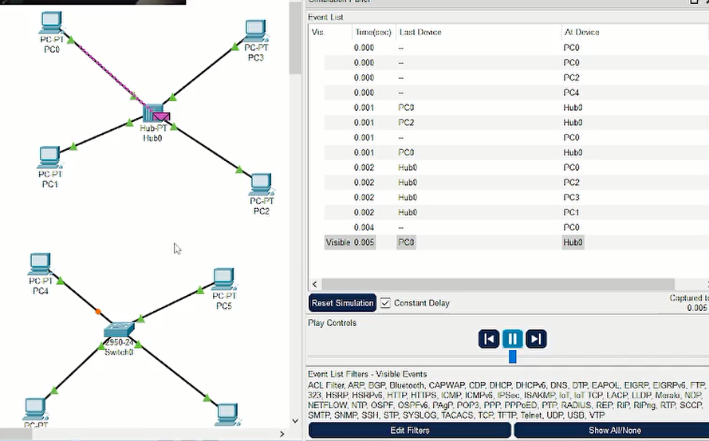
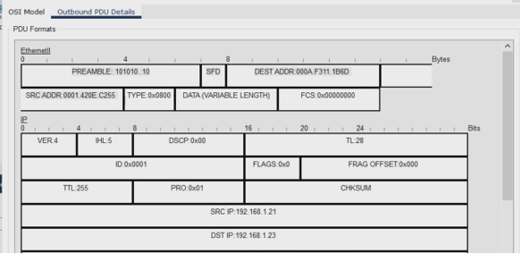
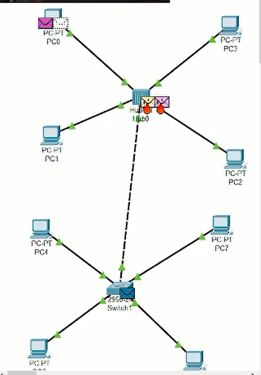
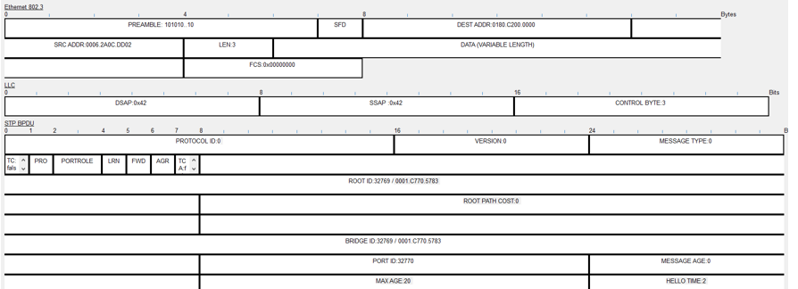
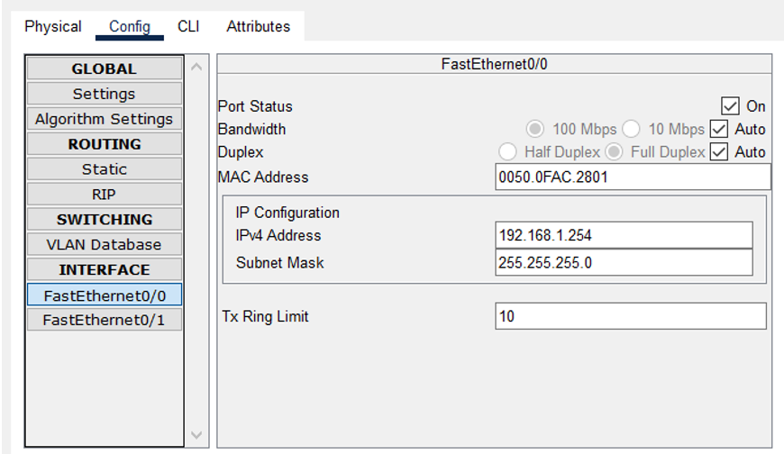
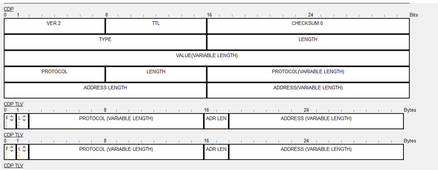

---
## Front matter
lang: ru-RU
title: Лабораторная работа №1
subtitle: Знакомство с Cisco Packet Tracer
author:
  - Джахангиров Илгар Залид оглы
institute:
  - Российский университет дружбы народов, Москва, Россия

## i18n babel
babel-lang: russian
babel-otherlangs: english

## Formatting pdf
toc: false
toc-title: Содержание
slide_level: 2
aspectratio: 169
section-titles: true
theme: metropolis
header-includes:
 - \metroset{progressbar=frametitle,sectionpage=progressbar,numbering=fraction}
 - '\makeatletter'
 - '\beamer@ignorenonframefalse'
 - '\makeatother'
---

# Информация

## Докладчик

:::::::::::::: {.columns align=center}
::: {.column width="70%"}

  * Джахангиров Илгар Залид оглы
  * студент
  * Российский университет дружбы народов
  * [1032225689@pfur.ru]

:::
::::::::::::::

## Цель работы

Установить инструмент моделирования конфигурации сети Cisco Packet Tracer, ознакомиться с его интерфейсом.

#3 Задание

1. Установить на домашнем устройстве Cisco Packet Tracer.

2. Построить простейшую сеть в Cisco Packet Tracer, провести простейшую настройку оборудования.

## Выполнение лабораторной работы

Создадим новый проект lab_PT-01.pkt.

В рабочем пространстве разместим концентратор (Hub-PT) и четыре оконечных устройства PC. Соединим оконечные устройства с концентратором прямым кабелем. Щёлкнув последовательно на каждое оконечном устройстве, зададим статические IP-адреса 192.168.1.11, 192.168.1.12,
192.168.1.13, 192.168.1.14 с маской подсети 255.255.255.0

## Выполнение лабораторной работы

## Выполнение лабораторной работы

В основном окне проекта перейдем из режима реального времени (Realtime) в режим моделирования (Simulation). Выберем на панели инструментов мышкой «Add Simple PDU (P)» и щёлкним сначала на PC0, затем на PC2.
В рабочей области должны появились два конверта, обозначающих пакеты, в списке событий на панели моделирования должны будут появиться
два события, относящихся к пакетам ARP и ICMP соответственно.
На панели моделирования нажмем кнопку «Play» и проследим за движением пакетов ARP и ICMP от устройства PC0 до устройства PC2 и обратно.

Можно увидеть, что пакет сначала отправляется на хаб, далее рассылается по всем устройствам, но принимает его только тот ПК, которому был предназначен пакет.

## Выполнение лабораторной работы

Щёлкнув на строке события, откроем окно информации о PDU и изучим, что происходит на уровне модели OSI при перемещении пакета.
Используя кнопку «Проверь себя» (Challenge Me) на вкладке OSI Model, ответим на вопросы.

## Выполнение лабораторной работы

Откроем вкладку с информацией о PDU. Исследуем структуру
пакета ICMP. Изначально в PDU есть только заголовок IP, в котором есть соответсвенно информация об IP-адресах источника и назначения. Также там есть заголовок ICMP. В нем содержится данные о типе ICMP-пакета, его коде, контрольной сумме, его идентификаторе и порядковом номере. Эти заголовки остаются постоянными при передаче. 

Далее появляется кадр Ethernet. Тут есть поле преамбула — 7 байт для синхронизации. Поле SFD. Destination Address — Ethernet-адрес получателя, 6 байт. Source Address — Ethernet-адрес отправителя, 6 байт. Type — тип, для обозначения типа протокола уровня. FCS — frame check sequence, 4 байта, поле контрольной последовательности фрейма.

Рассмотрим структуру mac-адресса. 00D0.D3B9.0470 - адрес назначения PC2. 00E0.8F9A.80B0  - адрес источника PC1. Первые 3 байта указывают на производителя (в нашем случае CISCO), следующие 3 байта указывают на идентификатор устройства.

## Выполнение лабораторной работы

Очистим список событий, удалив сценарий моделирования. Выберем на панели инструментов мышкой «Add Simple PDU (P)» и щёлкнем сначала на PC0, затем на PC2. Снова выберем на панели инструментов мышкой «Add Simple PDU (P)» и щёлкнем сначала на PC2, затем на PC0. На панели
моделирования нажмем кнопку «Play» и проследим за возникновением коллизии. В списке событий посмотрим информацию о PDU.

## Выполнение лабораторной работы

## Выполнение лабораторной работы

Увидим, что пакеты сначала передаются на хаб, где и возникает коллизия, так как он не может передать два сообщения одновременно. У первого сообщения информация о PDU не отображается, а у второго ее в принципе не должно быть. Далее второй пакет вообще исчезает, а второй отправляется на все устройства, но пустое, возникает ошибка.

## Выполнение лабораторной работы

Перейдем в режим реального времени (Realtime). В рабочем пространстве разместим коммутатор (например Cisco 2950-24) и 4 оконечных устройства PC. Соединим оконечные устройства с коммутатором прямым кабелем. Щёлкнув последовательно на каждом оконечном устройстве, зададим статические IP-адреса 192.168.1.21, 192.168.1.22, 192.168.1.23, 192.168.1.24 с маской подсети 255.255.255.0.

## Выполнение лабораторной работы

В основном окне проекта перейдем из режима реального времени (Realtime) в режим моделирования (Simulation). Выберем на панели инструментов мышкой «Add Simple PDU (P)» и щёлкним сначала на PC4, затем на PC6. В рабочей области появились два конверта, обозначающих пакеты, в списке событий на панели моделирования появились два события, относящихся к пакетам ARP и ICMP соответственно. На панели моделирования нажмем кнопку «Play» и проследим
за движением пакетов ARP и ICMP от устройства PC4 до устройства PC6 и обратно. 

Сначала, как и в случае с хабом, пакеты ARP рассылаются по всем оконечным устройстам, но принимает его только ПК, которому предназначалось сообщение. Обратно же ARP не рассылается по всем устройствам, пакет идет только к ПК6 (он уже знает свой путь).

Исследуем структуру пакета ICMP. Изначально в PDU есть только заголовок IP, в котором есть соответсвенно информация об IP-адресах источника и назначения. Также там есть заголовок ICMP. В нем содержится данные о типе ICMP-пакета, его коде, контрольной сумме, его идентификаторе и порядковом номере. Эти заголовки остаются постоянными при передаче. 

Далее появляется кадр Ethernet. Тут есть поле преамбула — 7 байт для синхронизации. Поле SFD. Destination Address — Ethernet-адрес получателя, 6 байт. Source Address — Ethernet-адрес отправителя, 6 байт. Type — тип, для обозначения типа протокола уровня. FCS — frame check sequence, 4 байта, поле контрольной последовательности фрейма.

Пакет отправляется на коммутатор, в заголовке указаны mac-адреса, в которых указано, что пакет идет от ПК4 к ПК6. 
Рассмотрим структуру mac-адресса. 000A.F311.1B6D - адрес назначения PC6. 0001.420E.C255  - адрес источника PC4. Первые 3 байта указывают на производителя (в нашем случае CISCO), следующие 3 байта указывают на идентификатор устройства.

## Выполнение лабораторной работы

Очистим список событий, удалив сценарий моделирования. Выберем на панели инструментов мышкой «Add Simple PDU (P)» и щёлкнем сначала на PC4, затем на PC6. Снова выберем на панели инструментов мышкой «Add Simple PDU (P)» и щёлкнем сначала на PC6, затем на PC4. На панели моделирования нажмем кнопку «Play» и проследим за движением
пакетов. 

Коллизия не возникает, потому что пакет не отправляется всем устройствам, а расходится по нужным назначениям коммутатором.

Перейдем в режим реального времени (Realtime). В рабочем пространстве соединим кроссовым кабелем концентратор и коммутатор. Перейдем в режим моделирования (Simulation). Очистим список событий, удалив сценарий моделирования. Выберем на панели инструментов мышкой «Add Simple PDU (P)» и щёлкнем сначала на PC0, затем на PC4. Снова выберем на панели инструментов мышкой «Add Simple PDU (P)» и щёлкнем
сначала на PC4, затем на PC0. На панели моделирования нажмем кнопку «Play» и проследим за движением пакетов.

## Выполнение лабораторной работы

Пакет, который отправлен из сети с хабом, как и в прошлый раз исчезает. А пакет, отправленный из сети с коммутатором достигает своего назначения. Так получается, потому что коммутатор может работать в режиме полного дуплекса (двунаправленная передача данных. Способность устройства или линии связи передавать данные одновременно в обоих направлениях по одному каналу, потенциально удваивая пропускную способность). 

Очистим список событий, удалив сценарий моделирования. На панели моделирования нажмием «Play» и в списке событий получим пакеты STP. Исследуем структуру STP. 

Заголовок STP (Spanning Tree Protocol) включает в себя поля: Идентификатор протокола (Protocol Identifier) — 2-х байтовое поле, которое всегда равно нулю.
Версия STP протокола (Protocol Version Identifier) — поле размером в 1 байт, значение которого, всегда равно «0».
Тип BPDU (BPDU type) — 1 байт, которые принимает значение «0», если это конфигурационный BPDU (CBPDU), или «1», если это TCN BPDU.
CBPDU (Configuration Bridge Protocol Data Unit) — кадр, используемый для вычисления связующего дерева. То есть, когда значение = 0.
Флаги (Flags) — в этом поле используются только 1 байт. Эти флаги используются при изменении топологии (бит «1») и при подтверждении топологии (бит «8»).
Идентификатор корневого моста (Root Identifier) — в этом поле содержится информация о корневом коммутаторе, а именно его приоритет и MAC-адрес.
Расстояние до корневого моста (Root Path Cost) — здесь содержится суммарная стоимость до корневого коммутатора. 
Идентификатор моста (Bridge Identifier) — сюда коммутатор-отправитель записывает свои данные (приоритет + MAC-адрес).
Идентификатор порта (Port Identifier) — сюда коммутатор-отправитель записывает идентификатор порта (то есть тот, с которого этот BPDU выйдет).
Время жизни сообщения (Message Age) — здесь содержится временной интервал (в секундах). Он нужен для того, чтобы распознать устаревшие кадры и отбросить. 
Максимальное время жизни сообщения (Max Age) — это поле отвечает, как раз, за максимальное время жизни. Превысив его, коммутатор отбрасывает кадр.
Время приветствия (Hello Time) — Временной интервал, через который коммутатор посылает BPDU кадры. По-умолчанию — это 2 секунды.
Задержка смены состояний (Forward Delay) — временной интервал, указывающий сколько секунд порт коммутатора будет находиться в состоянии прослушивания и обучения.

Опишем структуру кадра Ethernet в этих пакетах. В STP пакетах кадр Ethernet имеет тип 802.3. В нем указана преамбула, mac-адреса источника и назначения и длина.
Структура mac-адресов осталась прежней.

## Выполнение лабораторной работы

Перейдем в режим реального времени (Realtime). В рабочем пространстве добавим маршрутизатор (например, Cisco 2811). Соединим прямым кабелем коммутатор и маршрутизатор. Щёлкнем на маршрутизаторе и на вкладке его конфигурации пропишем статический IP-адрес 192.168.1.254 с маской 255.255.255.0, активируем порт, поставив галочку
«On» напротив «Port Status».

## Выполнение лабораторной работы

## Выполнение лабораторной работы

Перейдем в режим моделирования (Simulation). Очистим список событий, удалив сценарий моделирования. Выберем на панели инструментов мышкой «Add Simple PDU (P)» и щёлкнем сначала на PC3, затем на маршрутизаторе. На панели моделирования нажмем кнопку «Play» и проследим
за движением пакетов ARP, ICMP, STP и CDP.

Сначала посылаются пакеты ARP, затем ICMP. В сети с хабом рассылка идет по всем устройствам, а в сети с коммутатором только к пункту назначения. После получения пакета идет идет рассылка STP пакетов всем устройствам сети. Затем появляются пакеты DTP, а потом уже появляются пакеты CDP(англ. Cisco Discovery Protocol) — проприетарный протокол второго уровня, разработанный компанией Cisco Systems.

## Выполнение лабораторной работы

Исследуем структуру пакета CDP. 
Поле Version - поле версии содержит используемую версию протокола CDP. В этом поле всегда содержится значение 0x01.

Поле Time-to-Live (время жизни) указывает время в секундах, в течение которого получатель пакета CDP должен сохранять информацию, содержащуюся в пакете.

Поле Checksum контрольной суммы содержит стандартную для протокола IP контрольную сумму.

Поле Type - поле типа указывает на тип тройки type/length/value.

Length - поле длины содержит общую длину в байтах полей type/length/value.

Value - поле значения содержит нечто, зависящее от параметра Type.

Структура кадра Ethernet 802.3 такая же как в пакетах STP и mac-адреса также остались прежними.

## Выполнение лабораторной работы

## Выводы

В процессе выполнения данной лабораторной работы я установил инструмент моделирования конфигурации сети Cisco Packet Tracer, ознакомилась с его интерфейсом.