---
## Front matter
lang: ru-RU
title: Лабораторная работа №2
subtitle: Предварительная настройка оборудования Cisco
author:
  - Джахангиров Илгар Залид оглы
institute:
  - Российский университет дружбы народов, Москва, Россия

## i18n babel
babel-lang: russian
babel-otherlangs: english

## Formatting pdf
toc: false
toc-title: Содержание
slide_level: 2
aspectratio: 169
section-titles: true
theme: metropolis
header-includes:
 - \metroset{progressbar=frametitle,sectionpage=progressbar,numbering=fraction}
 - '\makeatletter'
 - '\beamer@ignorenonframefalse'
 - '\makeatother'
---

# Информация

## Докладчик

:::::::::::::: {.columns align=center}
::: {.column width="70%"}

  * Джахангиров Илгар Залид оглы
  * студент
  * Российский университет дружбы народов
  * [1032225689@pfur.ru]

:::
::::::::::::::

## Цель работы

Получить основные навыки по начальному конфигурированию оборудования Cisco.

## Задание

1. Сделать предварительную настройку маршрутизатора:

- задать имя в виде «город-территория-учётная_записьтип_оборудования-номер»;

- задать интерфейсу Fast Ethernet с номером 0 ip-адрес 192.168.1.254 и маску 255.255.255.0, затем поднять интерфейс;

- задать пароль для доступа к привилегированному режиму (сначала в открытом виде, затем — в зашифрованном);

- настроить доступ к оборудованию сначала через telnet, затем — через ssh (используя в качестве имени домена donskaya.rudn.edu);

- сохранить и экспортировать конфигурацию в отдельный файл.

2. Сделать предварительную настройку коммутатора:

- задать имя в виде «город-территория-учётная_записьтип_оборудования-номер» 
 
- задать интерфейсу vlan 2 ip-адрес 192.168.2.1 и маску 255.255.255.0, затем поднять интерфейс;

- привязать интерфейс Fast Ethernet с номером 1 к vlan 2;

- задать в качестве адреса шлюза по умолчанию адрес 192.168.2.254;

- задать пароль для доступа к привилегированному режиму (сначала в открытом виде, затем — в зашифрованном);

- настроить доступ к оборудованию сначала через telnet, затем — через ssh (используя в качестве имени домена donskaya.rudn.edu);

- для пользователя admin задать доступ 1-го уровня по паролю;

- сохранить и экспортировать конфигурацию в отдельный файл.

## Выполнение лабораторной работы

В логической рабочей области Packet Tracer разместим коммутатор, маршрутизатор и 2 оконечных устройства типа PC, соединим один PC
с маршрутизатором консольным и кроссовым кабелем, другой PC — с коммутатором консольным и прямым кабелем 

## Выполнение лабораторной работы

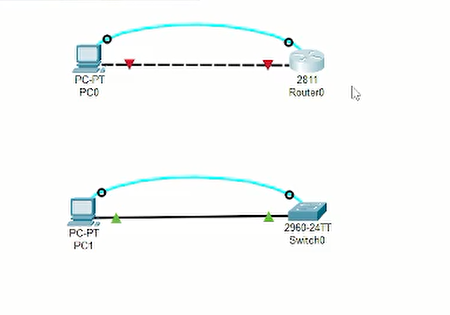

Для начала зададим статический ip-адрес PC0 192.168.1.10 с соответствующей маской подсети 255.255.255.0 

## Выполнение лабораторной работы

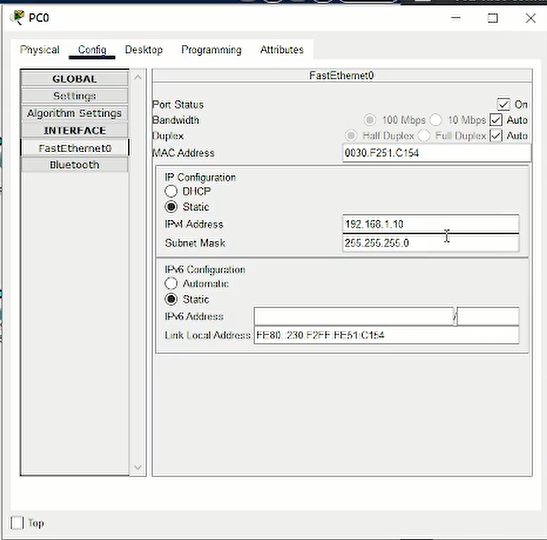

## Настройка маршрутизатора

Зададим интерфейсу Fast Ethernet с номером 0 ip-адрес 192.168.1.254 и маску 255.255.255.0, затем поднимем интерфейс командой `no shutdown` 

## Выполнение лабораторной работы

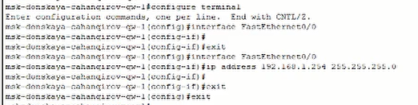

Проверим работоспособность соединения с помощью команды `ping`. Увидим, что было полсано 4 пакета и принято тоже 4, потерь нет. Так что соединение успешно работает .

## Выполнение лабораторной работы

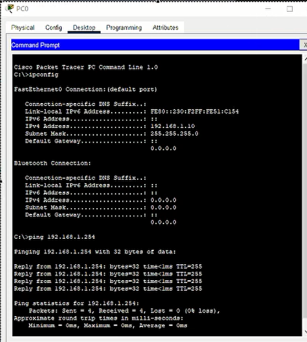

Зададим пароль для доступа к привилегированному режиму (сначала в открытом виде, затем — в зашифрованном). Зададим пароль для доступа к терминалу, к консоли, и поставим пароль на `enable` (привилегированным режим). 

## Выполнение лабораторной работы

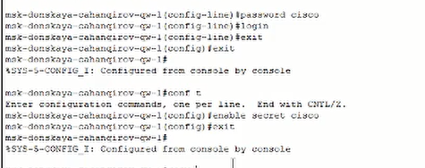

Если использовать команду `secret`, то пароль сразу будет зашифрованным. Но там, где мы использовали команду `password` пароль не скрыт, и любой может его посмотреть (рис. [-

## Выполнение лабораторной работы

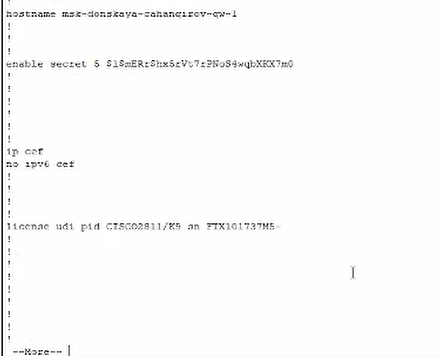

Чтобы это исправить, надо зашифровать наши пароли с помощью команды `service password −encryption` 

## Выполнение лабораторной работы

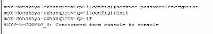

Теперь настроим доступ к оборудованию сначала через telnet, затем — через ssh (используя в качестве имени домена donskaya.rudn.edu) 

## Выполнение лабораторной работы

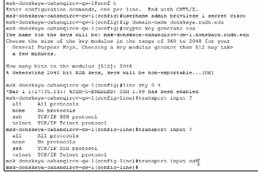

Так как мы оставили возможным доступ только через ssh, то при попытке доступа через telnet нам будет отказано. А при доступе через ssh запрашивается пароль, как и должен, и доступ успешно предоставляется .

## Выполнение лабораторной работы

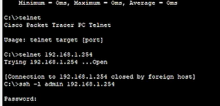

## Настройка коммутатора

Для начала зададим ста
тический ip-адрес PC0 192.168.2.10 с соответствующей маской подсети 255.255.255.0 

## Выполнение лабораторной работы

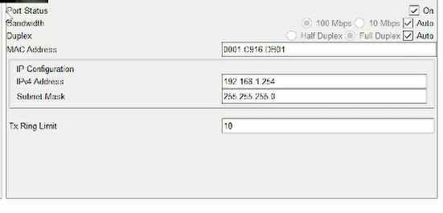

Теперь проведем настройку коммутатора в соответствии с заданием. Откроем Command Line Interface (CLI) у маршрутизатора, который идентичен терминалу ПК. Для перехода в привилегированный режим из пользовательского режима воспользуемся командой `enable`. А для перехода в режим глобальной конфигурации из привилегированного режима используем команду `configure terminal` или её сокращённый аналог `conf t`. И в этом режиме зададим имя хоста, введя команду `hostname msk−donskaya −gw−1`. Также зададим интерфейсу Fast Ethernet с номером 0 ip-адрес 192.168.1.254 и маску 255.255.255.0, затем поднимем интерфейс командой `no shutdown.

## Выполнение лабораторной работы

Привяжем интерфейс Fast Ethernet с номером 1 к vlan 2 

## Выполнение лабораторной работы

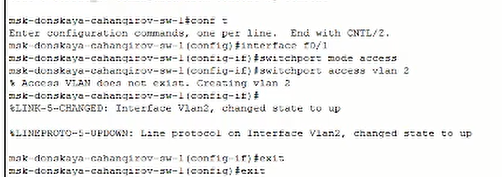

И зададим в качестве адреса шлюза по умолчанию адрес 192.168.2.254 

## Выполнение лабораторной работы

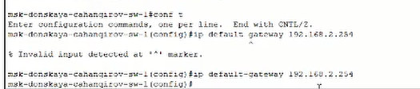

Проверим работоспособность соединения с помощью команды `ping`. Увидим, что было полсано 4 пакета и принято тоже 4, потерь нет. Так что соединение успешно работает 

## Выполнение лабораторной работы

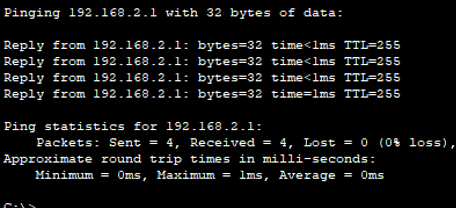

Зададим пароль для доступа к привилегированному режиму (сначала в открытом виде, затем — в зашифрованном). Зададим пароль для доступа к терминалу, к консоли, и поставим пароль на `enable` (привилегированным режим). Зашифруем наши пароли с помощью команды `service password −encryption`  

## Выполнение лабораторной работы

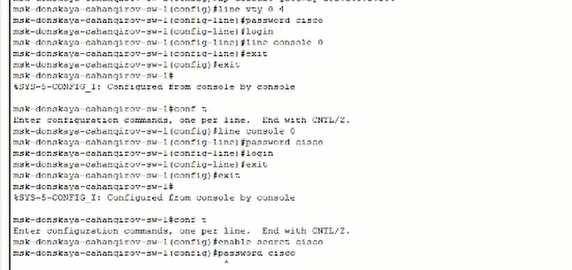

## Выполнение лабораторной работы

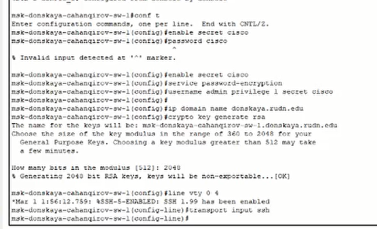

Так как мы оставили возможным доступ только через ssh, то при попытке доступа через telnet нам будет отказано. А при доступе через ssh запрашивается пароль, как и должен, и доступ успешно предоставляется 

## Выполнение лабораторной работы

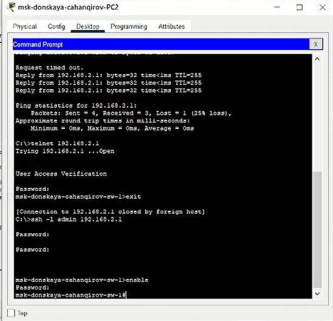

## Выводы

В процессе выполнения данной лабораторной работы я получил основные навыки по начальному конфигурированию оборудования Cisco.
