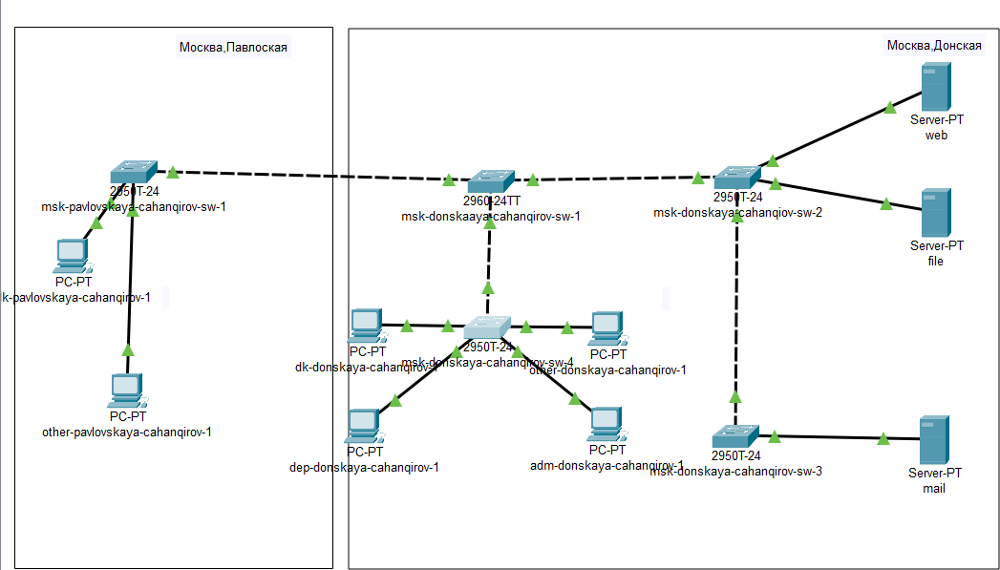
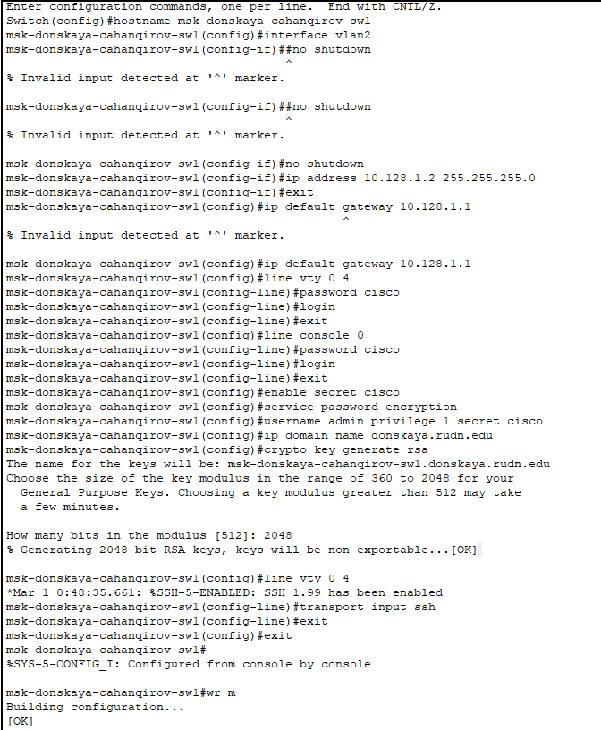
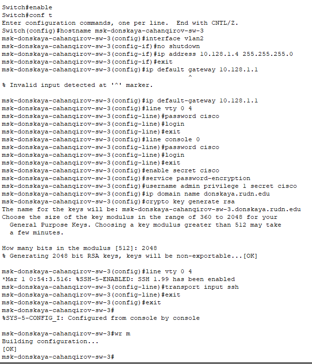
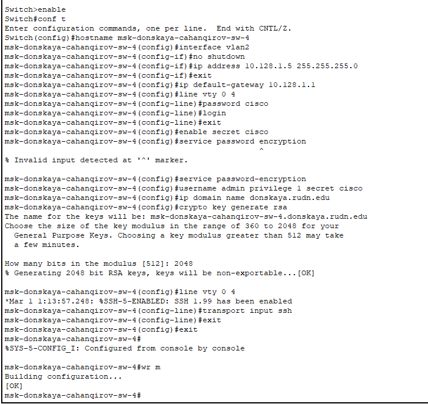
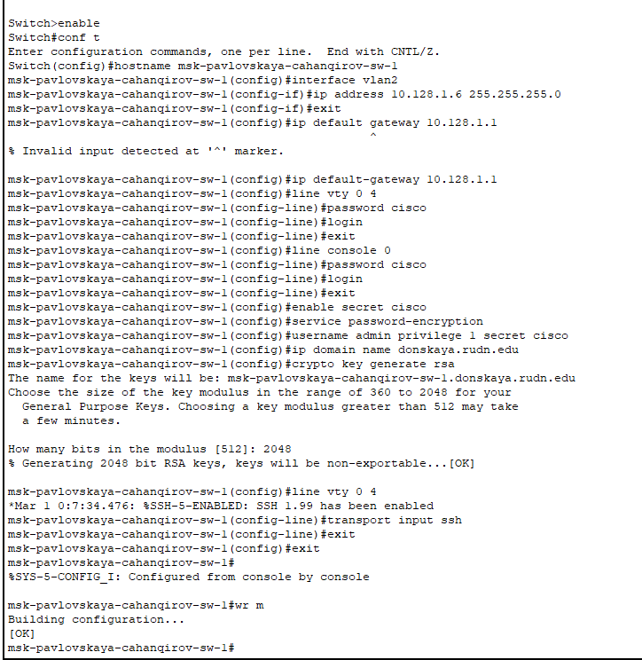

---
## Front matter
lang: ru-RU
title: Лабораторная работа №4
subtitle: Первоначальное конфигурирование сети
author:
  - Джахангиров Илгар Залид оглы
institute:
  - Российский университет дружбы народов, Москва, Россия

## i18n babel
babel-lang: russian
babel-otherlangs: english

## Formatting pdf
toc: false
toc-title: Содержание
slide_level: 2
aspectratio: 169
section-titles: true
theme: metropolis
header-includes:
 - \metroset{progressbar=frametitle,sectionpage=progressbar,numbering=fraction}
 - '\makeatletter'
 - '\beamer@ignorenonframefalse'
 - '\makeatother'
---

# Информация

## Докладчик

:::::::::::::: {.columns align=center}
::: {.column width="70%"}

  * Джахангиров Илгар Залид оглы
  * студент
  * Российский университет дружбы народов
  * [1032225689@pfur.ru]

:::
::::::::::::::

## Цель работы

Провести подготовительную работу по первоначальной настройке коммутаторов сети.

# Задание

Требуется сделать первоначальную настройку коммутаторов сети, представленной на схеме L1. Под первоначальной настройкой понимается указание имени устройства, его IP-адреса, настройка доступа по паролю к виртуальным терминалам и консоли, настройка удалённого доступа к устройству по ssh.
При выполнении работы необходимо учитывать соглашение об именовании.

## Выполнение лабораторной работы

1. В логической рабочей области Packet Tracer разместим коммутаторы и оконечные устройства согласно схеме сети L1  и соединим их через соответствующие интерфейсы (рис. [-@fig:001]). Для соединения коммутаторов между собой используем кроссовый кабель, а для подключения коммутаторов к оконечным устройством возьмем прямой кабель.

## Выполнение лабораторной работы

2. Используя типовую конфигурацию коммутатора, настроем
все коммутаторы, изменяя название устройства и его IP-адрес согласно плану IP, сделанный в предыдущей лабораторной работе.

Для первого устройства имя msk-donskaya-cahanqirov-sw-1 зададим ip-адрес -- 10.128.1.2 

## Выполнение лабораторной работы

Для второго устройства имя msk-donskaya-cahanqirov-sw-2 зададим ip-адрес -- 10.128.1.3 

## Выполнение лабораторной работы

 

Для третьего устройства имя msk-donskaya-cahanqirov-sw-3 зададим ip-адрес -- 10.128.1.4 

## Выполнение лабораторной работы

Для четвертого устройства имя msk-donskaya-cahanqirov-sw-4 зададим ip-адрес -- 10.128.1.5 

## Выполнение лабораторной работы

Для пятого (первого на Павловской) устройства имя msk-pavlovskaya-cahanqirov-sw-1 зададим ip-адрес -- 10.128.1.6 

## Выполнение лабораторной работы

## Выводы

В результате выполнения данной лабораторной работы я провел подготовительную работу по первоначальной настройке коммутаторов сети.

