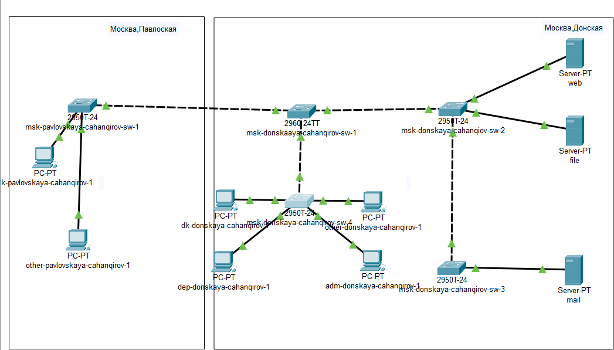
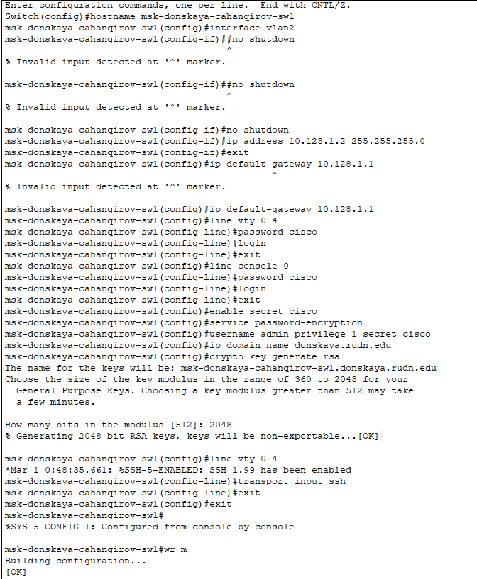
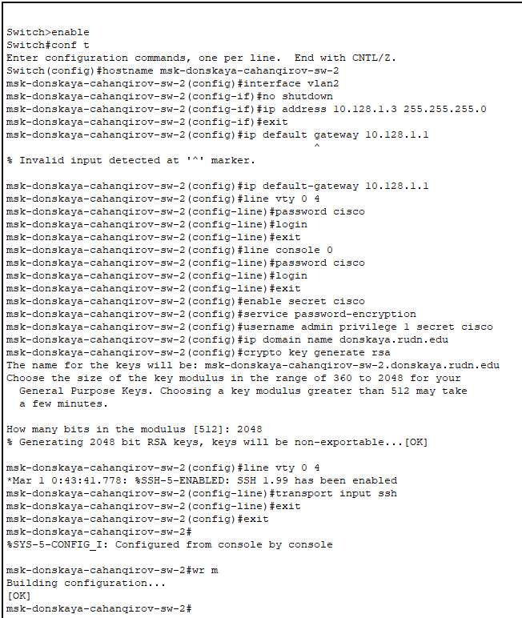
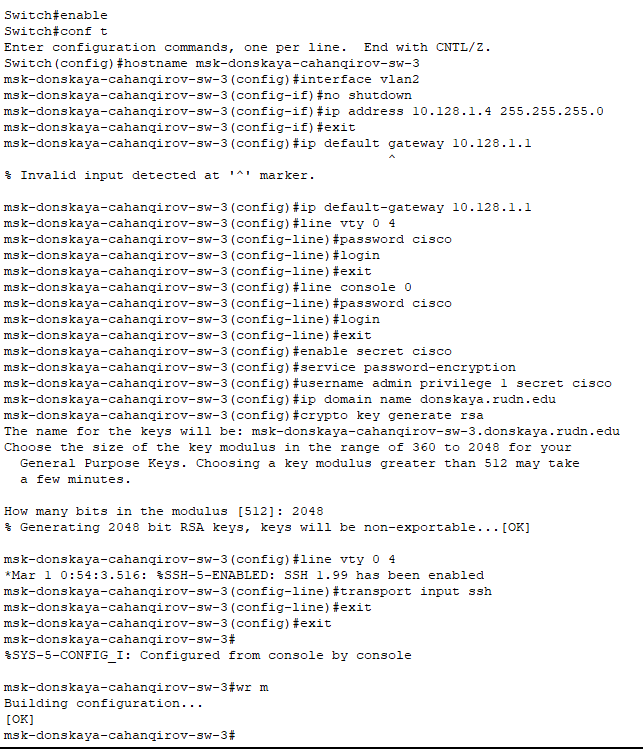
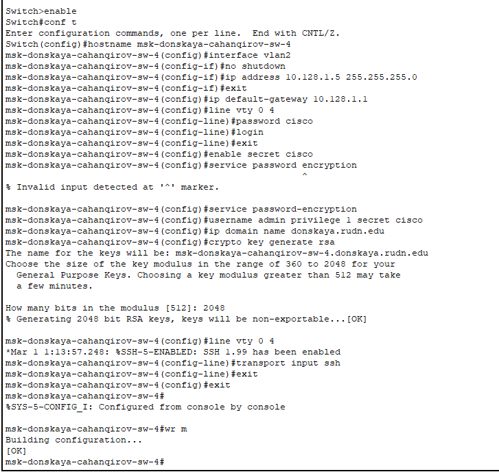
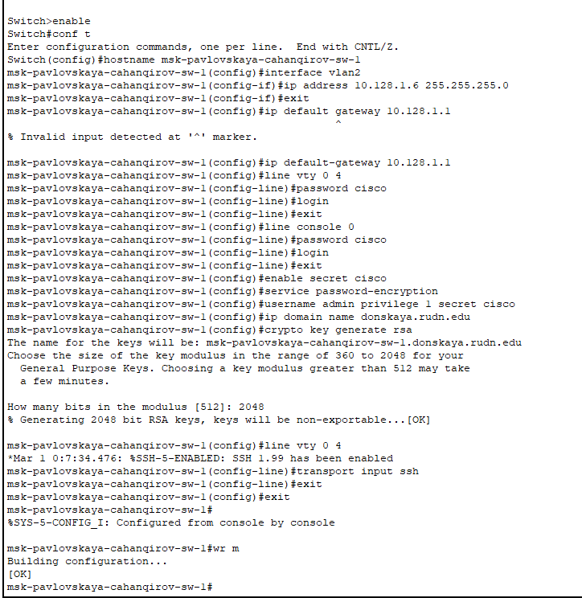

---
## Front matter
title: "Лабораторная работа № 4"
subtitle: "Первоначальное конфигурирование сети"
author: "Джахангиров Илгар Залид оглы"

## Generic otions
lang: ru-RU
toc-title: "Содержание"

## Bibliography
bibliography: bib/cite.bib
csl: pandoc/csl/gost-r-7-0-5-2008-numeric.csl

## Pdf output format
toc: true # Table of contents
toc-depth: 2
lof: true # List of figures
lot: false # List of tables
fontsize: 12pt
linestretch: 1.5
papersize: a4
documentclass: scrreprt
## I18n polyglossia
polyglossia-lang:
  name: russian
  options:
	- spelling=modern
	- babelshorthands=true
polyglossia-otherlangs:
  name: english
## I18n babel
babel-lang: russian
babel-otherlangs: english
## Fonts
mainfont: PT Serif
romanfont: PT Serif
sansfont: PT Sans
monofont: PT Mono
mainfontoptions: Ligatures=TeX
romanfontoptions: Ligatures=TeX
sansfontoptions: Ligatures=TeX,Scale=MatchLowercase
monofontoptions: Scale=MatchLowercase,Scale=0.9
## Biblatex
biblatex: true
biblio-style: "gost-numeric"
biblatexoptions:
  - parentracker=true
  - backend=biber
  - hyperref=auto
  - language=auto
  - autolang=other*
  - citestyle=gost-numeric
## Pandoc-crossref LaTeX customization
figureTitle: "Рис."
tableTitle: "Таблица"
listingTitle: "Листинг"
lofTitle: "Список иллюстраций"
lotTitle: "Список таблиц"
lolTitle: "Листинги"
## Misc options
indent: true
header-includes:
  - \usepackage{indentfirst}
  - \usepackage{float} # keep figures where there are in the text
  - \floatplacement{figure}{H} # keep figures where there are in the text
---

# Цель работы

Провести подготовительную работу по первоначальной настройке коммутаторов сети.

# Задание

Требуется сделать первоначальную настройку коммутаторов сети, представленной на схеме L1. Под первоначальной настройкой понимается указание имени устройства, его IP-адреса, настройка доступа по паролю к виртуальным терминалам и консоли, настройка удалённого доступа к устройству по ssh.
При выполнении работы необходимо учитывать соглашение об именовании.

# Выполнение лабораторной работы

1. В логической рабочей области Packet Tracer разместим коммутаторы и оконечные устройства согласно схеме сети L1  и соединим их через соответствующие интерфейсы (рис. [-@fig:001]). Для соединения коммутаторов между собой используем кроссовый кабель, а для подключения коммутаторов к оконечным устройством возьмем прямой кабель.

2. Используя типовую конфигурацию коммутатора, настроем
все коммутаторы, изменяя название устройства и его IP-адрес согласно плану IP, сделанный в предыдущей лабораторной работе.

Для первого устройства имя msk-donskaya-cahanqirov-sw-1 зададим ip-адрес -- 10.128.1.2 

Для второго устройства имя msk-donskaya-cahanqirov-sw-2 зададим ip-адрес -- 10.128.1.3 

 

Для третьего устройства имя msk-donskaya-cahanqirov-sw-3 зададим ip-адрес -- 10.128.1.4 

Для четвертого устройства имя msk-donskaya-cahanqirov-sw-4 зададим ip-адрес -- 10.128.1.5 

Для пятого (первого на Павловской) устройства имя msk-pavlovskaya-cahanqirov-sw-1 зададим ip-адрес -- 10.128.1.6 

# Выводы

В результате выполнения данной лабораторной работы я провела подготовительную работу по первоначальной настройке коммутаторов сети.

