---
## Front matter
title: "Лабораторная работа № 5"
subtitle: "Конфигурирование VLAN"
author: "Джахангиров Илгар Залид оглы"

## Generic otions
lang: ru-RU
toc-title: "Содержание"

## Bibliography
bibliography: bib/cite.bib
csl: pandoc/csl/gost-r-7-0-5-2008-numeric.csl

## Pdf output format
toc: true # Table of contents
toc-depth: 2
lof: true # List of figures
lot: false # List of tables
fontsize: 12pt
linestretch: 1.5
papersize: a4
documentclass: scrreprt
## I18n polyglossia
polyglossia-lang:
  name: russian
  options:
	- spelling=modern
	- babelshorthands=true
polyglossia-otherlangs:
  name: english
## I18n babel
babel-lang: russian
babel-otherlangs: english
## Fonts
mainfont: PT Serif
romanfont: PT Serif
sansfont: PT Sans
monofont: PT Mono
mainfontoptions: Ligatures=TeX
romanfontoptions: Ligatures=TeX
sansfontoptions: Ligatures=TeX,Scale=MatchLowercase
monofontoptions: Scale=MatchLowercase,Scale=0.9
## Biblatex
biblatex: true
biblio-style: "gost-numeric"
biblatexoptions:
  - parentracker=true
  - backend=biber
  - hyperref=auto
  - language=auto
  - autolang=other*
  - citestyle=gost-numeric
## Pandoc-crossref LaTeX customization
figureTitle: "Рис."
tableTitle: "Таблица"
listingTitle: "Листинг"
lofTitle: "Список иллюстраций"
lotTitle: "Список таблиц"
lolTitle: "Листинги"
## Misc options
indent: true
header-includes:
  - \usepackage{indentfirst}
  - \usepackage{float} # keep figures where there are in the text
  - \floatplacement{figure}{H} # keep figures where there are in the text
---

# Цель работы

Получить основные навыки по настройке VLAN на коммутаторах сети.

# Задание

1. На коммутаторах сети настроить Trunk-порты на соответствующих интерфейсах, связывающих коммутаторы между собой.

2. Коммутатор msk-donskaya-sw-1 настроить как VTP-сервер и прописать на
нём номера и названия VLAN.

3. Коммутаторы msk-donskaya-sw-2 — msk-donskaya-sw-4, mskpavlovskaya-sw-1 настроить как VTP-клиенты, на интерфейсах указать
принадлежность к соответствующему VLAN.

4. На серверах прописать IP-адреса.

5. На оконечных устройствах указать соответствующий адрес шлюза и прописать статические IP-адреса из диапазона соответствующей сети, следуя регламенту выделения ip-адресов.

6. Проверить доступность устройств, принадлежащих одному VLAN, и недоступность устройств, принадлежащих разным VLAN.

7. При выполнении работы необходимо учитывать соглашение об именовании.

# Выполнение лабораторной работы

Откроем файл .pkt, сделанный в предыдущей лабораторной работе, где у нас уже размещены и подключены устройства, и начнем выполнять конфигурацию VLAN.

Используя приведённую в файле лабораторной работы последовательность команд из примера по конфигурации Trunk-порта на интерфейсе g0/1 коммутатора msk-donskaya-sw-1, настроем Trunk-порты на соответствующих интерфейсах всех коммутаторов..

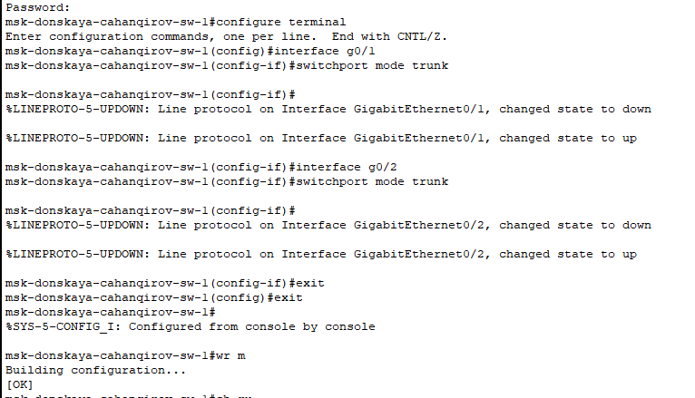

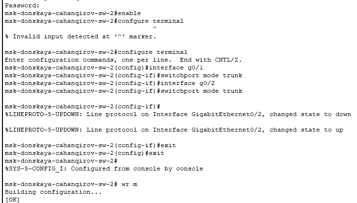

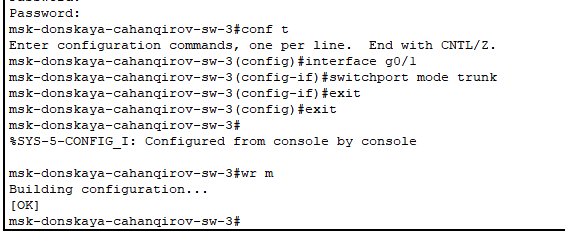

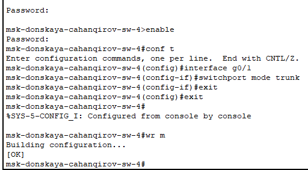

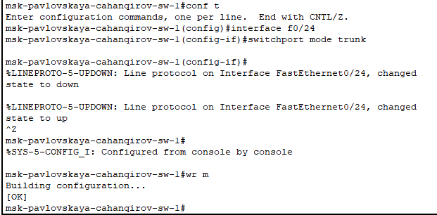

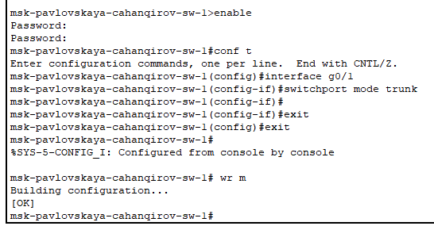

Используя приведённую в лабораторной работе последовательность команд по конфигурации VTP, настроем коммутатор msk-donskaya-sw-1 как VTP-сервер и пропишем на нём номера и названия VLAN. Настроем коммутаторы msk-donskaya-sw-2 — msk-donskaya-sw-4, msk-pavlovskaya-sw-1 как VTP-клиенты.

Сначала зададим список VLAN:

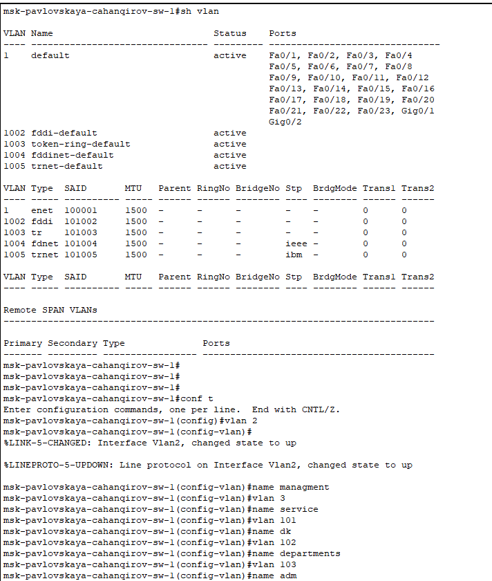

Убедимся, что VLAN заданы, выполнив команду `show vlan`:

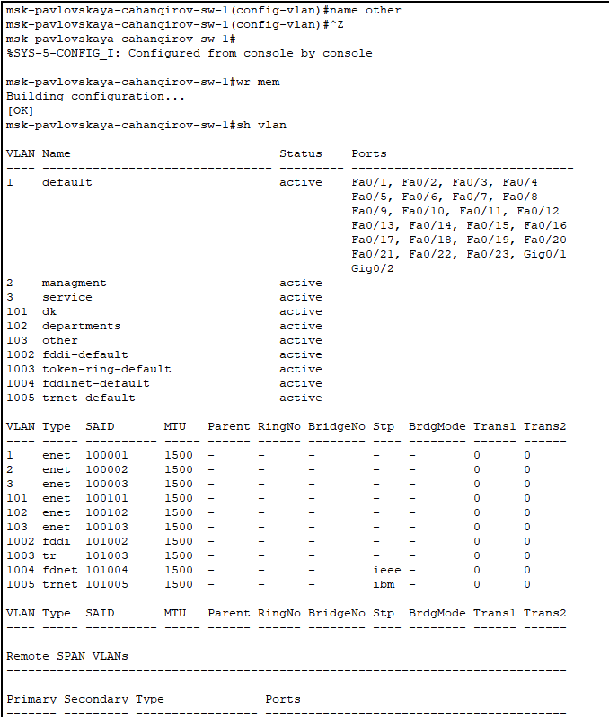

Теперь настроем msk-donskaya-cahanqirov-sw-1 как VTP-сервер:

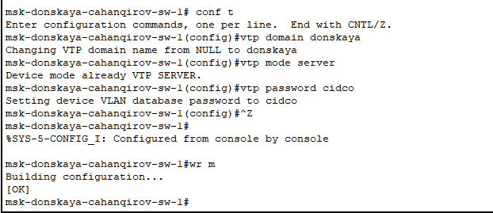

Благодаря протоколу VTP мы можем задать VLAN только на сервере, тогда на клиентах будут отражаться такие же VLAN.

Настроем msk-donskaya-cahanqirov-sw-2 как VTP-клиент:

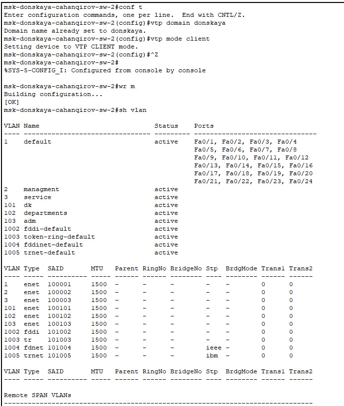

Настроем msk-donskaya-cahanqirov-sw-3 как VTP-клиент:

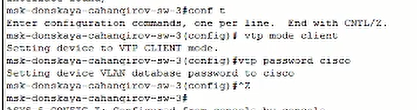

Настроем msk-donskaya-cahanqirov-sw-4 как VTP-клиент:

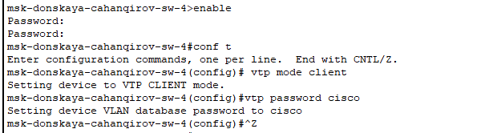

Посмотрим vtp статус, увидим, что у нас подключено 11 VLAN, и устройство является клиентом:

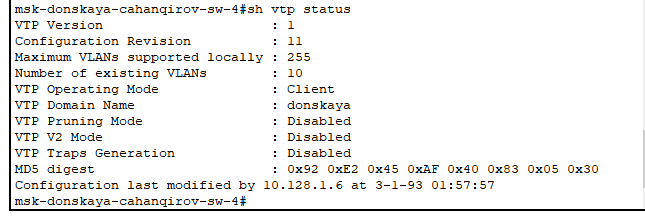

Проверим, что у нас отображаются нужные VLAN:

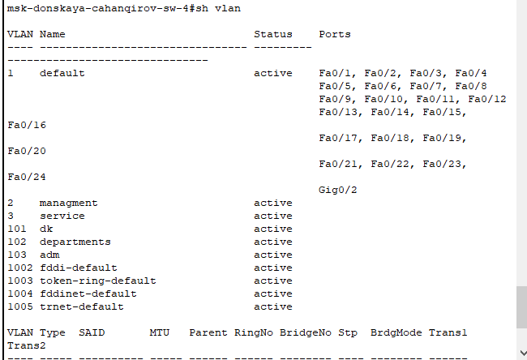

Настроем msk-pavlovskaya-cahanqirov-sw-1 как VTP-клиент:

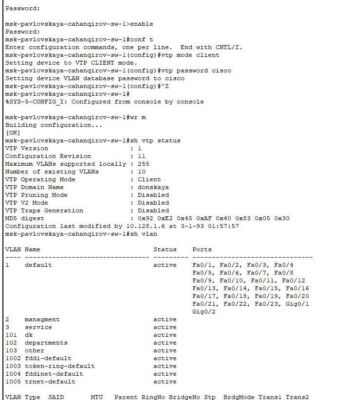

Используя приведённую в лабораторной работе последовательность команд по конфигурации диапазонов портов и на интерфейсах
укажем принадлежность к VLAN.

Выполним эту конфигурацию в соответствии с таблицей:

:Таблица портов

| Устройство                       | Порт        | Примечание           | Access VLAN | Trunk VLAN               |
|----------------------------------|-------------|----------------------|-------------|--------------------------|
| msk-donskaya-cahanqirov-gw-1    | f0/1        | UpLink               |             |                          |
|                                  | f0/0        | msk-donskaya-sw-1    |             | 2, 3, 101, 102, 103, 104 |
| msk-donskaya-cahanqirov-sw-1    | f0/24       | msk-donskaya-gw-1    |             | 2, 3, 101, 102, 103, 104 |
|                                  | g0/1        | msk-donskaya-sw-2    |             | 2, 3                     |
|                                  | g0/2        | msk-donskaya-sw-4    |             | 2, 101, 102, 103, 104    |
|                                  | g0/1        | msk-pavlovskaya-sw-1 |             | 2, 101, 104              |
| msk-donskaya-cahanqirov-sw-2    | g0/1        | msk-donskaya-sw-1    |             | 2, 3                     |
|                                  | g0/2        | msk-donskaya-sw-3    |             | 2, 3                     |
|                                  | f0/1        | Web-server           | 3           |                          |
|                                  | f0/2        | File-server          | 3           |                          |
| msk-donskaya-cahanqirov-sw-3    | g0/1        | msk-donskaya-sw-2    |             | 2, 3                     |
|                                  | f0/1        | Mail-server          | 3           |                          |
|                                  | f0/2        | Dns-server           | 3           |                          |
| msk-donskaya-cahanqirov-sw-4    | g0/1        | msk-donskaya-sw-1    |             | 2, 101, 102, 103, 104    |
|                                  | f0/1–f0/5   | dk                   | 101         |                          |
|                                  | f0/6–f0/10  | departments          | 102         |                          |
|                                  | f0/11–f0/15 | adm                  | 103         |                          |
|                                  | f0/16–f0/24 | other                | 104         |                          |
| msk-pavlovskaya-cahanqirov-sw-1 | f0/24       | msk-donskaya-sw-1    |             | 2, 101, 104              |
|                                  | f0/1–f0/15  | dk                   | 101         |                          |
|                                  | f0/20       | other                | 104         |                          | 

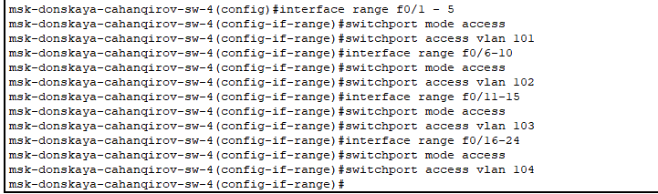

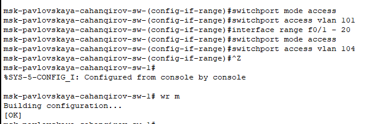

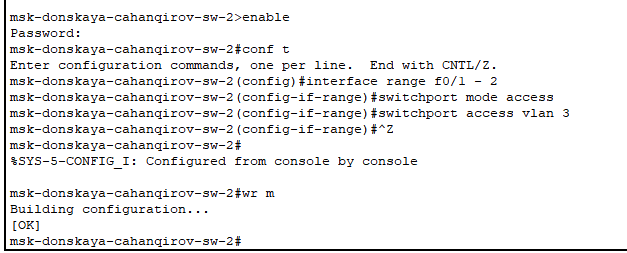

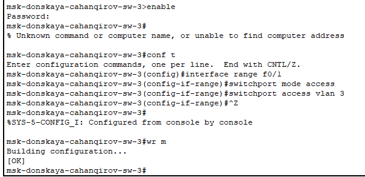
Укажем статические IP-адреса на оконечных устройствах и проверим с помощью команды ping доступность устройств, принадлежащих
одному VLAN, и недоступность устройств, принадлежащих разным VLAN.

Задавать IP-адреса будем в соответствии с таблицей:

:Таблица IP. Сеть 10.128.0.0/16

| IP-адреса               | Примечание                 | VLAN |
|-------------------------|----------------------------|------|
| 10.128.0.0/16           | Вся сеть                   |      |
| 10.128.0.0/24           | Серверная ферма            | 3    |
| 10.128.0.1              | Шлюз                       |      |
| 10.128.0.2              | Web                        |      |
| 10.128.0.3              | File                       |      |
| 10.128.0.4              | Mail                       |      |
| 10.128.0.5              | Dns                        |      |
| 10.128.0.6-10.128.0.254 | Зарезервировано            |      |
| 10.128.1.0/24           | Управление                 | 2    |
| 10.128.1.1              | Шлюз                       |      |
| 10.128.1.2              | msk-donskaya-sw-1          |      |
| 10.128.1.3              | msk-donskaya-sw-2          |      |
| 10.128.1.4              | msk-donskaya-sw-3          |      |
| 10.128.1.5              | Msk-donskaya-sw-4          |      |
| 10.128.1.6              | msk-pavlovskaya-sw-1       |      |
| 10.128.1.7-10.128.1.254 | Зарезервировано            |      |
| 10.128.2.0/24           | Сеть Point-to-Point        |      |
| 10.128.2.1              | Шлюз                       |      |
| 10.128.2.2-10.128.2.254 | Зарезервировано            |      |
| 10.128.3.0/24           | Дисплейные классы(DK)      | 101  |
| 10.128.3.1              | Шлюз                       |      |
| 10.128.3.2-10.128.3.254 | Пул для пользователей      |      |
| 10.128.4.0/24           | Кафедра (DEP)              | 102  |
| 10.128.4.1              | Шлюз                       |      |
| 10.128.4.2-10.128.4.254 | Пул для пользователей      |      |
| 10.128.5.0/24           | Администрация (ADM)        | 103  |
| 10.128.5.1              | Шлюз                       |      |
| 10.128.5.2-10.128.5.254 | Пул для пользователей      |      |
| 10.128.6.0/24           | Другие пользователи(OTHER) | 104  |
| 10.128.6.1              | Шлюз                       |      |
| 10.128.6.2-10.128.6.254 | Пул для пользователей      |      |

Задаем IP-адрес шлюзу и самому серверу web:

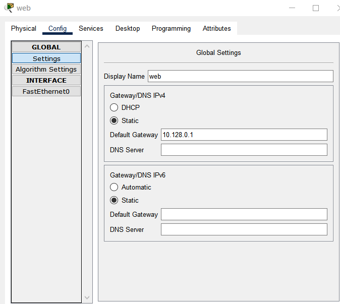

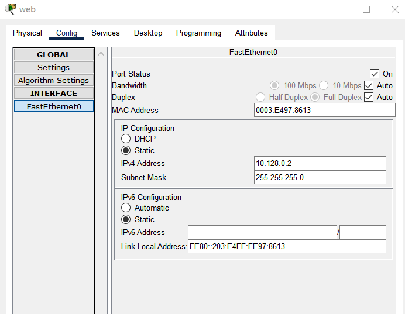

По аналогии и с помощью таблицы IP-адресов задаем IP-адреса всем оконечным устройствам.

Далее выполним проверку нашей настройке устройств и пропингуем dk-pavlovskaya-cahanqirov-1 с dk-donskaya-cahanqirov-1.

Выполнив команду `ipconfig` можем посмотреть заданные IP-адреса:

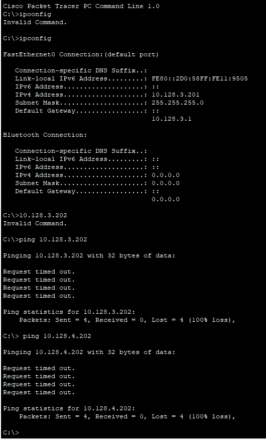

Выполним команду `ping`. Так как эти устройства находятся в одной сети, то пингование проходит успешно.
Но если мы попробуем с dk-donskaya-cahanqirov-1 пропинговать dk-pavlovskaya-cahanqirov-1, который находиться в другом VLAN, у нас ничего не получится.

Используя режим симуляции в Packet Tracer, изучим процесс передвижения пакета ICMP по сети. Изучим содержимое передаваемого пакета и заголовки задействованных протоколов.

Передача пакета между устройствами из одной сети проходит успешно.

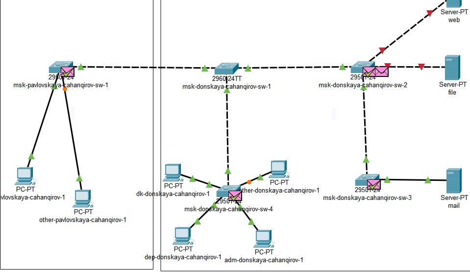

# Выводы

В процессе выполнения данной лабораторной работы я получил основные навыки по настройке VLAN на коммутаторах сети.
