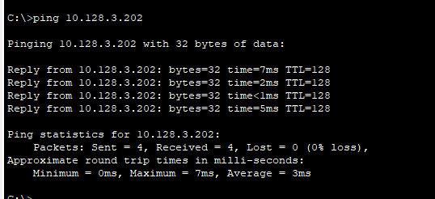

---
## Front matter
lang: ru-RU
title: Лабораторная работа №6
subtitle: Статическая маршрутизация VLAN
author:
  - Джахангиров Илгар Залид оглы
institute:
  - Российский университет дружбы народов, Москва, Россия

## i18n babel
babel-lang: russian
babel-otherlangs: english

## Formatting pdf
toc: false
toc-title: Содержание
slide_level: 2
aspectratio: 169
section-titles: true
theme: metropolis
header-includes:
 - \metroset{progressbar=frametitle,sectionpage=progressbar,numbering=fraction}
 - '\makeatletter'
 - '\beamer@ignorenonframefalse'
 - '\makeatother'
---

# Информация

## Докладчик

:::::::::::::: {.columns align=center}
::: {.column width="70%"}

  * Джахангиров Илгар Залид оглы
  * студент
  * Российский университет дружбы народов
  * [1032225689@pfur.ru]

:::
::::::::::::::

## Цель работы

Настроить статическую маршрутизацию VLAN в сети.

## Задание

1. Добавить в локальную сеть маршрутизатор, провести его первоначальную настройку.

2. Настроить статическую маршрутизацию VLAN.

3. При выполнении работы необходимо учитывать соглашение об именовании

## Выполнение лабораторной работы

Откроем файл .pkt, в котором мы выполняли предыдущую лабораторную работу(где уже есть сеть с какой-то настройкой).

В логической области проекта разместим маршрутизатор Cisco 2811, подключим его к порту 24 коммутатора msk-donskaya-sw-1 в соответствии с таблицей портов (рис. [-@fig:001]).

## Выполнение лабораторной работы

Используя приведённую в лабораторной работе последовательность команд по первоначальной настройке маршрутизатора, сконфигурируем маршрутизатор, задав на
нём имя, пароль для доступа к консоли, настроем удалённое подключение к нему по ssh

## Выполнение лабораторной работы

## Выполнение лабораторной работы

Настроем порт 24 коммутатора msk-donskaya-sw-1 как trunk-порт .

## Выполнение лабораторной работы

На интерфейсе f0/0 маршрутизатора msk-donskaya-gw-1 настроем виртуальные интерфейсы, соответствующие номерам VLAN. Согласно таблице IP-адресов (сделанной ранее) зададим соответствующие IP-адреса на виртуальных интерфейсах. Для этого используем приведённую в лабораторной работе
последовательность команд по конфигурации VLAN-интерфейсов маршрутизатора 

## Выполнение лабораторной работы

## Выполнение лабораторной работы

## Выполнение лабораторной работы

Проверим доступность оконечных устройств из разных VLAN. Зайдем в терминал ПК (dk-donskaya-dmbelicheva), посмотрим его `ipconfig`, увидим ip-адрес 10.128.3.201. Попробуем сначала пропинговать ПК из этой же сети. Как и раньше пингование проходит успешно 

## Выполнение лабораторной работы

Теперь попробуем пропинговать устройства из другой сети, по началу будет возникать задержка, потому что коммутаторы обучаются, но при повторном пингование задержка пропадает .

## Выполнение лабораторной работы

## Выполнение лабораторной работы

## Выполнение лабораторной работы

Используя режим симуляции в Packet Tracer, изучим процесс передвижения пакета ICMP по сети. Изучим содержимое передаваемого пакета и заголовки задействованных протоколов.

Сначала отправим пакет между устройствами в одной сети . Пакет движется через коммутаторы, к маршрутизатору не идет. Передача проходит успешно.

## Выполнение лабораторной работы

## Выводы

В результате выполнения лабораторной работы я настроил статическую маршрутизацию VLAN в сети.

## Контрольные вопросы

1. Охарактеризуйте стандарт IEEE 802.1Q.

IEEE 802.1Q — открытый стандарт, который описывает процедуру тегирования трафика для передачи информации о принадлежности к VLAN по сетям стандарта IEEE 802.3 Ethernet.

Так как 802.1Q не изменяет заголовки кадра (фрейма), то сетевые устройства, которые не поддерживают этот стандарт, могут передавать трафик без учёта его принадлежности к VLAN. Поскольку данный стандарт является открытым, он используется для построения «транковых» портов между оборудованием различных производителей.
802.1Q помещает внутрь фрейма тег, который передает информацию о принадлежности трафика к VLAN.

2. Опишите формат кадра IEEE 802.1Q.

Спецификация 802.1 Q определяет 12 возможных форматов инкапсуляции долнительного поля в кадры МАС-уровня. Эти форматы определяются в зависимости от трех типов кадров (Ethernet II, LLC в нормальном формате, LLC в формате Token Ring), двух типов сетей (802.3/Ethernet или Token Ring/FDDI) и двух типов меток VLAN (неявных или явных). Имеются также определенные правила трансляции исходных кадров Ethernet или Token Ring в помеченные кадры и обратной трансляции помеченных кадров в исходные.

Поле идентификатора протокола меток (Tag Protocol Identifier,TPI) заменило поле EtherType кадра Ethernet, которое заняло место после двухбайтного поля метки VLAN.

В поле метки VLAN имеется три подполя.

Подполе Priority предназначено для хранения трех бит приоритета кадра, что позволяет определить до 8 уровней приоритетов. Однобитный признак TR- Encapsulation показывает, содержат ли данные, переносимые кадром, инкапсулированный кадр формата IEEE (признак равен 1) 802.5 или же они соответствуют типу внешнего кадра (признак равен 0).

С помощью этого признака можно туннелировать трафик сетей Token Ring на коммутируемых магистралях Ethernet.

12-битный идентификатор VLAN (VID) уникально идентифицирует VLAN, к которой относится данный кадр.

Максимальный размер кадра Ethernet увеличивается при применении спецификации IEEE 802.1 Q не 4 байта- с 1518 байт до 1522 байт.