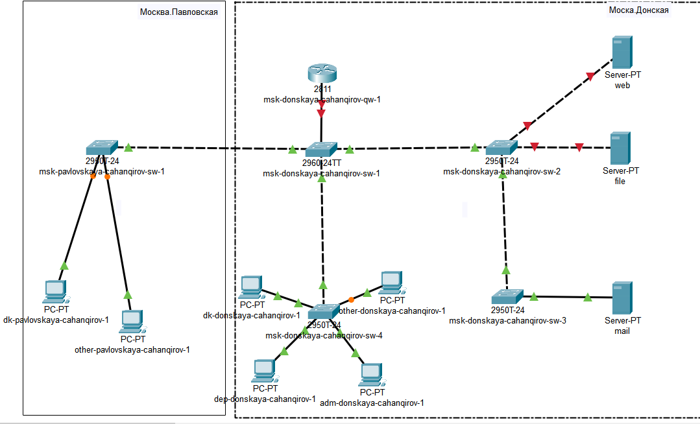
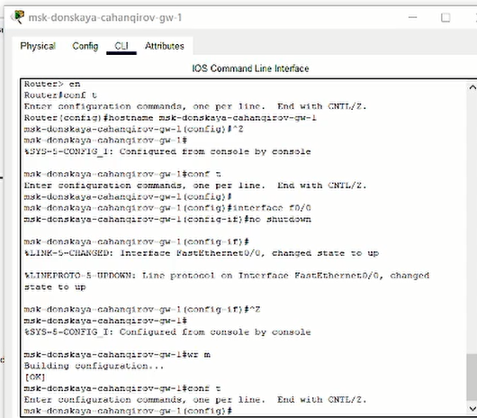
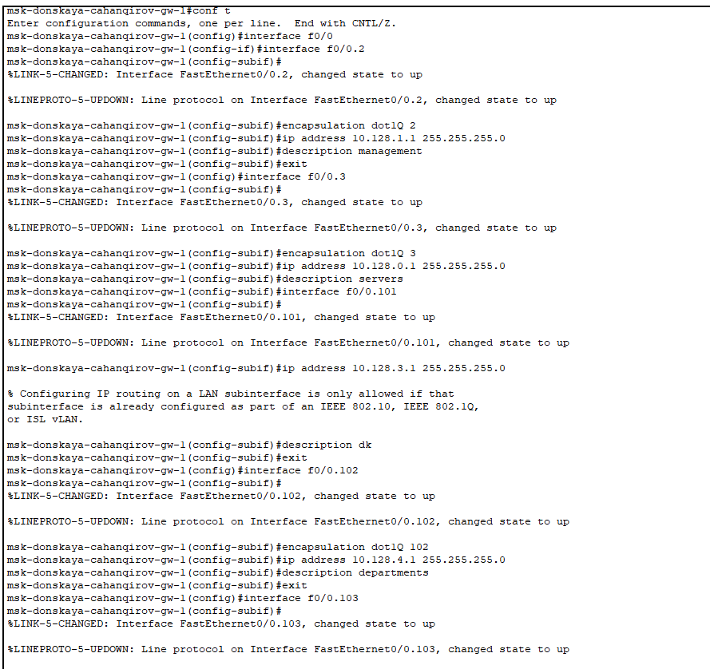
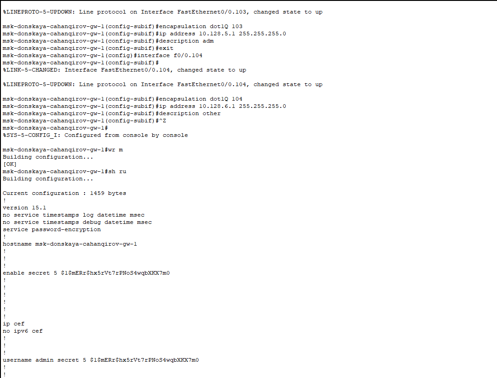
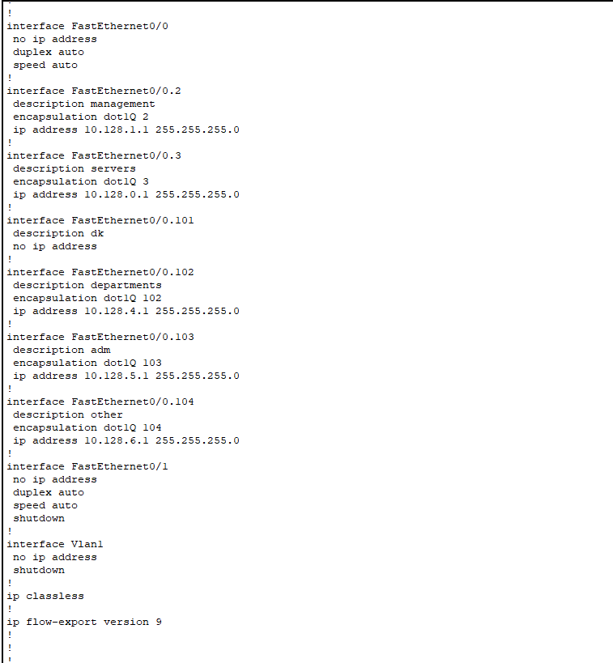
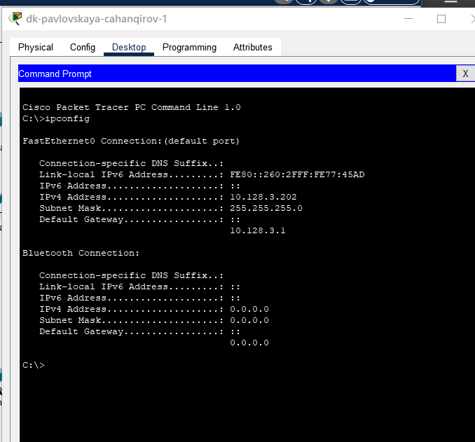
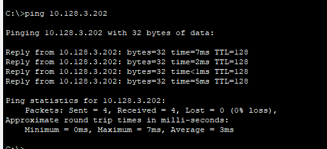
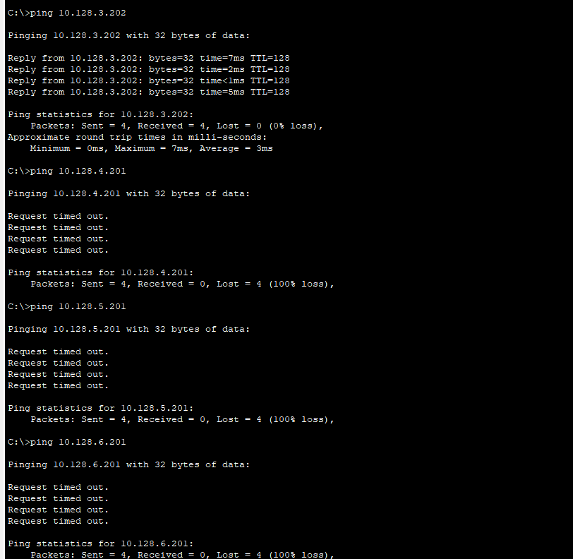
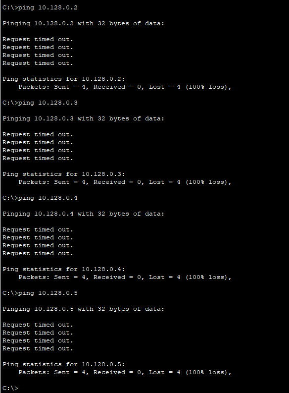
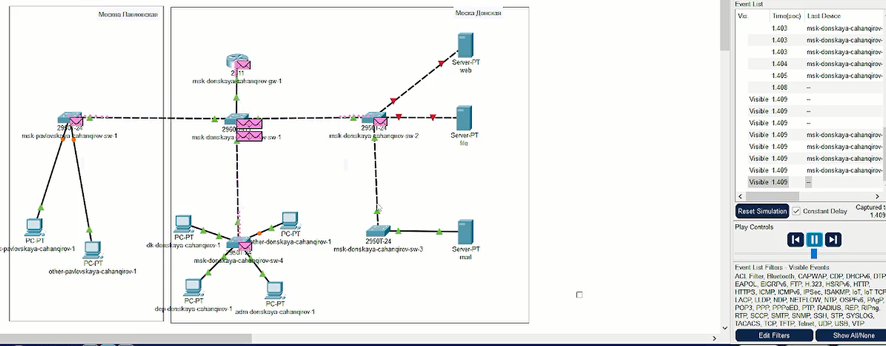

---
## Front matter
title: "Лабораторная работа № 6"
subtitle: "Статическая маршрутизация VLAN"
author: "Джахангиров Илгар Залид оглы"

## Generic otions
lang: ru-RU
toc-title: "Содержание"

## Bibliography
bibliography: bib/cite.bib
csl: pandoc/csl/gost-r-7-0-5-2008-numeric.csl

## Pdf output format
toc: true # Table of contents
toc-depth: 2
lof: true # List of figures
lot: false # List of tables
fontsize: 12pt
linestretch: 1.5
papersize: a4
documentclass: scrreprt
## I18n polyglossia
polyglossia-lang:
  name: russian
  options:
	- spelling=modern
	- babelshorthands=true
polyglossia-otherlangs:
  name: english
## I18n babel
babel-lang: russian
babel-otherlangs: english
## Fonts
mainfont: PT Serif
romanfont: PT Serif
sansfont: PT Sans
monofont: PT Mono
mainfontoptions: Ligatures=TeX
romanfontoptions: Ligatures=TeX
sansfontoptions: Ligatures=TeX,Scale=MatchLowercase
monofontoptions: Scale=MatchLowercase,Scale=0.9
## Biblatex
biblatex: true
biblio-style: "gost-numeric"
biblatexoptions:
  - parentracker=true
  - backend=biber
  - hyperref=auto
  - language=auto
  - autolang=other*
  - citestyle=gost-numeric
## Pandoc-crossref LaTeX customization
figureTitle: "Рис."
tableTitle: "Таблица"
listingTitle: "Листинг"
lofTitle: "Список иллюстраций"
lotTitle: "Список таблиц"
lolTitle: "Листинги"
## Misc options
indent: true
header-includes:
  - \usepackage{indentfirst}
  - \usepackage{float} # keep figures where there are in the text
  - \floatplacement{figure}{H} # keep figures where there are in the text
---

# Цель работы

Настроить статическую маршрутизацию VLAN в сети.

# Задание

1. Добавить в локальную сеть маршрутизатор, провести его первоначальную настройку.

2. Настроить статическую маршрутизацию VLAN.

3. При выполнении работы необходимо учитывать соглашение об именовании

# Выполнение лабораторной работы

Откроем файл .pkt, в котором мы выполняли предыдущую лабораторную работу(где уже есть сеть с какой-то настройкой).

В логической области проекта разместим маршрутизатор Cisco 2811, подключим его к порту 24 коммутатора msk-donskaya-sw-1 в соответствии с таблицей портов (рис. [-@fig:001]).

Используя приведённую в лабораторной работе последовательность команд по первоначальной настройке маршрутизатора, сконфигурируем маршрутизатор, задав на
нём имя, пароль для доступа к консоли, настроем удалённое подключение к нему по ssh

Настроем порт 24 коммутатора msk-donskaya-sw-1 как trunk-порт .

На интерфейсе f0/0 маршрутизатора msk-donskaya-gw-1 настроем виртуальные интерфейсы, соответствующие номерам VLAN. Согласно таблице IP-адресов (сделанной ранее) зададим соответствующие IP-адреса на виртуальных интерфейсах. Для этого используем приведённую в лабораторной работе
последовательность команд по конфигурации VLAN-интерфейсов маршрутизатора 

Проверим доступность оконечных устройств из разных VLAN. Зайдем в терминал ПК (dk-donskaya-dmbelicheva), посмотрим его `ipconfig`, увидим ip-адрес 10.128.3.201. Попробуем сначала пропинговать ПК из этой же сети. Как и раньше пингование проходит успешно 

Теперь попробуем пропинговать устройства из другой сети, по началу будет возникать задержка, потому что коммутаторы обучаются, но при повторном пингование задержка пропадает (рис. [-@fig:010]).

Используя режим симуляции в Packet Tracer, изучим процесс передвижения пакета ICMP по сети. Изучим содержимое передаваемого пакета и заголовки задействованных протоколов.

Сначала отправим пакет между устройствами в одной сети . Пакет движется через коммутаторы, к маршрутизатору не идет. Передача проходит успешно.

{#fig:006 width=70%}

# Выводы

В результате выполнения лабораторной работы я настроил статическую маршрутизацию VLAN в сети.

# Контрольные вопросы

1. Охарактеризуйте стандарт IEEE 802.1Q.

IEEE 802.1Q — открытый стандарт, который описывает процедуру тегирования трафика для передачи информации о принадлежности к VLAN по сетям стандарта IEEE 802.3 Ethernet.

Так как 802.1Q не изменяет заголовки кадра (фрейма), то сетевые устройства, которые не поддерживают этот стандарт, могут передавать трафик без учёта его принадлежности к VLAN. Поскольку данный стандарт является открытым, он используется для построения «транковых» портов между оборудованием различных производителей.
802.1Q помещает внутрь фрейма тег, который передает информацию о принадлежности трафика к VLAN.

2. Опишите формат кадра IEEE 802.1Q.

Спецификация 802.1 Q определяет 12 возможных форматов инкапсуляции долнительного поля в кадры МАС-уровня. Эти форматы определяются в зависимости от трех типов кадров (Ethernet II, LLC в нормальном формате, LLC в формате Token Ring), двух типов сетей (802.3/Ethernet или Token Ring/FDDI) и двух типов меток VLAN (неявных или явных). Имеются также определенные правила трансляции исходных кадров Ethernet или Token Ring в помеченные кадры и обратной трансляции помеченных кадров в исходные.

Поле идентификатора протокола меток (Tag Protocol Identifier,TPI) заменило поле EtherType кадра Ethernet, которое заняло место после двухбайтного поля метки VLAN.

В поле метки VLAN имеется три подполя.

Подполе Priority предназначено для хранения трех бит приоритета кадра, что позволяет определить до 8 уровней приоритетов. Однобитный признак TR- Encapsulation показывает, содержат ли данные, переносимые кадром, инкапсулированный кадр формата IEEE (признак равен 1) 802.5 или же они соответствуют типу внешнего кадра (признак равен 0).

С помощью этого признака можно туннелировать трафик сетей Token Ring на коммутируемых магистралях Ethernet.

12-битный идентификатор VLAN (VID) уникально идентифицирует VLAN, к которой относится данный кадр.

Максимальный размер кадра Ethernet увеличивается при применении спецификации IEEE 802.1 Q не 4 байта- с 1518 байт до 1522 байт.