---
## Front matter
lang: ru-RU
title: Лабораторная работа №7
subtitle: Учёт физических параметров сети
author:
  - Джахангиров Илгар Залид оглы
institute:
  - Российский университет дружбы народов, Москва, Россия

## i18n babel
babel-lang: russian
babel-otherlangs: english

## Formatting pdf
toc: false
toc-title: Содержание
slide_level: 2
aspectratio: 169
section-titles: true
theme: metropolis
header-includes:
 - \metroset{progressbar=frametitle,sectionpage=progressbar,numbering=fraction}
 - '\makeatletter'
 - '\beamer@ignorenonframefalse'
 - '\makeatother'
---

# Информация

## Докладчик

:::::::::::::: {.columns align=center}
::: {.column width="70%"}

  * Джахангиров Илгар Залид оглы
  * студент
  * Российский университет дружбы народов
  * [1032225689@pfur.ru]

:::
::::::::::::::

## Цель работы

Получить навыки работы с физической рабочей областью Packet Tracer,
а также учесть физические параметры сети.

## Задание

Требуется заменить соединение между коммутаторами двух территорий
msk-donskaya-sw-1 и msk-pavlovskaya-sw-1 на соединение, учитывающее физические параметры сети, а именно — расстояние между двумя
территориями.
При выполнении работы необходимо учитывать соглашение об именовании.

## Выполнение лабораторной работы

Откроем проект предыдущей лабораторной работы.

Перейдем в физическую рабочую область Packet Tracer. Присвоим название городу — Moscow (рис. [-@fig:001]).

## Выполнение лабораторной работы

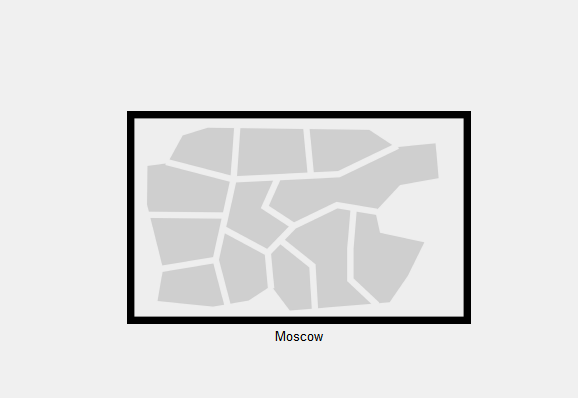

Щёлкнув на изображении города, увидим изображение здания.
Присвоим ему название Donskaya. Добавим здание для территории
Pavlovskaya (рис. [-@fig:002]).

## Выполнение лабораторной работы

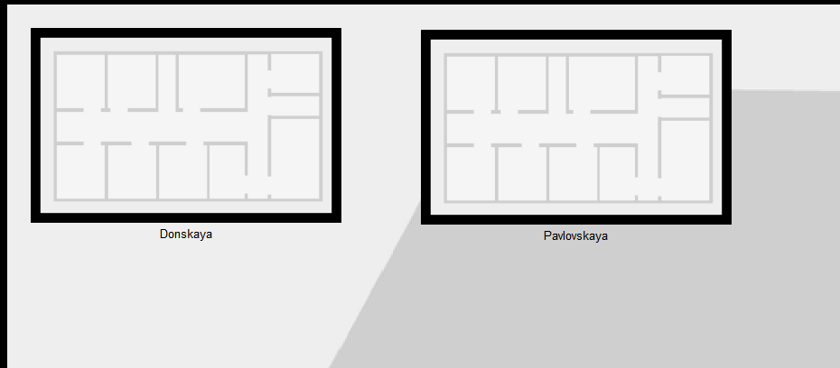

Щёлкнув на изображении здания Donskaya, переместим изображение, обозначающее серверное помещение, в него (рис. [-@fig:003]).

## Выполнение лабораторной работы

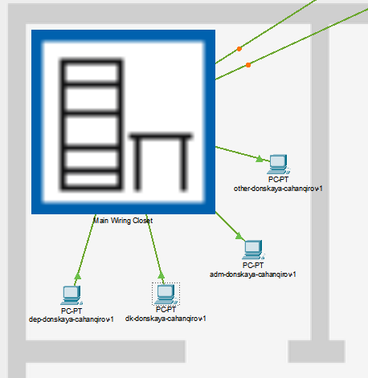
Щёлкнув на изображении серверной, увидим отображение серверных
стоек (рис. [-@fig:004]).

## Выполнение лабораторной работы

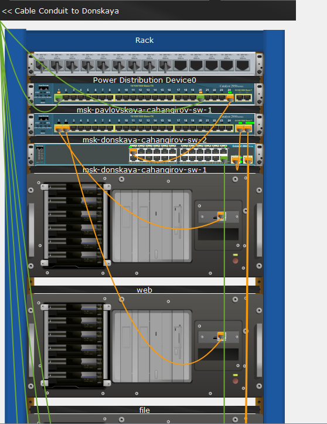

Вернувшись в логическую рабочую область Packet Tracer, пропингуем с коммутатора msk-donskaya-sw-1 коммутатор msk-pavlovskaya-sw-1 (рис. [-@fig:006]).
Убедимся в работоспособности соединения. Соединение действительно работает.

## Выполнение лабораторной работы

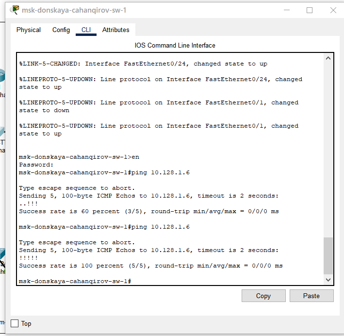

В меню Options , Preferences во вкладке Interface активируем разрешение
на учёт физических характеристик среды передачи (Enable Cable Length
Effects) (рис. [-@fig:008]).

## Выполнение лабораторной работы

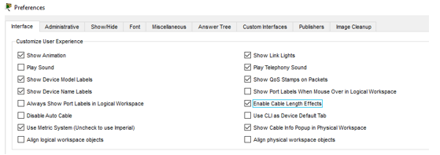

В физической рабочей области Packet Tracer разместим две территории на
расстоянии более 100 м друг от друга (рекомендуемое расстояние — около
1000 м или более).

## Выполнение лабораторной работы

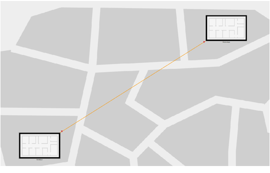

Вернувшись в логическую рабочую область Packet Tracer, пропингуем с коммутатора msk-donskaya-sw-1 коммутатор msk-pavlovskaya-sw-1 .
Убедимся в неработоспособности соединения. Соединение теперь не работоспособно.

## Выполнение лабораторной работы

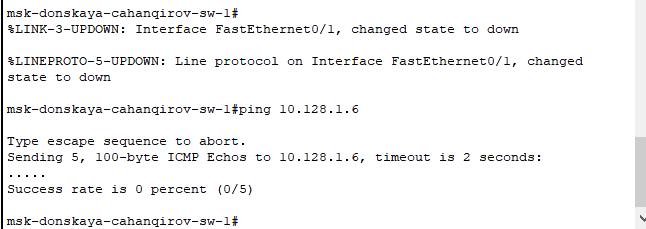

Удалим соединение между msk-donskaya-sw-1 и msk-pavlovskaya-sw-1.
Добавим в логическую рабочую область два повторителя (RepeaterPT). Присвоим им соответствующие названия msk-donskaya-mc-1
и msk-pavlovskaya-mc-1. Заменим имеющиеся модули на PT-REPEATERNM-1FFE и PT-REPEATER-NM-1CFE для подключения оптоволокна
и витой пары по технологии Fast Ethernet (рис. [-@fig:010]).

## Выполнение лабораторной работы

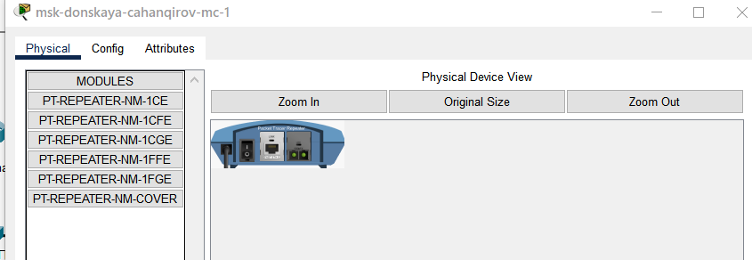

Переместим msk-pavlovskaya-mc-1 на территорию Pavlovskaya (в физической рабочей области Packet Tracer) .

## Выполнение лабораторной работы

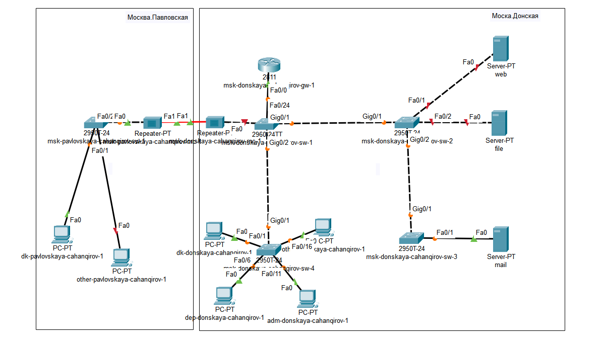

Также внесем соответствующие изменения в таблицу портов (табл. [-@tbl:fiz]).

:Таблица портов {#tbl:fiz}

| Устройство                       | Порт        | Примечание                         |
|----------------------------------|-------------|------------------------------------|
| msk-donskaya-cahanqirov-gw-1     | f0/1        | UpLink                             |
|                                  | f0/0        | msk-donskaya-cahanqirov-sw-1       |
| msk-donskaya-cahanqirov -sw-1    | f0/24       | msk-donskaya-cahanqirov-gw-1       |
|                                  | g0/1        | msk-donskaya-cahanqirov-sw-2       |
|                                  | g0/2        | msk-donskaya-cahanqirov-sw-4       |
|                                  | f0/1        | msk-donskaya-cahanqirov-mc-1       |
| msk-donskaya-cahanqirov -sw-2    | g0/1        | msk-donskaya-cahanqirov-sw-1       |
|                                  | f0/1        | Web-server                         |
|                                  | g0/2        | msk-donskaya-cahanqirov-sw-3       |
|                                  | f0/2        | File-server                        |
| msk-donskaya-cahanqirov -sw-3    | g0/1        | msk-donskaya-cahanqirov-sw-2       |
|                                  | f0/2        | Dns-server                         |
|                                  | f0/1        | Mail-server                        |
| msk-donskaya-cahanqirov -sw-4    | g0/1        | msk-donskaya-cahanqirov-sw-1       |
|                                  | f0/6–f0/10  | departments                        |
|                                  | f0/1–f0/5   | dk                                 |
|                                  | f0/11–f0/15 | adm                                |
|                                  | f0/16–f0/24 | other                              |
| msk-donskaya-cahanqirov-mc-1     | f0/0        | msk-donskaya-cahanqirov-sw-1       |
|                                  | f0/1        | msk-pavlovskaya-cahanqirov-mc-1    |
| msk-pavlovskaya-cahanqirov-mc-1  | f0/0        | msk-pavlovskaya-cahanqirov-sw-1    |
|                                  | f0/1        | msk-donskaya-cahanqirov-mc-1       |
| msk-pavlovskaya-cahanqirov-sw-1  | f0/24       | msk-pavlovskaya-cahanqirov-mc-1    |
|                                  | f0/1–f0/15  | dk                                 |
|                                  | f0/20       | other                              |

Убедимся в работоспособности соединения между msk-donskaya-sw-1
и msk-pavlovskaya-sw-1 (рис. [-@fig:017]).

## Выполнение лабораторной работы

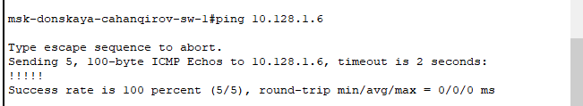

## Выводы

В результате выполнения лабораторной работы я получил навыки работы с физической рабочей областью Packet Tracer,
а также учитывала физические параметры сети.

