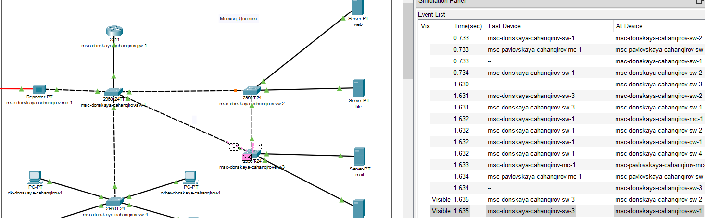
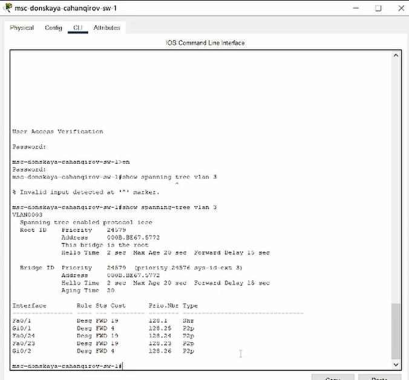
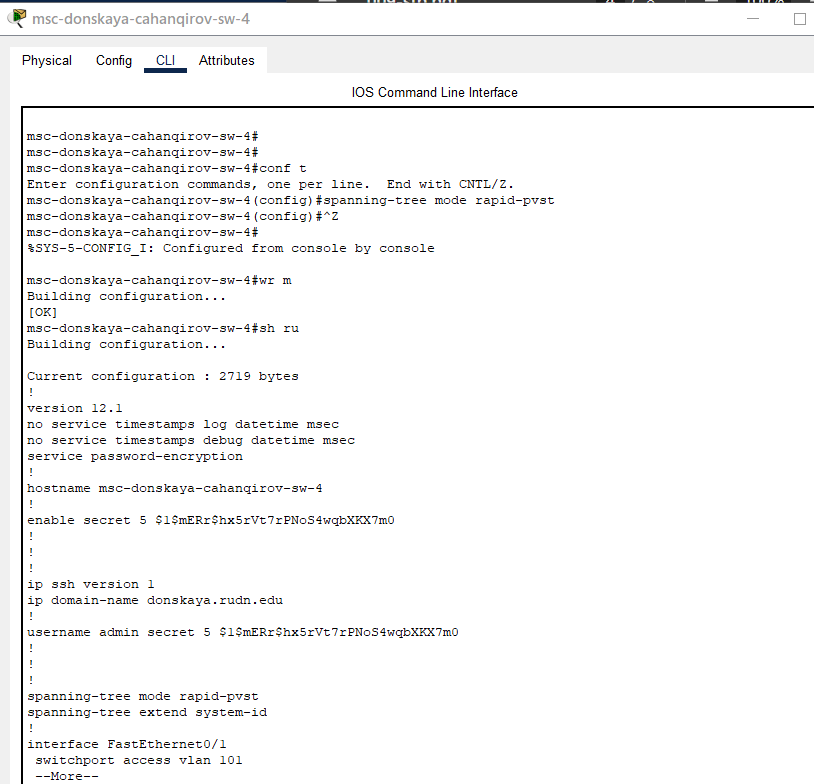

---
## Front matter
lang: ru-RU
title: Лабораторная работа №8
subtitle: Настройка сетевых сервисов.DHCP
author:
  - Джахангиров Илгар Залид оглы
institute:
  - Российский университет дружбы народов, Москва, Россия

## i18n babel
babel-lang: russian
babel-otherlangs: english

## Formatting pdf
toc: false
toc-title: Содержание
slide_level: 2
aspectratio: 169
section-titles: true
theme: metropolis
header-includes:
 - \metroset{progressbar=frametitle,sectionpage=progressbar,numbering=fraction}
 - '\makeatletter'
 - '\beamer@ignorenonframefalse'
 - '\makeatother'
---

# Информация

## Докладчик

:::::::::::::: {.columns align=center}
::: {.column width="70%"}

  * Джахангиров Илгар Залид оглы
  * студент
  * Российский университет дружбы народов
  * [1032225689@pfur.ru]

:::
::::::::::::::

## Цель работы

Приобрести практические навыки по настройке динамического распределения IP-адресов посредством протокола DHCP (Dynamic Host Configuration Protocol) в локальной сети.

## Задание

1. Добавить DNS-записи для домена donskaya.rudn.ru на сервер dns.
2. Настроить DHCP-сервис на маршрутизаторе.
3. Заменить в конфигурации оконечных устройствах статическое распределение адресов на динамическое.
4. При выполнении работы необходимо учитывать соглашение об именовании.

## Выполнение лабораторной работы

В логическую рабочую область проекта добавим сервер dns и подключим
его к коммутатору msk-donskaya-sw-3 через порт Fa0/2, не забыв
активировать порт при помощи соответствующих команд на коммутаторе .

В конфигурации сервера укажем в качестве адреса шлюза 10.128.0.1 (рис. [-@fig:002]),
а в качестве адреса самого сервера — 10.128.0.5 с соответствующей маской
255.255.255.0 (рис. [-@fig:003]).

## Выполнение лабораторной работы

## Выполнение лабораторной работы

- в конфигурации сервера выберем службу DNS, активируем её (выбрав
флаг On);
- в поле Type в качестве типа записи DNS выберем записи типа A(A Record);
- в поле Name укажем доменное имя, по которому можно обратиться, например, к web-серверу — www.donskaya.rudn.ru, затем укажем его IP-адрес в соответствующем поле 10.128.0.2;
- нажав на кнопку Add , добавьте DNS-запись на сервер;
- аналогичным образом добавим DNS-записи для серверов mail, file, dns согласно распределению адресов из таблицы, сделанной в лабораторной работе №3;
- сохраним конфигурацию сервера.

## Выполнение лабораторной работы

Настроем DHCP-сервис на маршрутизаторе, используя приведённые в лабораторной работе №8
команды для каждой выделенной сети
- укажем IP-адрес DNS-сервера;
- перейдем к настройке DHCP; 
- зададим название конфигурируемому
диапазону адресов (пулу адресов), укажем адрес сети, а также адреса шлюза и DNS-сервера; 
- зададим пулы адресов, исключаемых из динамического
распределения (см. табл. [-@tbl:reg]).

:Регламент выделения ip-адресов (для сети класса C) {#tbl:reg}

| IP-адреса | Назначение           |
|-----------|----------------------|
| 1         | Шлюз                 |
| 2–19      | Сетевое оборудование |
| 20–29     | Серверы              |
| 30–199    | Компьютеры, DHCP     |
| 200–219   | Компьютеры, Static   |
| 220–229   | Принтеры             |
| 230–254   | Резерв               |

## Выполнение лабораторной работы

## Выполнение лабораторной работы

## Выполнение лабораторной работы

Изначально у нас были заданы статические ip-адреса, можем посмотреть их с помощью команды `ipconfig` 

## Выполнение лабораторной работы

Теперь на оконечных устройствах заменим в настройках статическое распределение адресов на динамическое =.

## Выполнение лабораторной работы

## Выполнение лабораторной работы

В режиме симуляции изучим, каким образом происходит запрос адреса по
протоколу DHCP  (какие сообщения и какие отклики передаются по сети).

## Выполнение лабораторной работы 

Можем также посмотреть список событий, чтобы понять, как происходит запрос Оконечное устройство отправляет запрос на получение ip-адреса по протоколу DHCP. Сначала DHCP-пакет рассылается всем устройствам сети и принимается маршрутизатором. В заголовках DHCP при этом указан только MAC-адрес устройства, которому нужен адрес, ip-адреса еще нет 

## Выполнение лабораторной работы

## Выполнение лабораторной работы

## Выводы

В процессе выполнения данной лабораторной работы я приобрел практические навыки по настройке динамического распределения IP-адресов посредством протокола DHCP (Dynamic Host Configuration Protocol) в локальной сети.

## Контрольные вопросы

1. За что отвечает протокол DHCP?

Протокол DHCP — это стандартный протокол, определяемый RFC 1541 (который заменяется RFC 2131), позволяющий серверу динамически распределять IP-адреса и сведения о конфигурации клиентам.

2. Какие типы DHCP-сообщений передаются по сети?

По данным источника, в DHCP-протоколе используются следующие типы сообщений:

* DHCPDISCOVER — клиент отправляет пакет, пытаясь найти сервер DHCP в сети.

* DHCPOFFER — сервер отправляет пакет, включающий предложение использовать уникальный IP-адрес.

* DHCPREQUEST — клиент отправляет пакет с просьбой выдать в аренду предложенный уникальный адрес.

* DHCPACK — сервер отправляет пакет, в котором утверждается запрос клиента на использование IP-адреса.

3. Какие параметры могут быть переданы в сообщениях DHCP?

Параметры DHCP могут включать IP-адреса, шлюзы, DNS-серверы, временные интервалы аренды и другие настройки сети.

4. Что такое DNS?

DNS (Система доменных имён, англ. Domain Name System) — это иерархическая децентрализованная система именования для интернет-ресурсов подключённых к Интернет, которая ведёт список доменных имён вместе с их числовыми IP-адресами или местонахождениями. DNS позволяет перевести простое запоминаемое имя хоста в IP-адрес.

5. Какие типы записи описания ресурсов есть в DNS и для чего они используются? 
 
Основными ресурсными записями DNS являются:

* A-запись — одна из самых важных записей. Именно эта запись указывает на IP-адрес сервера, который привязан к доменному имени.
* MX-запись — указывает на сервер, который будет использован при отсылке доменной электронной почты.
* NS-запись — указывает на DNS-сервер домена.
* CNAME-запись — позволяет одному из поддоменов дублировать DNS-записи своего родителя.