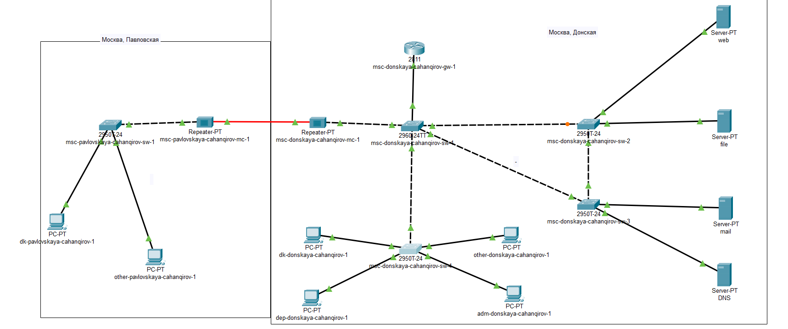

---
## Front matter
lang: ru-RU
title: Лабораторная работа №9
subtitle: Лабораторная работа № 9. Использование протокола STP. Агрегирование каналов
author:
  - Джахангиров Илгар Залид оглы
institute:
  - Российский университет дружбы народов, Москва, Россия

## i18n babel
babel-lang: russian
babel-otherlangs: english

## Formatting pdf
toc: false
toc-title: Содержание
slide_level: 2
aspectratio: 169
section-titles: true
theme: metropolis
header-includes:
 - \metroset{progressbar=frametitle,sectionpage=progressbar,numbering=fraction}
 - '\makeatletter'
 - '\beamer@ignorenonframefalse'
 - '\makeatother'
---

# Информация

## Докладчик

:::::::::::::: {.columns align=center}
::: {.column width="70%"}

  * Джахангиров Илгар Залид оглы
  * студент
  * Российский университет дружбы народов
  * [1032225689@pfur.ru]

:::
::::::::::::::

## Цель работы

Изучить возможности протокола STP и его модификаций по обеспечению
отказоустойчивости сети, агрегированию интерфейсов и перераспределению
нагрузки между ними.

## Задание

1. Сформировать резервное соединение между коммутаторами msk-donskayasw-1 и msk-donskaya-sw-3.

2. Настроить балансировку нагрузки между резервными соединениями.

3. Настроить режим Portfast на тех интерфейсах коммутаторов, к которым подключены серверы.

4. Изучить отказоустойчивость резервного соединения.

5. Сформировать и настроить агрегированное соединение интерфейсов Fa0/20 -- Fa0/23 между коммутаторами msk-donskaya-sw-1 и msk-donskaya-sw-4.

6. При выполнении работы необходимо учитывать соглашение об именовании.

## Выполнение лабораторной работы

Сформируем резервное соединение между коммутаторами msk-donskayasw-1 и msk-donskaya-sw-3 (рис. [-@fig:001]). Для этого:

- заменим соединение между коммутаторами msk-donskaya-sw-1(Gig0/2) и msk-donskaya-sw-4 (Gig0/1) на соединение между коммутаторами msk-donskaya-sw-1 (Gig0/2) и msk-donskaya-sw-3 (Gig0/2);
  
- сделаем порт на интерфейсе Gig0/2 коммутатора msk-donskaya-sw-3 транковым (рис. [-@fig:002]);

- соединение между коммутаторами msk-donskaya-sw-1 и msk-donskayasw-4 сделаем через интерфейсы Fa0/23, не забыв активировать их в транковом режиме (рис. [-@fig:003,-@fig:004]).

## Выполнение лабораторной работы

## Выполнение лабораторной работы

## Выполнение лабораторной работы

С оконечного устройства dk-donskaya-1 пропингуем серверы mail и web 

## Выполнение лабораторной работы

В режиме симуляции проследим движение пакетов ICMP. Убедимся, что движение пакетов происходит через коммутатор msk-donskaya-sw-2 

## Выполнение лабораторной работы 

## Выполнение лабораторной работы

На коммутаторе msk-donskaya-sw-2 посмотрим состояние протокола STP для vlan 3 (рис. [-@fig:008]):

## Выполнение лабораторной работы

В качестве корневого коммутатора STP настроем коммутатор msk-donskaya-sw-1 (рис. [-@fig:009]):

## Выполнение лабораторной работы

Используя режим симуляции, убедимся, что пакеты ICMP пойдут от
хоста dk-donskaya-1 до mail через коммутаторы msk-donskaya-sw-1 и mskdonskaya-sw-3, а от хоста dk-donskaya-1 до web через коммутаторы
msk-donskaya-sw-1 и msk-donskaya-sw-2 

## Выполнение лабораторной работы

## Выполнение лабораторной работы

Настроим режим Portfast на тех интерфейсах коммутаторов, к которым
подключены серверы 

## Выполнение лабораторной работы

## Выполнение лабораторной работы

Изучим отказоустойчивость протокола STP и время восстановления соединения при переключении на резервное соединение. Для этого используем
команду `ping -n 1000 mail.donskaya.rudn.ru` на хосте dk-donskaya-1 (рис. [-@fig:014]),
а разрыв соединения обеспечим переводом соответствующего интерфейса
коммутатора в состояние shutdown (рис. [-@fig:015]).

## Выполнение лабораторной работы

## Выполнение лабораторной работы

Видно, что на время восстановления соединения потребовалось 4 пинга, что достаточно долго (рис. [-@fig:016]). После восстановление пингование продолжило работать, как и в начале.

## Выполнение лабораторной работы

Переключим коммутаторы в режим работы по протоколу Rapid PVST+ 

## Выполнение лабораторной работы

## Выполнение лабораторной работы

## Выполнение лабораторной работы

## Выполнение лабораторной работы

## Выполнение лабораторной работы

Изучим теперь отказоустойчивость протокола Rapid PVST+ и время восстановления соединения при переключении на резервное соединение 

## Выполнение лабораторной работы

Сразу после разрыва соединения задержки по времени вообще не было, сесть моментально перестроилась.

А вот, когда обратно вернули старое соединение потребовался 1 пинг, что достаточно быстро (рис. [-@fig:024]). После восстановление пингование продолжило работать, как и в начале.

## Выполнение лабораторной работы

Сформируем агрегированное соединение интерфейсов Fa0/20 – Fa0/23
между коммутаторами msk-donskaya-sw-1 и msk-donskaya-sw-4 (рис. [-@fig:029]).

## Выполнение лабораторной работы

Настроим агрегирование каналов (режим EtherChannel) (рис. [-@fig:024--@fig:028]):

## Выполнение лабораторной работы

## Выполнение лабораторной работы

## Выводы

В результате выполнения лабораторной работы я изучил возможности протокола STP и его модификаций по обеспечению
отказоустойчивости сети, агрегированию интерфейсов и перераспределению нагрузки между ними.

