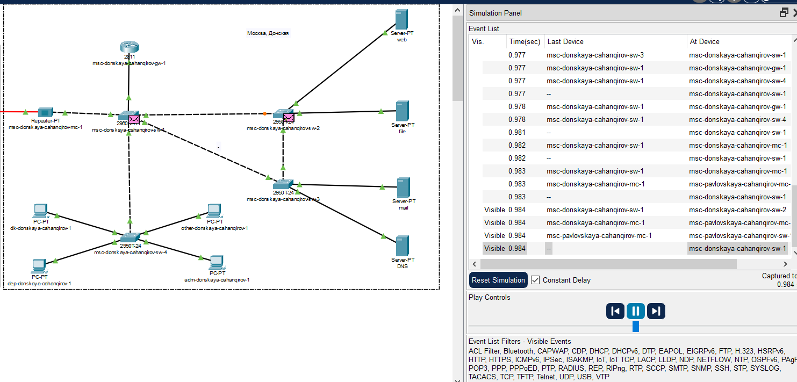

---
## Front matter
title: "Лабораторная работа № 9"
subtitle: "Использование протокола STP. Агрегирование каналов"
author: "Джахангиров Илгар Залид оглы"

## Generic otions
lang: ru-RU
toc-title: "Содержание"

## Bibliography
bibliography: bib/cite.bib
csl: pandoc/csl/gost-r-7-0-5-2008-numeric.csl

## Pdf output format
toc: true # Table of contents
toc-depth: 2
lof: true # List of figures
lot: false # List of tables
fontsize: 12pt
linestretch: 1.5
papersize: a4
documentclass: scrreprt
## I18n polyglossia
polyglossia-lang:
  name: russian
  options:
	- spelling=modern
	- babelshorthands=true
polyglossia-otherlangs:
  name: english
## I18n babel
babel-lang: russian
babel-otherlangs: english
## Fonts
mainfont: PT Serif
romanfont: PT Serif
sansfont: PT Sans
monofont: PT Mono
mainfontoptions: Ligatures=TeX
romanfontoptions: Ligatures=TeX
sansfontoptions: Ligatures=TeX,Scale=MatchLowercase
monofontoptions: Scale=MatchLowercase,Scale=0.9
## Biblatex
biblatex: true
biblio-style: "gost-numeric"
biblatexoptions:
  - parentracker=true
  - backend=biber
  - hyperref=auto
  - language=auto
  - autolang=other*
  - citestyle=gost-numeric
## Pandoc-crossref LaTeX customization
figureTitle: "Рис."
tableTitle: "Таблица"
listingTitle: "Листинг"
lofTitle: "Список иллюстраций"
lotTitle: "Список таблиц"
lolTitle: "Листинги"
## Misc options
indent: true
header-includes:
  - \usepackage{indentfirst}
  - \usepackage{float} # keep figures where there are in the text
  - \floatplacement{figure}{H} # keep figures where there are in the text
---

# Цель работы

Изучить возможности протокола STP и его модификаций по обеспечению
отказоустойчивости сети, агрегированию интерфейсов и перераспределению
нагрузки между ними.

# Задание

1. Сформировать резервное соединение между коммутаторами msk-donskayasw-1 и msk-donskaya-sw-3.

2. Настроить балансировку нагрузки между резервными соединениями.

3. Настроить режим Portfast на тех интерфейсах коммутаторов, к которым подключены серверы.

4. Изучить отказоустойчивость резервного соединения.

5. Сформировать и настроить агрегированное соединение интерфейсов Fa0/20 -- Fa0/23 между коммутаторами msk-donskaya-sw-1 и msk-donskaya-sw-4.

6. При выполнении работы необходимо учитывать соглашение об именовании.

# Выполнение лабораторной работы

Сформируем резервное соединение между коммутаторами msk-donskayasw-1 и msk-donskaya-sw-3 (рис. [-@fig:001]). Для этого:

- заменим соединение между коммутаторами msk-donskaya-sw-1(Gig0/2) и msk-donskaya-sw-4 (Gig0/1) на соединение между коммутаторами msk-donskaya-sw-1 (Gig0/2) и msk-donskaya-sw-3 (Gig0/2);
  
- сделаем порт на интерфейсе Gig0/2 коммутатора msk-donskaya-sw-3 транковым (рис. [-@fig:002]);

- соединение между коммутаторами msk-donskaya-sw-1 и msk-donskayasw-4 сделаем через интерфейсы Fa0/23, не забыв активировать их в транковом режиме (рис. [-@fig:003,-@fig:004]).

С оконечного устройства dk-donskaya-1 пропингуем серверы mail и web (рис. [-@fig:005]).

В режиме симуляции проследим движение пакетов ICMP. Убедимся, что движение пакетов происходит через коммутатор msk-donskaya-sw-2 

На коммутаторе msk-donskaya-sw-2 посмотрим состояние протокола STP для vlan 3 (рис. [-@fig:008]):

В качестве корневого коммутатора STP настроем коммутатор msk-donskaya-sw-1 (рис. [-@fig:009]):

Используя режим симуляции, убедимся, что пакеты ICMP пойдут от
хоста dk-donskaya-1 до mail через коммутаторы msk-donskaya-sw-1 и mskdonskaya-sw-3, а от хоста dk-donskaya-1 до web через коммутаторы
msk-donskaya-sw-1 и msk-donskaya-sw-2 (рис. [-@fig:010,-@fig:011]).

Настроим режим Portfast на тех интерфейсах коммутаторов, к которым
подключены серверы (рис. [-@fig:012,-@fig:013]):

Изучим отказоустойчивость протокола STP и время восстановления соединения при переключении на резервное соединение. Для этого используем
команду `ping -n 1000 mail.donskaya.rudn.ru` на хосте dk-donskaya-1 (рис. [-@fig:014]),
а разрыв соединения обеспечим переводом соответствующего интерфейса
коммутатора в состояние shutdown (рис. [-@fig:015]).

Видно, что на время восстановления соединения потребовалось 4 пинга, что достаточно долго (рис. [-@fig:016]). После восстановление пингование продолжило работать, как и в начале.

Переключим коммутаторы в режим работы по протоколу Rapid PVST+ (рис. [-@fig:017,-@fig:018,-@fig:019,-@fig:020]):

Изучим теперь отказоустойчивость протокола Rapid PVST+ и время восстановления соединения при переключении на резервное соединение 

Сразу после разрыва соединения задержки по времени вообще не было, сесть моментально перестроилась.

А вот, когда обратно вернули старое соединение потребовался 1 пинг, что достаточно быстро (рис. [-@fig:024]). После восстановление пингование продолжило работать, как и в начале.

Сформируем агрегированное соединение интерфейсов Fa0/20 – Fa0/23
между коммутаторами msk-donskaya-sw-1 и msk-donskaya-sw-4 (рис. [-@fig:029]).

Настроим агрегирование каналов (режим EtherChannel) (рис. [-@fig:024--@fig:028]):

# Выводы

В результате выполнения лабораторной работы я изучил возможности протокола STP и его модификаций по обеспечению
отказоустойчивости сети, агрегированию интерфейсов и перераспределению нагрузки между ними.

