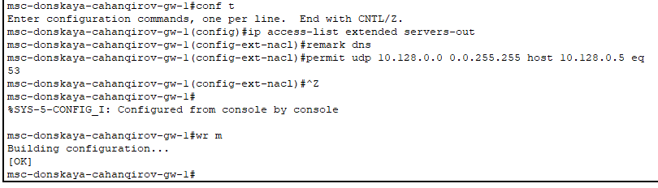

---
## Front matter
lang: ru-RU
title: Лабораторная работа №10
subtitle: Настройка списков управления доступом (ACL)
author:
  - Джахангиров Илгар Залид оглы
institute:
  - Российский университет дружбы народов, Москва, Россия

## i18n babel
babel-lang: russian
babel-otherlangs: english

## Formatting pdf
toc: false
toc-title: Содержание
slide_level: 2
aspectratio: 169
section-titles: true
theme: metropolis
header-includes:
 - \metroset{progressbar=frametitle,sectionpage=progressbar,numbering=fraction}
 - '\makeatletter'
 - '\beamer@ignorenonframefalse'
 - '\makeatother'
---

# Информация

## Докладчик

:::::::::::::: {.columns align=center}
::: {.column width="70%"}

  * Джахангиров Илгар Залид оглы
  * студент
  * Российский университет дружбы народов
  * [1032225689@pfur.ru]

:::
::::::::::::::

## Цель работы

Освоить настройку прав доступа пользователей к ресурсам сети.

## Задание

1. Требуется настроить следующие правила доступа:
   - web-сервер: разрешить доступ всем пользователям по протоколу HTTP
через порт 80 протокола TCP, а для администратора открыть доступ
по протоколам Telnet и FTP;
   - файловый сервер: с внутренних адресов сети доступ открыт по портам
для общедоступных каталогов, с внешних — доступ по протоколу FTP;
   - почтовый сервер: разрешить пользователям работать по протоколам
SMTP и POP3 (соответственно через порты 25 и 110 протокола TCP),
а для администратора — открыть доступ по протоколам Telnet и FTP;
   - DNS-сервер: открыть порт 53 протокола UDP для доступа из внутренней сети;
   - разрешить icmp-сообщения, направленные в сеть серверов;
   - запретить для сети Other любые запросы за пределы сети, за исключением администратора;
   - разрешить доступ в сеть управления сетевым оборудованием только
администратору сети.
2. Требуется проверить правильность действия установленных правил доступа.
3. Требуется выполнить задание для самостоятельной работы по настройке
прав доступа администратора сети на Павловской.
4. При выполнении работы необходимо учитывать соглашение об именовании.

## Выполнение лабораторной работы

В рабочей области проекта подключим ноутбук администратора с именем
admin к сети к other-donskaya-1 (рис. [-@fig:001]) с тем, чтобы разрешить ему потом любые
действия, связанные с управлением сетью. Для этого подсоединим ноутбук
к порту 24 коммутатора msk-donskaya-sw-4 и присвоим ему статический
адрес 10.128.6.200 (рис. [-@fig:002]), указав в качестве gateway-адреса 10.128.6.1 и адреса
DNS-сервера 10.128.0.5 (рис. [-@fig:003]).

## Выполнение лабораторной работы

## Выполнение лабораторной работы

## Выполнение лабораторной работы

Проверим, что у ноутбука корректно работает соединение через пингование разных устройств сети, например серверов (рис. [-@fig:004]).

## Выполнение лабораторной работы

На оборудовании Cisco правила в списке доступа
проверяются по порядку сверху вниз до первого совпадения — как только
одно из правил сработало, проверка списка правил прекращается и обработка
трафика происходит на основе сработавшего правила. Поэтому
сначала мы надо давать разрешение (permit) на какое-то действие, а уже потом накладывать ограничения (deny).

Настроем доступ к web-серверу по порту tcp 80 (рис.[-@fig:005]). Мы создаем список контроля доступа с названием servers-out (так как
предполагается ограничить доступ в конкретные подсети и по отношению к маршрутизатору это будет исходящий трафик); указано (в качестве
комментария-напоминания remark web), что ограничения предназначены
для работы с web-сервером, а также даем разрешение доступа (permit) по протоколу TCP всем (any) пользователям сети (host) на доступ к web-серверу,
имеющему адрес 10.128.0.2, через порт 80.
  

## Выполнение лабораторной работы

Добавим список управления доступом к интерфейсу (рис.[-@fig:006]). К интерфейсу f0/0.3 подключается список прав доступа servers-out и применяется к исходящему трафику (out).

## Выполнение лабораторной работы

Проверим, что доступ к web-серверу есть через протокол HTTP,введя в строке браузера хоста ip-адрес web-сервера (рис.[-@fig:007]). При этом команда ping будет демонстрировать недоступность web-сервера как по имени, так и по ip-адресу web-сервера (рис.[-@fig:008]).

## Выполнение лабораторной работы

## Выполнение лабораторной работы

Настроем дополнительный доступ для администратора по протоколам Telnet и FTP (рис.[-@fig:009]). В список контроля доступа servers-out добавлено правило, разрешающее устройству администратора с ip-адресом 10.128.6.200 доступ на
web-сервер (10.128.0.2) по протоколам FTP и telnet.

## Выполнение лабораторной работы

Убедимся, что с узла с ip-адресом 10.128.6.200 есть доступ по протоколу FTP (рис.[-@fig:010]). Для этого в командной строке устройства администратора введем
ftp 10.128.0.2, а затем по запросу имя пользователя cisco и пароль cisco, увидим, что доступ действительно есть.

## Выполнение лабораторной работы

Попробуем провести аналогичную процедуру с другого устройства сети (рис.[-@fig:011]). Увидим, что доступ запрещён.

## Выполнение лабораторной работы

Настроем доступ к файловому серверу (рис.[-@fig:012]). В списке контроля доступа servers-out указано (в качестве
комментария-напоминания remark file), что следующие ограничения
предназначены для работы с file-сервером; всем узлам внутренней сети
(10.128.0.0) разрешён доступ по протоколу SMB (работает через порт 445
протокола TCP) к каталогам общего пользования; любым узлам разрешён
доступ к file-серверу по протоколу FTP. Запись 0.0.255.255 — обратная маска (wildcard mask).

## Выполнение лабораторной работы

Настроем доступ к почтовому серверу (рис.[-@fig:013]). В списке контроля доступа servers-out указано (в качестве
комментария-напоминания remark mail), что следующие ограничения предназначены для работы с почтовым сервером; всем разрешён доступ
к почтовому серверу по протоколам POP3 и SMTP.

## Выполнение лабораторной работы

Настроем доступ к DNS-серверу (рис.[-@fig:014]). В списке контроля доступа servers-out указано (в качестве
комментария-напоминания remark dns), что следующие ограничения предназначены для работы с DNS-сервером; всем узлам внутренней сети разрешён доступ к DNS-серверу через UDP-порт 53.

## Выполнение лабораторной работы

Разрешим icmp-запросы (рис.[-@fig:017]).

## Выполнение лабораторной работы

Посмотрим номера строк правил в списке контроля доступа (рис.[-@fig:018]).

## Выполнение лабораторной работы

Настроем доступ для сети Other (рис.[-@fig:019]). Наложим ограничение на
исходящий из сети Other трафик, который по отношению к маршрутизатору
msk-donskaya-gw-1 является входящим трафиком. В списке контроля доступа other-in указано, что следующие правила
относятся к администратору сети; даётся разрешение устройству с адресом 10.128.6.200 на любые действия (any); к интерфейсу f0/0.104 подключается
список прав доступа other-in и применяется к входящему трафику (in).

## Выполнение лабораторной работы

Настроем доступ администратора к сети сетевого оборудования (рис.[-@fig:020]). В списке контроля доступа management-out указано (в качестве
комментария-напоминания remark admin), что устройству администратора с адресом 10.128.6.200 разрешён доступ к сети сетевого оборудования
(10.128.1.0); к интерфейсу f0/0.2 подключается список прав доступа
management-out и применяется к исходящему трафику (out).

## Выполнение лабораторной работы

Проверим получившийся список контроля доступа (рис.[-@fig:021]).

## Выполнение лабораторной работы

## Выводы

В процессе выполнения данной лабораторной работы я освоил настройку прав доступа пользователей к ресурсам сети.