---
## Front matter
lang: ru-RU
title: Лабораторная работа №11
subtitle: Настройка NAT.Планирование
author:
  - Джахангиров Илгар Залид оглы
institute:
  - Российский университет дружбы народов, Москва, Россия

## i18n babel
babel-lang: russian
babel-otherlangs: english

## Formatting pdf
toc: false
toc-title: Содержание
slide_level: 2
aspectratio: 169
section-titles: true
theme: metropolis
header-includes:
 - \metroset{progressbar=frametitle,sectionpage=progressbar,numbering=fraction}
 - '\makeatletter'
 - '\beamer@ignorenonframefalse'
 - '\makeatother'
---

# Информация

## Докладчик

:::::::::::::: {.columns align=center}
::: {.column width="70%"}

  * Джахангиров Илгар Залид оглы
  * студент
  * Российский университет дружбы народов
  * [1032225689@pfur.ru]

:::
::::::::::::::

## Цель работы

Провести подготовительные мероприятия по подключению локальной сети
организации к Интернету.

## Задание

1. Построить схему подсоединения локальной сети к Интернету;
2. Построить модельные сети провайдера и сети Интернет;
3. Построить схемы сетей L1, L2, L3;
4. При выполнении работы необходимо учитывать соглашение об именовании.

## Выполнение лабораторной работы

Модельные предположения:

- В сети провайдера располагаются 2 медиаконвертера provider-mc-1 и provider-mc-2 для связи с подсетью «Донская» и сетью модельного Интернета, маршрутизатор provider-gw-1 и коммутатор provider-sw-1. Оборудование соединяется между собой по Fast Ethernet согласно схеме.
- В модельной сети Интернет располагаются 4 сервера www.yandex.ru, www.rudn.ru, stud.rudn.university и esystem.pfur.ru, коммутатор internet-sw-1 и медиаконвертер internet-mc-1 для связи с сетью провайдера. Серверы подключены к коммутатору посредством Fast Ethernet, коммутатор подсоединён к медиаконвертеру также по Fast Ethernet.
- Имена и адреса серверам Интернета и маршрутизатору провайдера задаются согласно табл. [-@tbl:ip]. При этом учитывается, что под сеть адресов модельного Интернета выделяется адрес 192.0.2.0/24, а под сеть провайдера
- 198.51.100.1 (как рекомендовано в [4] для использования в примерах и документации при описании тестовых сетей).

: Распределение ip-адресов модельного Интернета {#tbl:ip}

| IP-адреса     | Примечание            |
|---------------|-----------------------|
| 192.0.2.1     | provider-gw-1         |
| 192.0.2.11    | www.yandex.ru         |
| 192.0.2.12    | stud.rudn.university  |
| 192.0.2.13    | esystem.pfur.ru       |
| 192.0.2.14    | www.rudn.ru           |

Network Address Translation (NAT) — механизм преобразования IP-адресов
транзитных пакетов.
В частности, механизм NAT используется для обеспечения доступа устройств
локальных сетей с внутренними IP-адресами к сети Интернет (рис. [-@fig:001]).

## Выполнение лабораторной работы

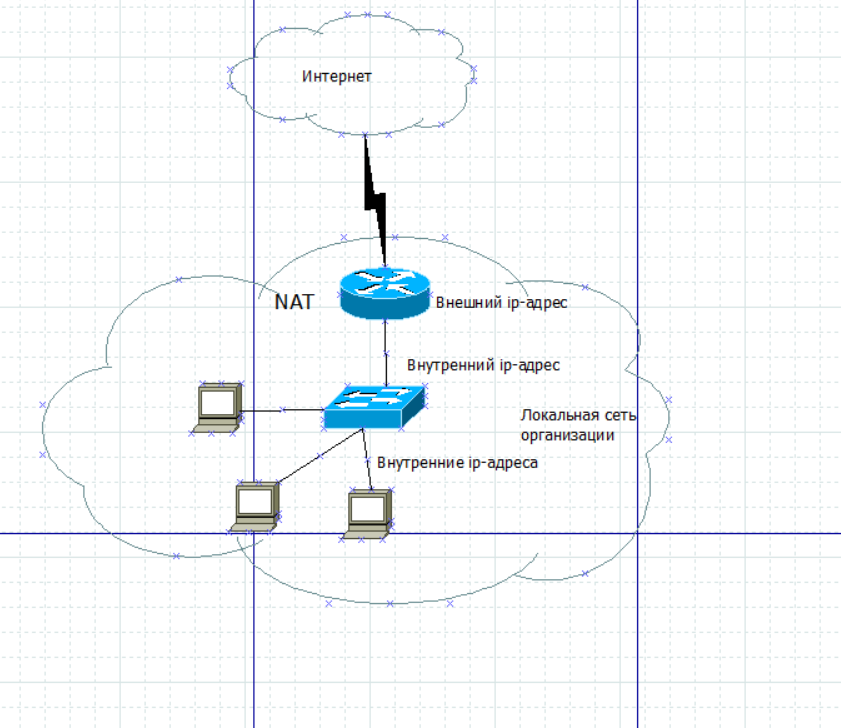

Внесем изменения в схему L1 сети, добавив в неё сеть провайдера и сеть модельного Интернета с указанием названий оборудования и портов подключения (рис. [-@fig:002]).

## Выполнение лабораторной работы

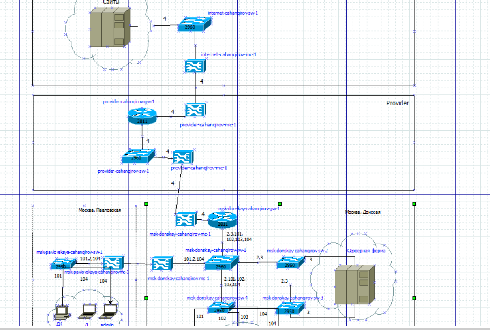

Внесем изменения в схемы L2(рис. [-@fig:003]) и L3 (рис. [-@fig:004]) сети, указав адреса и VLAN сети провайдера и модельной сети Интернета.

## Выполнение лабораторной работы

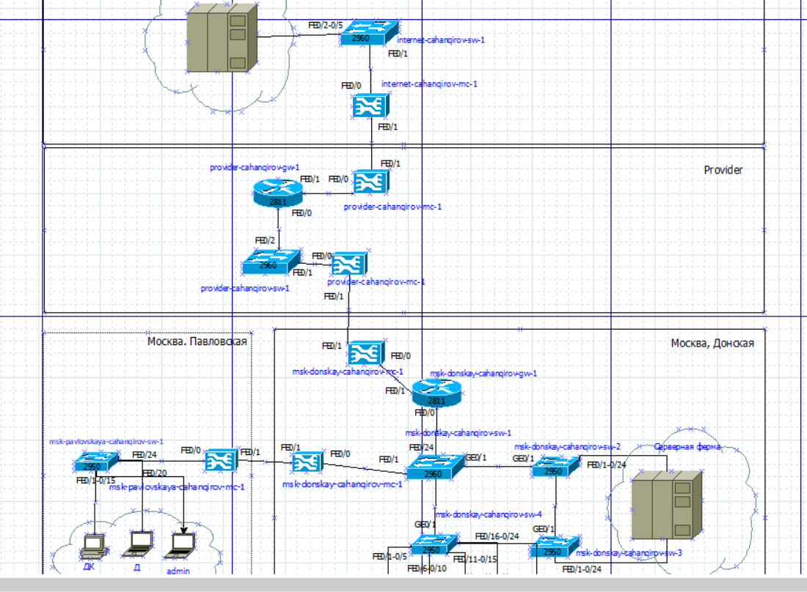

## Выполнение лабораторной работы

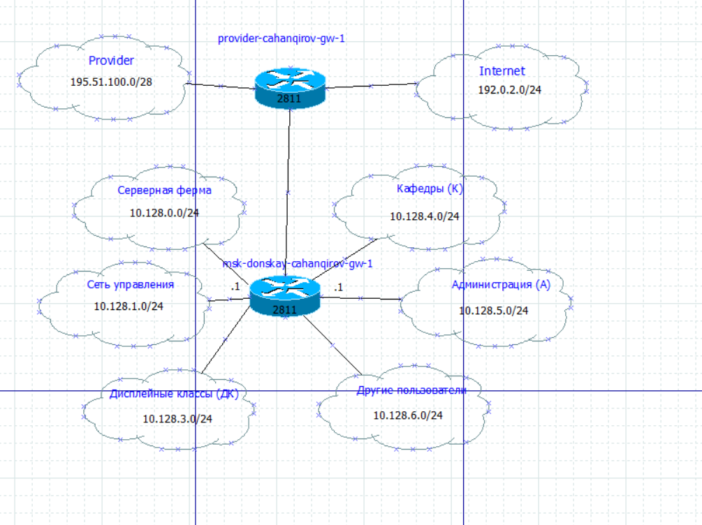

Скорректируем также таблицы распределения IP-адресов (табл. [-@tbl:ipplan]) и портов (табл. [-@tbl:port]).

: Таблица портов {#tbl:port}

| Устройство           | Порт          | Примечание           | Access VLAN | Trunk VLAN               |
|----------------------|---------------|----------------------|-------------|--------------------------|
| msk-donskaya-gw-1    | f0/1          | provider-mc-1        |             |                          |
|                      | f0/0          | msk-donskaya-sw-1    |             | 2, 3, 101, 102, 103, 104 |
| msk-donskaya-sw-1    | f0/24         | msk-donskaya-gw-1    |             | 2, 3, 101, 102, 103, 104 |
|                      | f0/20 — f0/23 | msk-donskaya-sw-4    |             | 2, 3                     |
|                      | g0/1          | msk-donskaya-sw-2    |             |                          |
|                      | g0/2          | msk-donskaya-sw-3    |             | 2, 101, 102, 103, 104    |
|                      | f0/1          | msk-donskaya-mc-1    |             | 2, 101, 104              |
| msk-donskaya-sw-2    | g0/1          | msk-donskaya-sw-1    |             | 2, 3                     |
|                      | g0/2          | msk-donskaya-sw-3    |             | 2, 3                     |
|                      | f0/1          | Web-server           | 3           |                          |
|                      | f0/2          | File-server          | 3           |                          |
| msk-donskaya-sw-3    | g0/1          | msk-donskaya-sw-2    |             | 2, 3                     |
|                      | g0/2          | msk-donskaya-sw-1    |             |                          |
|                      | f0/1          | Mail-server          | 3           |                          |
|                      | f0/2          | Dns-server           | 3           |                          |
| msk-donskaya-sw-4    | f0/20 — f0/23 | msk-donskaya-sw-1    |             | 2, 101, 102, 103, 104    |
|                      | f0/1–f0/5     | dk                   | 101         |                          |
|                      | f0/6–f0/10    | departments          | 102         |                          |
|                      | f0/11–f0/15   | adm                  | 103         |                          |
|                      | f0/16–f0/24   | other                | 104         |                          |
|                      | f0/24         | admin                | 104         |                          |
| msk-donskaya-mc-1    | f0/0          | msk-donskaya-sw-1    |             |                          |
|                      | f0/1          | msk-donskaya-mc-1    |             |                          |
| msk-donskaya-mc-2    | f0/0          | msk-donskaya-gw-1    |             |                          |
|                      | f0/1          | provider-mc-1        |             |                          |
| msk-pavlovskaya-mc-1 | f0/0          | msk-pavlovskaya-sw-1 |             |                          |
|                      | f0/1          | msk-donskaya-mc-1    |             |                          |
| msk-pavlovskaya-sw-1 | f0/24         | msk-pavlovskaya-mc-1 |             | 2, 101, 104              |
|                      | f0/1–f0/15    | dk                   | 101         |                          |
|                      | f0/20         | other                | 104         |                          |
|                      | f0/24         | admin-pavlovskaya    | 104         |                          |
| provider-gw-1        | f0/0          | provider-sw-1        |             |                          |
|                      | f0/1          | provider-mc-2        |             |                          |
| provider-sw-1        | f0/1          | provider-mc-1        |             |                          |
|                      | f0/2          | provider-gw-1        |             |                          |
| provider-mc-1        | f0/0          | provider-sw-1        |             |                          |
|                      | f0/1          | msk-donskaya-mc-2    |             |                          |
| provider-mc-2        | f0/0          | provider-gw-1        |             |                          |
|                      | f0/1          | internet-mc-1        |             |                          |
| internet-sw-1        | f0/1          | internet-mc-1        |             |                          |
|                      | f0/2          | esystem.pfur.ru      |             |                          |
|                      | f0/3          | www.rudn.ru          |             |                          |
|                      | f0/4          | stud.rudn.university |             |                          |
|                      | f0/5          | www.yandex.ru        |             |                          |
| internet-mc-1        | f0/0          | internet-sw-1        |             |                          |
|                      | f0/1          | provider-mc-2        |             |                          |

: Таблица IP {#tbl:ipplan}

| IP-адреса               | Примечание              | VLAN |
|-------------------------|-------------------------|------|
| 10.128.0.0/16           | Вся сеть                |      |
| 10.128.0.0/24           | Серверная ферма         | 3    |
| 10.128.0.1              | Шлюз                    |      |
| 10.128.0.2              | Web                     |      |
| 10.128.0.3              | File                    |      |
| 10.128.0.4              | Mail                    |      |
| 10.128.0.5              | Dns                     |      |
| 10.128.0.6-10.128.0.254 | Зарезервировано         |      |
| 10.128.1.0/24           | Управление              | 2    |
| 10.128.1.1              | Шлюз                    |      |
| 10.128.1.2              | msk-donskaya-sw-1       |      |
| 10.128.1.3              | msk-donskaya-sw-2       |      |
| 10.128.1.4              | msk-donskaya-sw-3       |      |
| 10.128.1.5              | msk-donskaya-sw-4       |      |
| 10.128.1.6              | msk-pavlovskaya-sw-1    |      |
| 10.128.1.7-10.128.1.254 | Зарезервировано         |      |
| 10.128.2.0/24           | Cеть Point-to-Point     |      |
| 10.128.2.1              | Шлюз                    |      |
| 10.128.2.2-10.128.2.254 | Зарезервировано         |      |
| 10.128.3.0/24           | Дисплейные классы (ДК)  | 101  |
| 10.128.3.1              | Шлюз                    |      |
| 10.128.3.2-10.128.3.254 | Пул для пользователей   |      |
| 10.128.4.0/24           | Кафедры (К)             | 102  |
| 10.128.4.1              | Шлюз                    |      |
| 10.128.4.2-10.128.4.254 | Пул для пользователей   |      |
| 10.128.5.0/24           | Администрация (А)       | 103  |
| 10.128.5.1              | Шлюз                    |      |
| 10.128.5.2-10.128.5.254 | Пул для пользователей   |      |
| 10.128.6.0/24           | Другие пользователи (Д) | 104  |
| 10.128.6.1              | Шлюз                    |      |
| 10.128.6.2-10.128.6.254 | Пул для пользователей   |      |
| 192.0.2.1               | provider-gw-1           |      |
| 192.0.2.11              | www.yandex.ru           | 4    |
| 192.0.2.12              | stud.rudn.university    | 4    |
| 192.0.2.13              | esystem.pfur.ru         | 4    |
| 192.0.2.14              | www.rudn.ru             | 4    |

На схеме предыдущего вашего проекта разместим необходимое оборудование для сети провайдера и сети модельного Интернета: 4 медиаконвертера (Repeater-PT), 2 коммутатора типа Cisco 2960-24TT,
маршрутизатор типа Cisco 2811, 4 сервера. Присвоим названия размещённым в сети провайдера и в сети модельного
Интернета объектам согласно модельным предположениям и схеме L1.

## Выполнение лабораторной работы

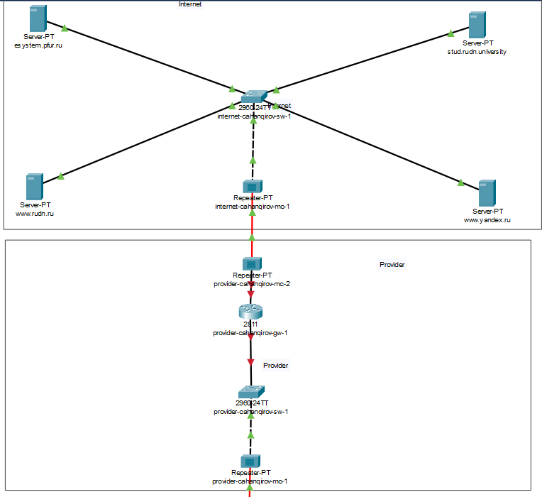

В физической рабочей области добавим здание провайдера и здание,
имитирующее расположение серверов модельного Интернета (рис. [-@fig:006]).
Присвоим им соответствующие названия. Перенесем из сети «Донская» оборудование провайдера (рис. [-@fig:008]) и модельной сети Интернета (рис. [-@fig:009]) в соответствующие здания.

## Выполнение лабораторной работы

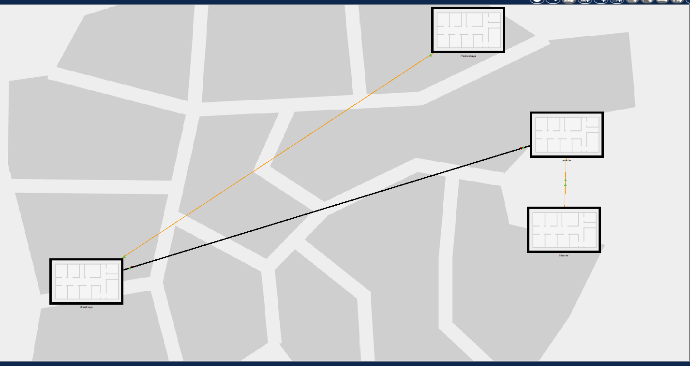

На медиаконвертерах заменим имеющиеся модули на PT-REPEATERNM-1FFE и PT-REPEATER-NM-1CFE для подключения витой пары по
технологии Fast Ethernet и оптоволокна соответственно (рис. [-@fig:007]).

## Выполнение лабораторной работы

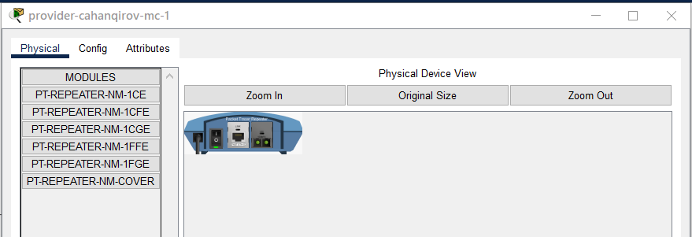

## Выполнение лабораторной работы

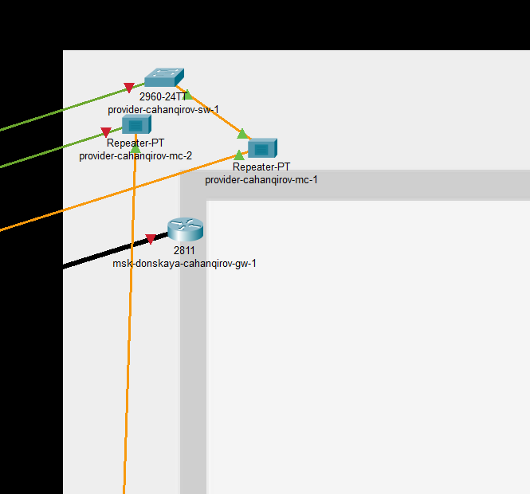

## Выполнение лабораторной работы

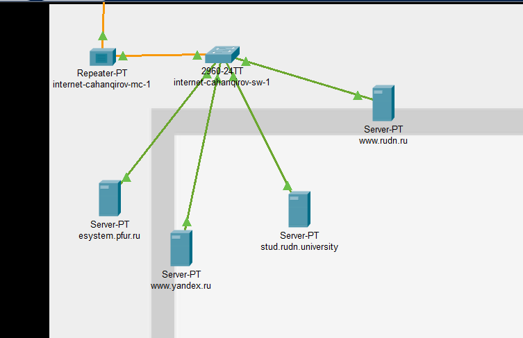

Проведем соединение объектов согласно скорректированной схеме L1 (рис. [-@fig:010]).

## Выполнение лабораторной работы

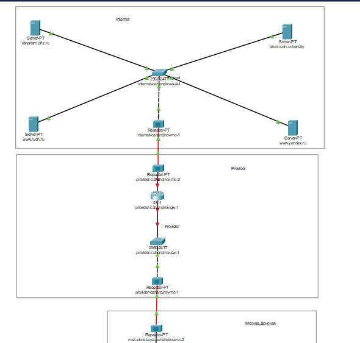

## Выполнение лабораторной работы

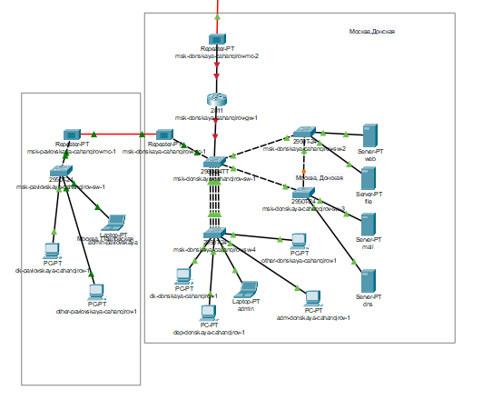

Пропишем IP-адреса серверам согласно табл. [-@tbl:ip]. В качестве примера показываю задание адреса шлюза и ip-адреса для сервера www.yandex.ru (рис. [-@fig:010],[-@fig:011]).

## Выполнение лабораторной работы

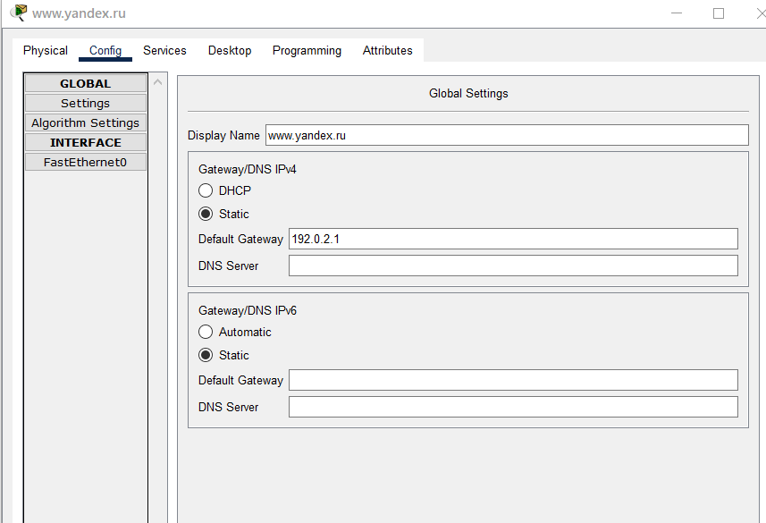

## Выполнение лабораторной работы

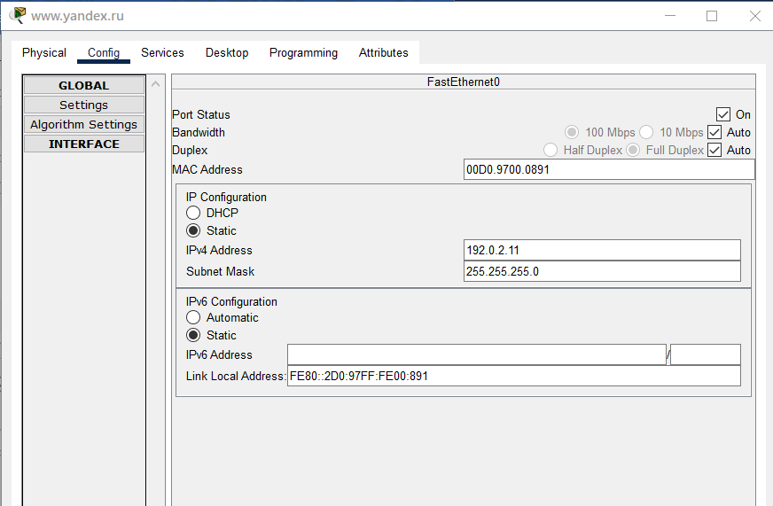

Пропишем сведения о серверах на DNS-сервере сети "Донская" (рис. [-@fig:013]).

## Выполнение лабораторной работы

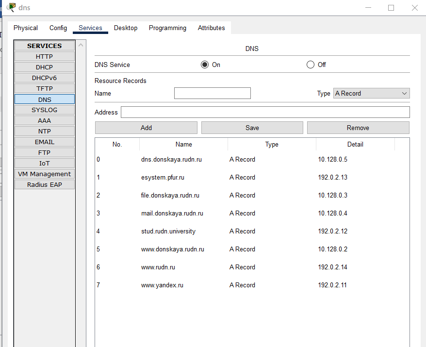

## Выводы

В процессе выполнения данной лабораторной работы я провел подготовительные мероприятия по подключению локальной сети организации к Интернету.
