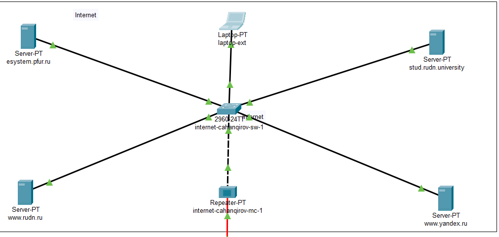

---
## Front matter
lang: ru-RU
title: Лабораторная работа №12
subtitle: Настройка NAT
author:
  - Джахангиров Илгар Залид оглы
institute:
  - Российский университет дружбы народов, Москва, Россия

## i18n babel
babel-lang: russian
babel-otherlangs: english

## Formatting pdf
toc: false
toc-title: Содержание
slide_level: 2
aspectratio: 169
section-titles: true
theme: metropolis
header-includes:
 - \metroset{progressbar=frametitle,sectionpage=progressbar,numbering=fraction}
 - '\makeatletter'
 - '\beamer@ignorenonframefalse'
 - '\makeatother'
---

# Информация

## Докладчик

:::::::::::::: {.columns align=center}
::: {.column width="70%"}

  * Джахангиров Илгар Залид оглы
  * студент
  * Российский университет дружбы народов
  * [1032225689@pfur.ru]

:::
::::::::::::::

## Цель работы

Приобрести практические навыки по настройке доступа локальной сети к внешней сети посредством NAT.

## Задание

1. Сделать первоначальную настройку маршрутизатора provider-gw-1 и коммутатора provider-sw-1 провайдера: задать имя, настроить доступ по
паролю и т.п.
2. Настроить интерфейсы маршрутизатора provider-gw-1 и коммутатора
provider-sw-1 провайдера.
3. Настроить интерфейсы маршрутизатора сети «Донская» для доступа к сети
провайдера.
4. Настроить на маршрутизаторе сети «Донская» NAT с правилами.
5. Настроить доступ из внешней сети в локальную сеть организации.
6. Проверить работоспособность заданных настроек.
7. При выполнении работы необходимо учитывать соглашение об именовании.

## Выполнение лабораторной работы

Проведем первоначальную настройку маршрутизатора provider-gw-1 (рис. [-@fig:001]). Зададим имя, настроим доступ по паролю.

## Выполнение лабораторной работы

Проведем первоначальную настройку коммутатора provider-sw-1 (рис. [-@fig:002]). Зададим имя, настроим доступ по паролю.

## Выполнение лабораторной работы

Проведем настройку интерфейсов маршрутизатора provider-gw-1 (рис. [-@fig:003]). Поднимем интерфейс f0/0, создадим интерфейс f0/0.4 для 4 vlan и зададим ip-адрес, поднимем интерфейс f0/1.

## Выполнение лабораторной работы

Проведем настройку интерфейсов коммутатора provider-sw-1 (рис. [-@fig:004]). Сделаем порты f0/1 и f0/2 транковыми, зададим 4 vlan с именем nat.

## Выполнение лабораторной работы

Проведем настройку интерфейсов маршрутизатора msk-donskaya-gw-1 (рис. [-@fig:005]). Поднимем интерфейс f0/1, создадим интерфейс f0/1.4 для 4 vlan и зададим ip-адрес.

## Выполнение лабораторной работы

Проверим доступ с маршрутизатора на Донской к маршрутизатору провайдера (рис. [-@fig:006]).

## Выполнение лабораторной работы

Теперь настроим список доступа к nat на всех подсетях для пользователей(рис. [-@fig:009]).

## Выполнение лабораторной работы

Настроим Port Address Translation (PAT) на субинтерфейсах маршрутизатора с территории Донская (рис. [-@fig:009]).

## Выполнение лабораторной работы

Проверка доступности к маршрутизаторам от ноутбука админ (рис. [-@fig:009]).

## Выполнение лабораторной работы

Настроим доступа из Интернета (рис. [-@fig:011]).

## Выполнение лабораторной работы

Добавим ноутбук на территории Интернета (рис. [-@fig:012]).

## Выполнение лабораторной работы

Проверим работоспособность соединения из сети Интернет в сеть Донской к web-серверу и файловому серверу по ftp (рис. [-@fig:013], [-@fig:014]).

## Выполнение лабораторной работы

## Выполнение лабораторной работы

## Выводы

В результате выполнения данной лабораторной работы я приобрел практические навыки по настройке доступа локальной сети к внешней сети посредством NAT.