---
## Front matter
title: "Лабораторная работа № 12"
subtitle: "Настройка NAT"
author: "Джахангиров Илгар Залид оглы"

## Generic otions
lang: ru-RU
toc-title: "Содержание"

## Bibliography
bibliography: bib/cite.bib
csl: pandoc/csl/gost-r-7-0-5-2008-numeric.csl

## Pdf output format
toc: true # Table of contents
toc-depth: 2
lof: true # List of figures
lot: false # List of tables
fontsize: 12pt
linestretch: 1.5
papersize: a4
documentclass: scrreprt
## I18n polyglossia
polyglossia-lang:
  name: russian
  options:
	- spelling=modern
	- babelshorthands=true
polyglossia-otherlangs:
  name: english
## I18n babel
babel-lang: russian
babel-otherlangs: english
## Fonts
mainfont: PT Serif
romanfont: PT Serif
sansfont: PT Sans
monofont: PT Mono
mainfontoptions: Ligatures=TeX
romanfontoptions: Ligatures=TeX
sansfontoptions: Ligatures=TeX,Scale=MatchLowercase
monofontoptions: Scale=MatchLowercase,Scale=0.9
## Biblatex
biblatex: true
biblio-style: "gost-numeric"
biblatexoptions:
  - parentracker=true
  - backend=biber
  - hyperref=auto
  - language=auto
  - autolang=other*
  - citestyle=gost-numeric
## Pandoc-crossref LaTeX customization
figureTitle: "Рис."
tableTitle: "Таблица"
listingTitle: "Листинг"
lofTitle: "Список иллюстраций"
lotTitle: "Список таблиц"
lolTitle: "Листинги"
## Misc options
indent: true
header-includes:
  - \usepackage{indentfirst}
  - \usepackage{float} # keep figures where there are in the text
  - \floatplacement{figure}{H} # keep figures where there are in the text
---

# Цель работы

Приобрести практические навыки по настройке доступа локальной сети к внешней сети посредством NAT.

# Задание

1. Сделать первоначальную настройку маршрутизатора provider-gw-1 и коммутатора provider-sw-1 провайдера: задать имя, настроить доступ по
паролю и т.п.
2. Настроить интерфейсы маршрутизатора provider-gw-1 и коммутатора
provider-sw-1 провайдера.
3. Настроить интерфейсы маршрутизатора сети «Донская» для доступа к сети
провайдера.
4. Настроить на маршрутизаторе сети «Донская» NAT с правилами.
5. Настроить доступ из внешней сети в локальную сеть организации.
6. Проверить работоспособность заданных настроек.
7. При выполнении работы необходимо учитывать соглашение об именовании.

# Выполнение лабораторной работы

Проведем первоначальную настройку маршрутизатора provider-gw-1 (рис. [-@fig:001]). Зададим имя, настроим доступ по паролю.

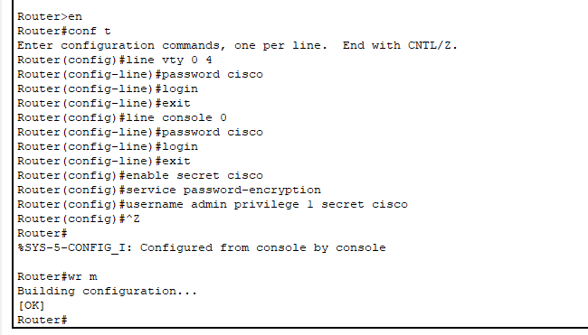

Проведем первоначальную настройку коммутатора provider-sw-1 (рис. [-@fig:002]). Зададим имя, настроим доступ по паролю.

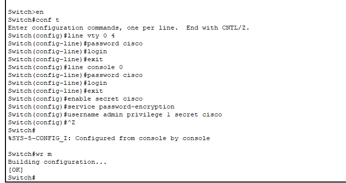

Проведем настройку интерфейсов маршрутизатора provider-gw-1 (рис. [-@fig:003]). Поднимем интерфейс f0/0, создадим интерфейс f0/0.4 для 4 vlan и зададим ip-адрес, поднимем интерфейс f0/1.

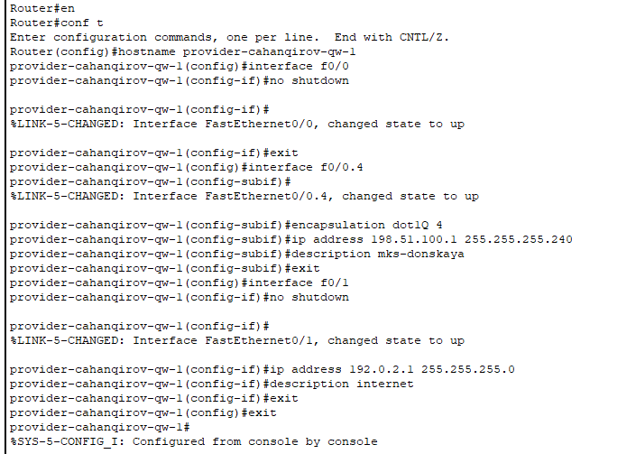

Проведем настройку интерфейсов коммутатора provider-sw-1 (рис. [-@fig:004]). Сделаем порты f0/1 и f0/2 транковыми, зададим 4 vlan с именем nat.

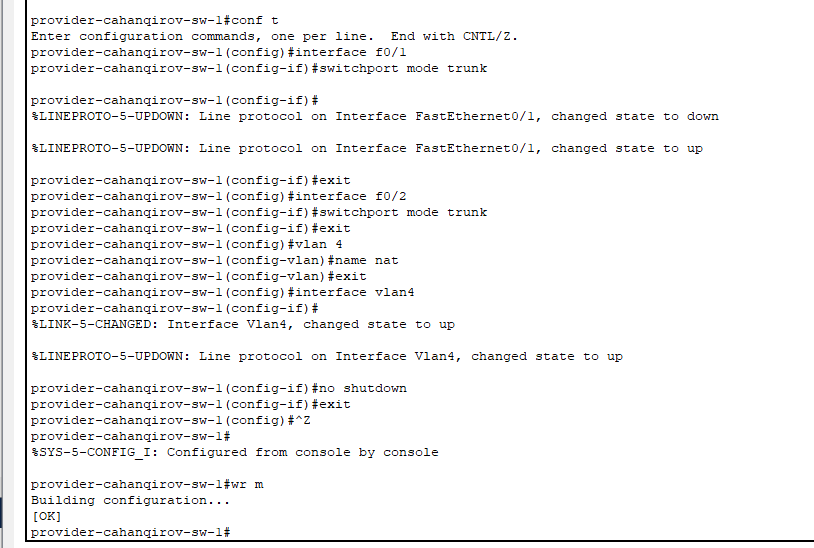

Проведем настройку интерфейсов маршрутизатора msk-donskaya-gw-1 (рис. [-@fig:005]). Поднимем интерфейс f0/1, создадим интерфейс f0/1.4 для 4 vlan и зададим ip-адрес.

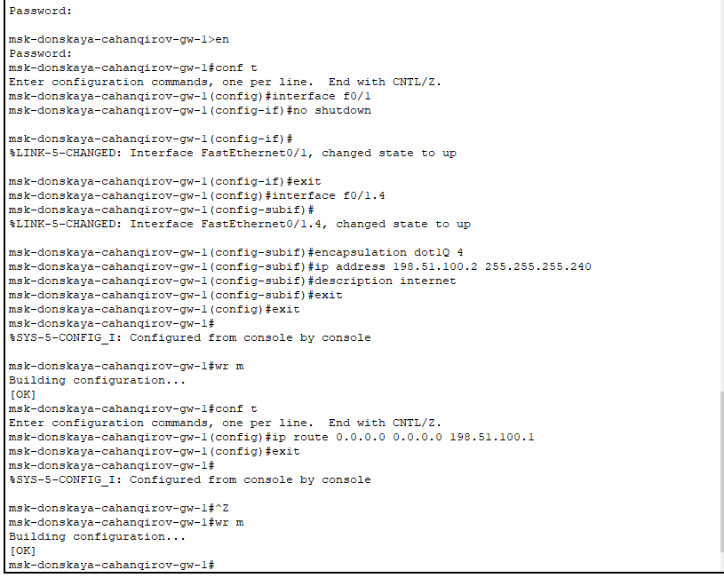

Проверим доступ с маршрутизатора на Донской к маршрутизатору провайдера (рис. [-@fig:006]).

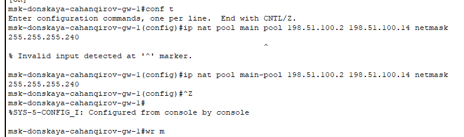

Теперь настроим список доступа к nat на всех подсетях для пользователей(рис. [-@fig:009]).

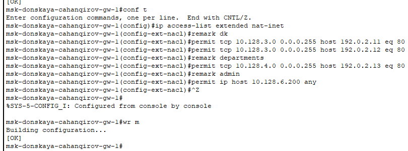

Настроим Port Address Translation (PAT) на субинтерфейсах маршрутизатора с территории Донская (рис. [-@fig:009]).

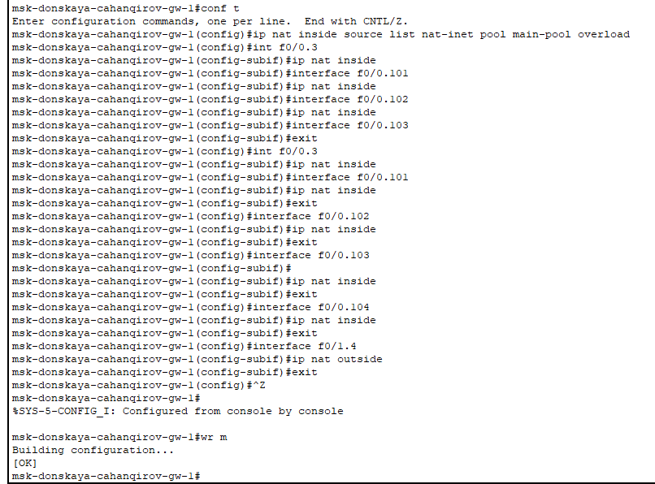

Проверка доступности к маршрутизаторам от ноутбука админ (рис. [-@fig:009]).

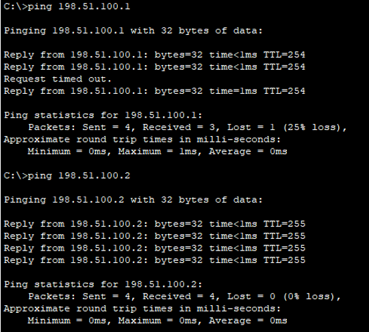

Настроим доступа из Интернета (рис. [-@fig:011]).

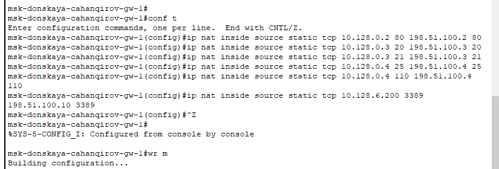

Добавим ноутбук на территории Интернета (рис. [-@fig:012]).

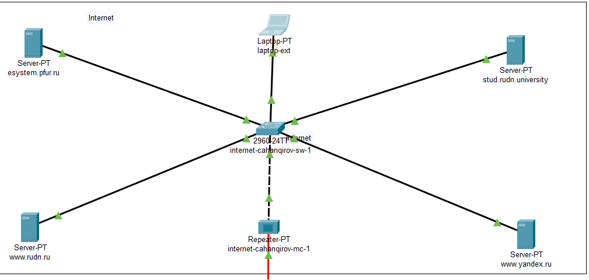

Проверим работоспособность соединения из сети Интернет в сеть Донской к web-серверу и файловому серверу по ftp (рис. [-@fig:013], [-@fig:014]).

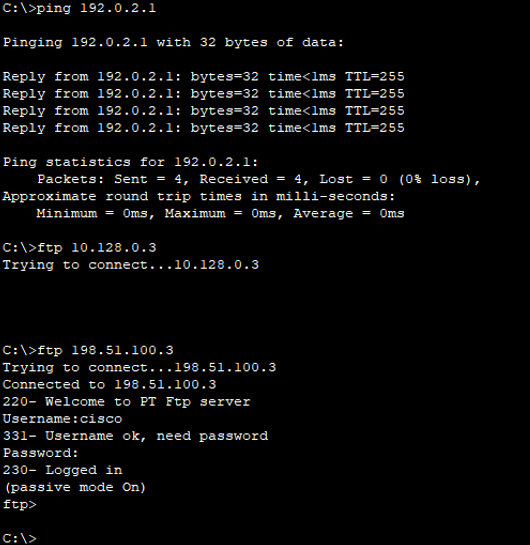

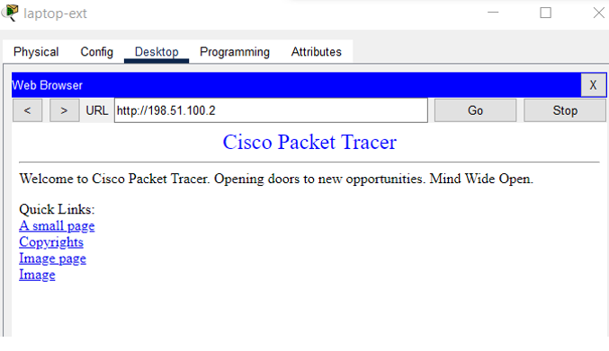

# Выводы

В результате выполнения данной лабораторной работы я приобрел практические навыки по настройке доступа локальной сети к внешней сети посредством NAT.

