---
## Front matter
title: "Лабораторная работа № 14"
subtitle: "Статическая маршрутизация в Интернете. Настройка"
author: "Джахангиров Илгар Залид оглы"

## Generic otions
lang: ru-RU
toc-title: "Содержание"

## Bibliography
bibliography: bib/cite.bib
csl: pandoc/csl/gost-r-7-0-5-2008-numeric.csl

## Pdf output format
toc: true # Table of contents
toc-depth: 2
lof: true # List of figures
lot: false # List of tables
fontsize: 12pt
linestretch: 1.5
papersize: a4
documentclass: scrreprt
## I18n polyglossia
polyglossia-lang:
  name: russian
  options:
	- spelling=modern
	- babelshorthands=true
polyglossia-otherlangs:
  name: english
## I18n babel
babel-lang: russian
babel-otherlangs: english
## Fonts
mainfont: PT Serif
romanfont: PT Serif
sansfont: PT Sans
monofont: PT Mono
mainfontoptions: Ligatures=TeX
romanfontoptions: Ligatures=TeX
sansfontoptions: Ligatures=TeX,Scale=MatchLowercase
monofontoptions: Scale=MatchLowercase,Scale=0.9
## Biblatex
biblatex: true
biblio-style: "gost-numeric"
biblatexoptions:
  - parentracker=true
  - backend=biber
  - hyperref=auto
  - language=auto
  - autolang=other*
  - citestyle=gost-numeric
## Pandoc-crossref LaTeX customization
figureTitle: "Рис."
tableTitle: "Таблица"
listingTitle: "Листинг"
lofTitle: "Список иллюстраций"
lotTitle: "Список таблиц"
lolTitle: "Листинги"
## Misc options
indent: true
header-includes:
  - \usepackage{indentfirst}
  - \usepackage{float} # keep figures where there are in the text
  - \floatplacement{figure}{H} # keep figures where there are in the text
---

# Цель работы

Настроить взаимодействие через сеть провайдера посредством статической маршрутизации локальной сети организации с сетью основного здания, расположенного в 42-м квартале в Москве, и сетью филиала, расположенного в г. Сочи.

# Задание

1. Настроить связь между территориями.
2. Настроить оборудование, расположенное в квартале 42 в Москве.
3. Настроить оборудование, расположенное в филиале в г. Сочи.
4. Настроить статическую маршрутизацию между территориями.
5. Настроить статическую маршрутизацию на территории квартала 42 в г.
Москве.
6. Настроить NAT на маршрутизаторе msk-donskaya-gw-1.
7. При выполнении работы необходимо учитывать соглашение об именовании.

# Выполнение лабораторной работы

## Настройка линка между площадками

Настроем интерфейсы маршрутизатора provider-cahanqirov-gw-1: поднимем и сделаем транковыми интерфейсы f0/3 и f0/4 (рис. [-@fig:001]).

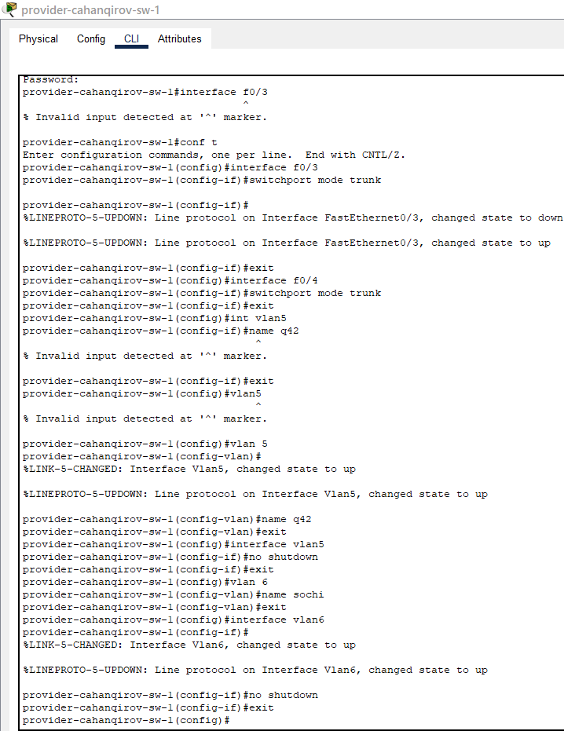

Затем на маршрутизаторе с территории Донская создадим субинтерфейсы f0/1.5 и f0/1.6 для 5 и 6 VLAN, также зададим ip-адрес маршрутизатора в этих VLAN (рис. [-@fig:002]):

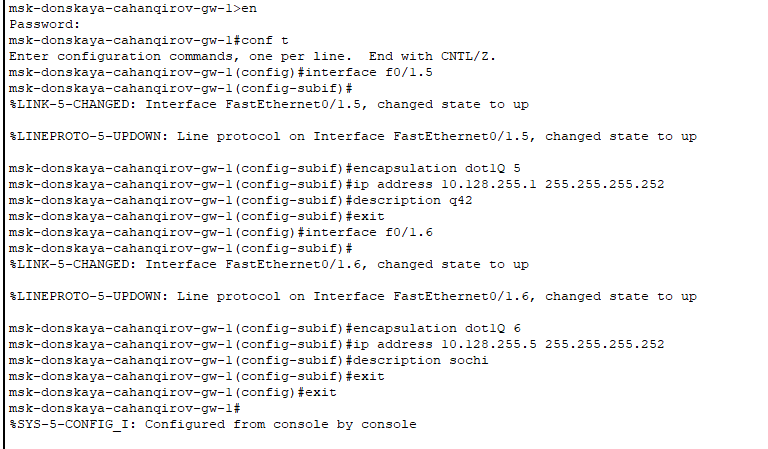

Настроим интерфейсы маршрутизатора msk-q42-cahanqirov-gw-1. Поднимем интерфейс f0/1, создадим субинтерфейс f0/1.5 для 5 vlan и зададим ip-адрес (рис. [-@fig:003]).

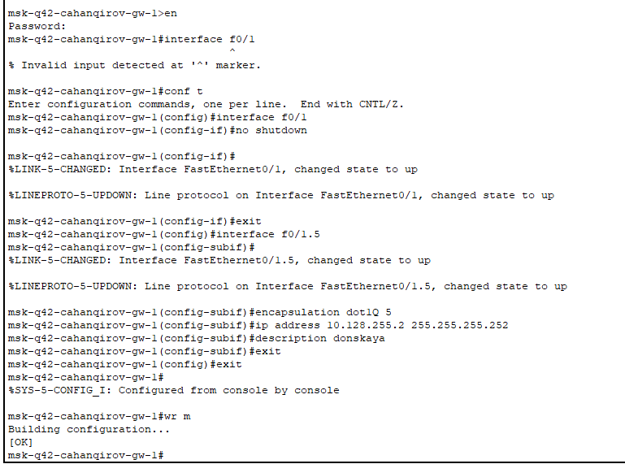

Настроим интерфейсы коммутатора sch-sochi-cahanqirov-sw-1: сделаем транковыми порты f0/23  и f0/24, зададим 6 vlan с именем sochi(рис. [-@fig:004]).

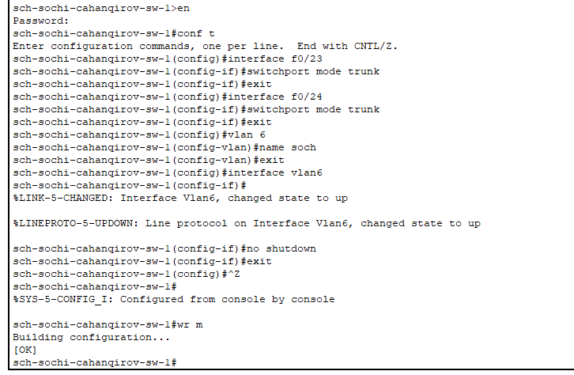

Настроим интерфейсы маршрутизатора sch-sochi-cahanqirov-gw-1: поднимем интерфейс f0/0, создадим интерфейс f0/0.6 для 6 vlan и зададим ip-адрес(рис. [-@fig:005]):

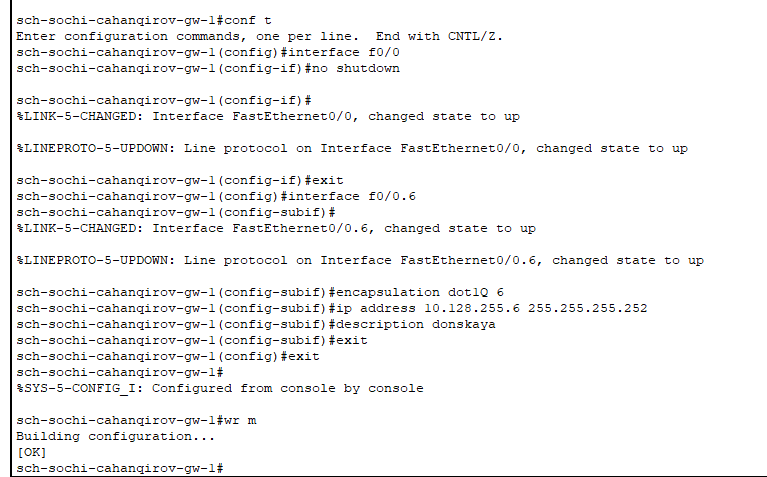

## Настройка площадки 42-го квартала

Настроим интерфейсы маршрутизатора msk-q42-cahanqirov-gw-1: поднимем интерфейс f0/0, создадим субинтерфейс f0/0.201 для 201 vlan(основной на этой территории) и зададим ip-адрес, создадим субинтерфейс f0/0.202 для 202 vlan(для управления устройствами территории) и зададим ip-адрес(рис. [-@fig:006]).

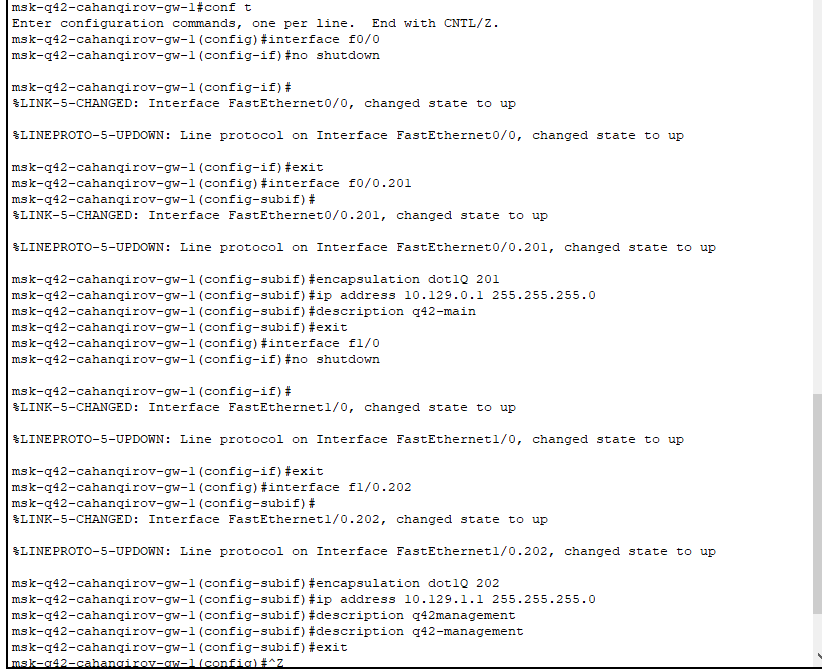

Настроим интерфейсы коммутатора msk-q42-cahanqirov-sw-1: сделаем транковым интерфейс f0/24, зададим оконечному устройству по f0/1 доступ к 201 vlan(рис. [-@fig:007]).

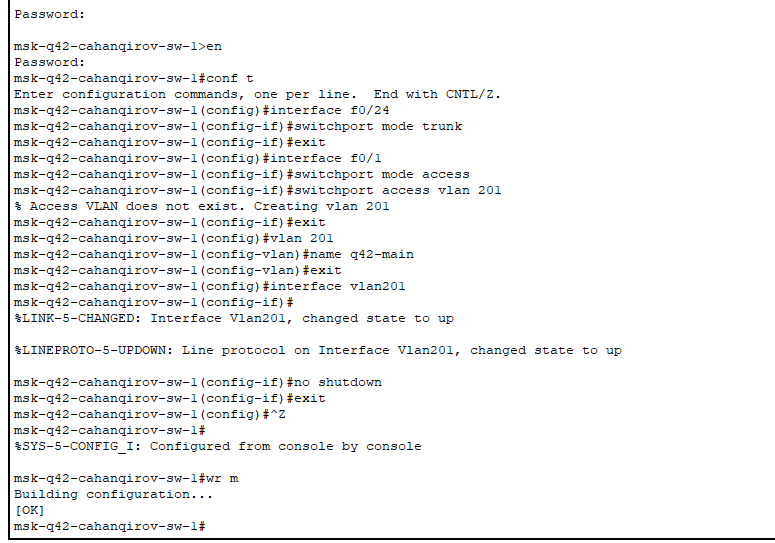

Настроим интерфейсы маршрутизирующего коммутатора msk-hostel-cahanqirov-gw-1: сделаем транковыми интерфейсы g0/1 и f0/1, создадим 202 и 301(для общежитий) vlan(рис. [-@fig:008]).

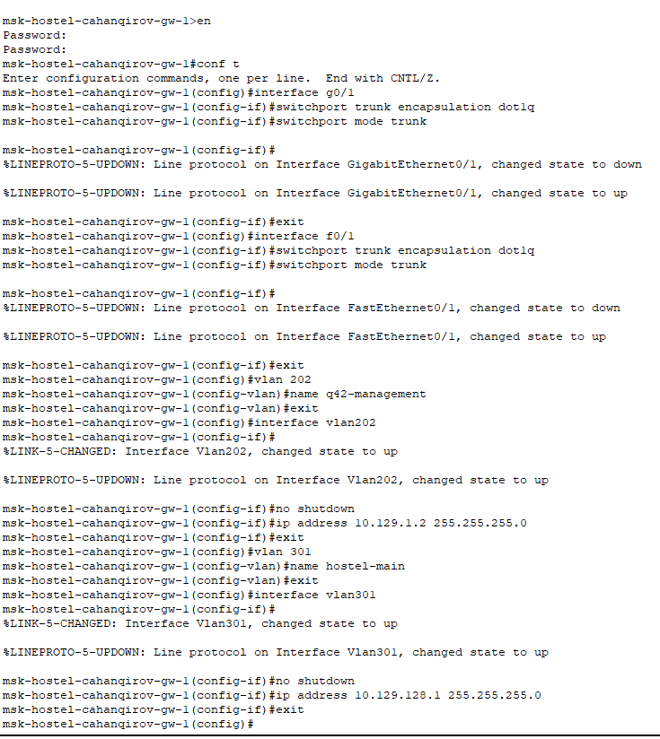

Настроим интерфейсы коммутатора msk-hostel-cahanqirov-sw-1: сделаем транковым интерфейс g0/1, по f0/1 дадим доступ к 301 vlan(рис. [-@fig:009]):

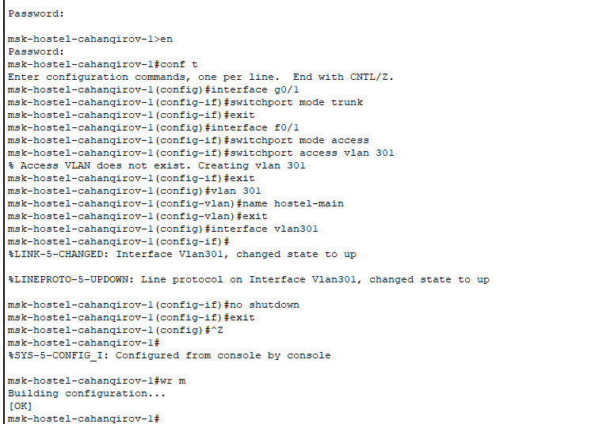

## Настройка площадки в Сочи

Настроим интерфейсы маршрутизатора sch-sochi-cahanqirov-gw-1: создадим субинтерфейс f0/0.401 для 401 vlan(основной на этой территории) и зададим ip-адрес, создадим субинтерфейс f0/0.402 для 402 vlan(для управления устройствами территории) и зададим ip-адрес(рис. [-@fig:010]):

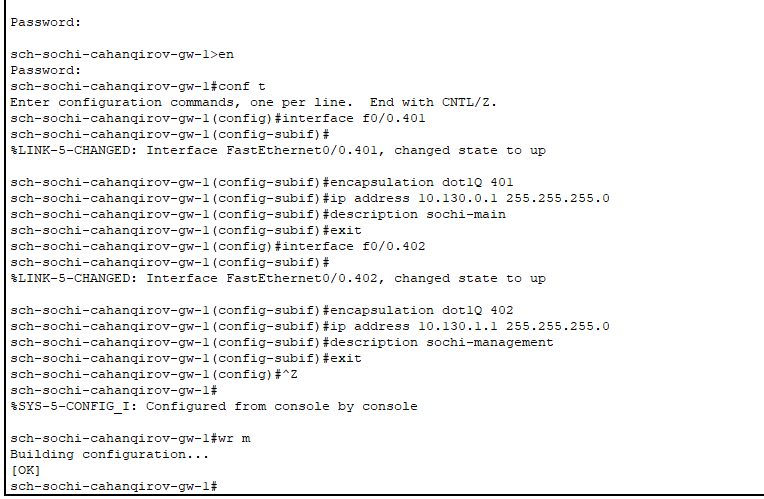

Настроим интерфейсы коммутатора sch-sochi-sw-1: зададим vlan 401 и оконечному устройству по f0/1 доступ к нему(рис. [-@fig:011]):

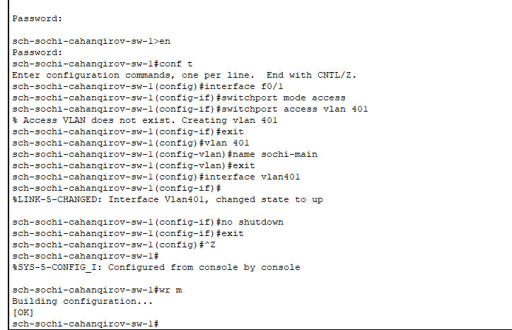
## Настройка маршрутизации между площадками

Зададим маршруты по умолчанию для маршрутизатора на Донской - на марщрутизаторы в Сочи и в 42 квартале, а также в обратную сторону(рис. [-@fig:012] - [-@fig:014]).

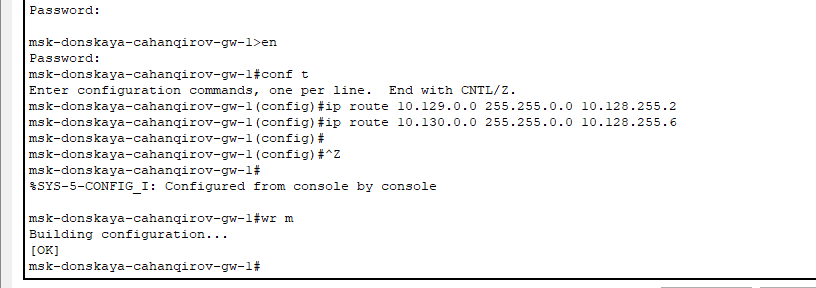

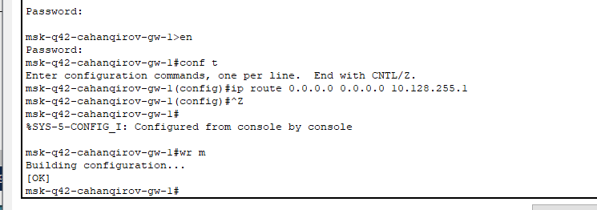

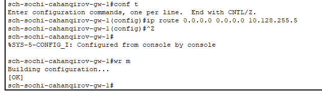

## Настройка маршрутизации на 42 квартале

Настроим маршруты между маршрутизаторами на 42 квартале(рис. [-@fig:015], [-@fig:016]).

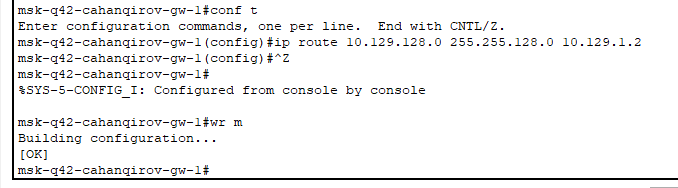

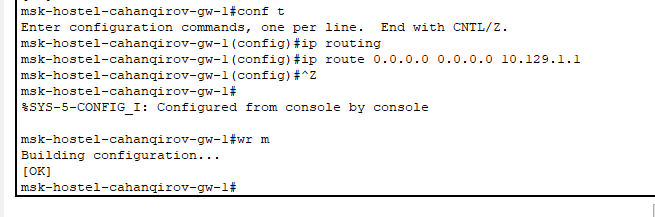

## Настройка NAT на маршрутизаторе msk-donskaya-gw-1

Настроим NAT на маршрутизаторе msk-donskaya-gw-1, дополним список доступа к интернет-ресурсам (разрешим оконечным устройствам с обеих территорий доступ ко всему) (рис. [-@fig:017]):

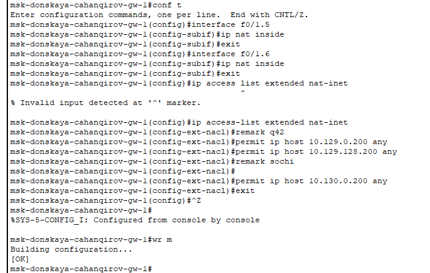

## Проверка настроек

Проверим связь между администратором с Донской и маршрутизаторами на 42 квартале и в Сочи (рис. [-@fig:018]):

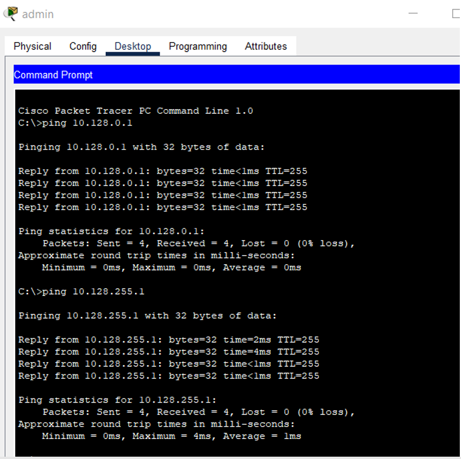

Проверим доступ в Интернет (рис. [-@fig:019]):

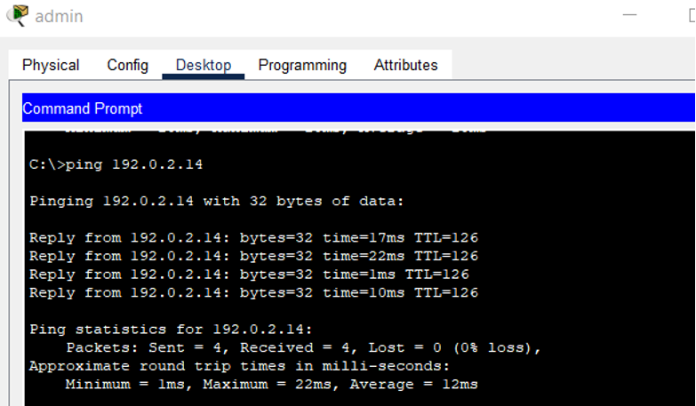

# Выводы

В результате выполнения лабораторной были приобретены практические навыки по настройке взаимодействие через сеть провайдера посредством статической маршрутизации локальной сети организации с сетью основного здания, расположенного в 42-м квартале в Москве, и сетью филиала, расположенного в г. Сочи.

