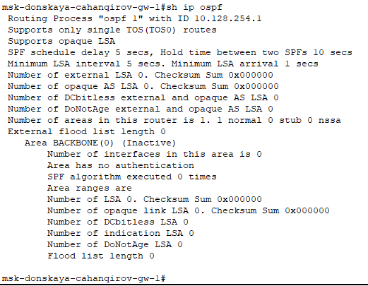
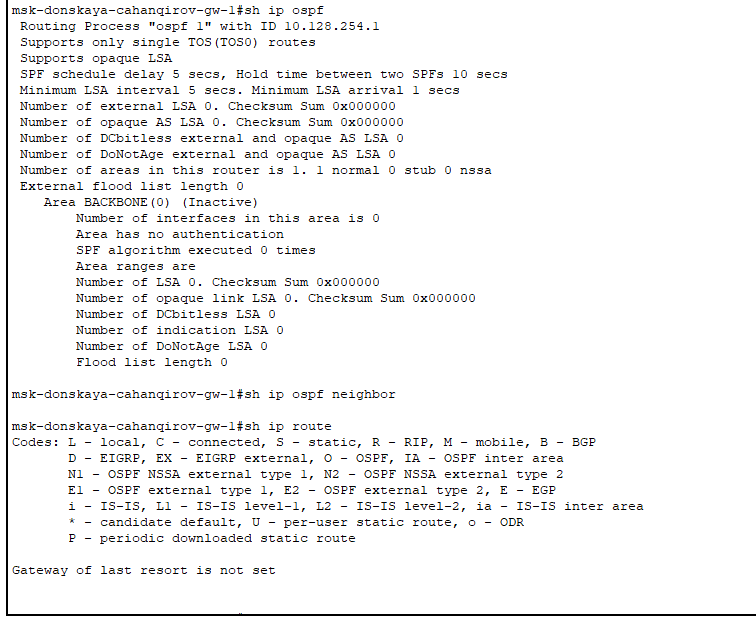
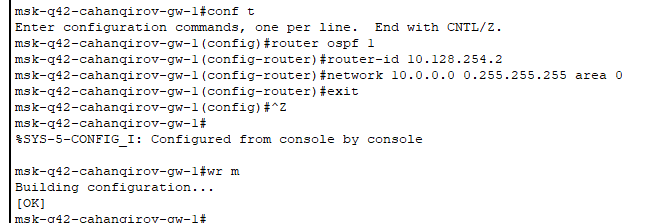
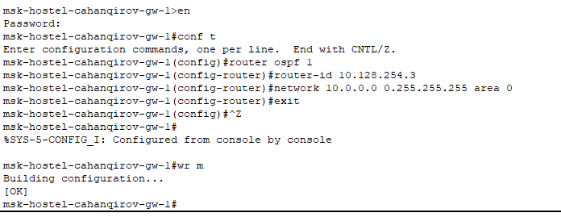
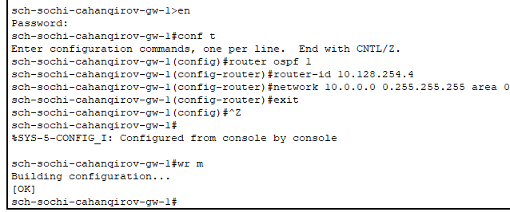
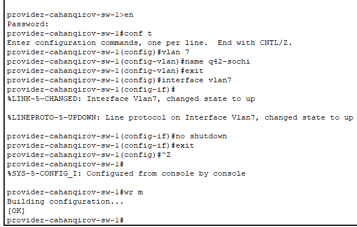
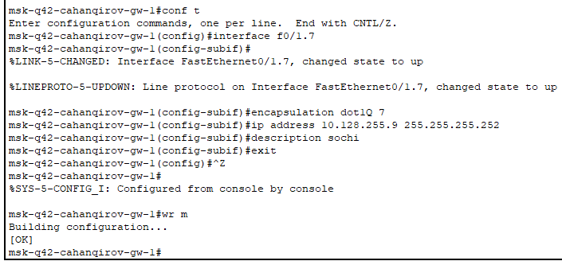
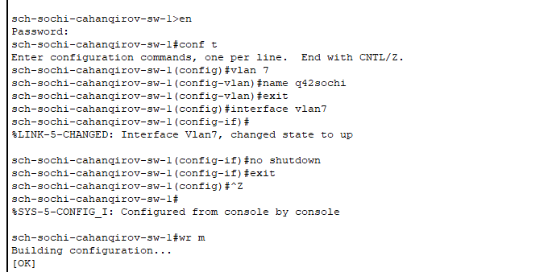
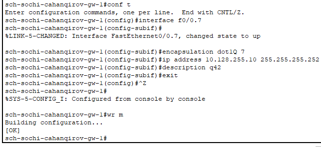
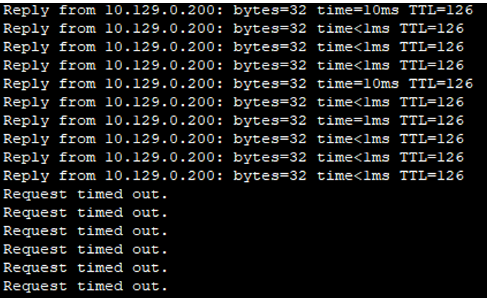

---
## Front matter
lang: ru-RU
title: Лабораторная работа №15
subtitle: Динамическая маршрутизация
author:
  - Джахангиров Илгар Залид оглы
institute:
  - Российский университет дружбы народов, Москва, Россия

## i18n babel
babel-lang: russian
babel-otherlangs: english

## Formatting pdf
toc: false
toc-title: Содержание
slide_level: 2
aspectratio: 169
section-titles: true
theme: metropolis
header-includes:
 - \metroset{progressbar=frametitle,sectionpage=progressbar,numbering=fraction}
 - '\makeatletter'
 - '\beamer@ignorenonframefalse'
 - '\makeatother'
---

# Информация

## Докладчик

:::::::::::::: {.columns align=center}
::: {.column width="70%"}

  * Джахангиров Илгар Залид оглы
  * студент
  * Российский университет дружбы народов
  * [1032225689@pfur.ru]

:::
::::::::::::::

## Цель работы

Настроить динамическую маршрутизацию между территориями организации.

## Задание

1. Настроить динамическую маршрутизацию по протоколу OSPF на маршрутизаторах msk-donskaya-gw-1, msk-q42-gw-1, msk-hostel-gw-1, sch-sochi-gw-1.
2. Настроить связь сети квартала 42 в Москве с сетью филиала в г. Сочи напрямую.
3. В режиме симуляции отследить движение пакета ICMP с ноутбука администратора сети на Донской в Москве (Laptop-PT admin) до компьютера пользователя в филиале в г. Сочи pc-sochi-1.
4. На коммутаторе провайдера отключить временно vlan 6 и в режиме симуляции убедиться в изменении маршрута прохождения пакета ICMP с ноутбука администратора сети на Донской в Москве (Laptop-PT admin) до компьютера пользователя в филиале в г. Сочи pc-sochi-1.
5. На коммутаторе провайдера восстановить vlan 6 и в режиме симуляции убедиться в изменении маршрута прохождения пакета ICMP с ноутбука администратора сети на Донской в Москве (Laptop-PT admin) до компьютера пользователя в филиале в г. Сочи pc-sochi-1.

## Выполнение лабораторной работы

## Настройка OSPF

Включим OSPF на маршрутизаторах: включим процесс OSPF командой `router ospf <process-id>`, и назначим области (зоны) интерфейсам с помощью команды
`network <network or IP address> <mask> area <area-id>`.

Сначала включим на маршрутизаторе msk-donskaya-gw-1 (рис. [-@fig:001]).

## Выполнение лабораторной работы

Идентификатор процесса OSPF (process-id) по сути идентифицирует маршрутизатор в автономной системе, и, вообще говоря, он не должен совпадать
с идентификаторами процессов на других маршрутизаторах.

И посмотрим состояние протокола: общую информацию об OSPF, соседей маршрутизатора(на этом тапе их нет, так как это единственный маршрутизатор с этим протоколом) и таблицу маршрутизации (рис. [-@fig:002], [-@fig:003]):

## Выполнение лабораторной работы

## Выполнение лабораторной работы

## Выполнение лабораторной работы

[Проверка состояния протокола OSPF на маршрутизаторе msk-donskaya-gw-1](image/12.png)

Затем включим OSPF на остальных маршрутизаторах (рис. [-@fig:004] - [-@fig:006]).

## Выполнение лабораторной работы

## Выполнение лабораторной работы

## Выполнение лабораторной работы

Проверим состояние протокола OSPF на всех маршрутизаторах. Для маршрутизатора на Донской появилась информация о соседях, в ней нет маршрутизирующего коммутатора msk-hostel-gw-1, так как с ним связь происходит через маршрутизатор msk-q42-gw-1 (рис. [-@fig:007]).

## Настройка линка 42-й квартал–Сочи

Настроим маршруты между маршрутизаторами на 42 квартале, добавив 7 vlan для их коммуникации на коммутаторе с территории провайдера(так как через него будут идти пакеты) и на маршрутизаторе в Сочи, коммутаторе в Сочи и маршрутизаторе в 42 квартале (рис. [-@fig:011], [-@fig:014]).

## Выполнение лабораторной работы

## Выполнение лабораторной работы

]
## Выполнение лабораторной работы

## Выполнение лабораторной работы

## Выполнение лабораторной работы

Потом включим vlan 5, и маршрут снова перестраивается на кратчайший (на изначальный).

## Выводы

В результате выполнения данной лабораторной я приобрел практические навыки по настройке динамической маршрутизации между территориями организации.