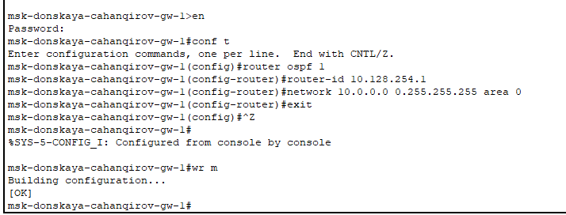
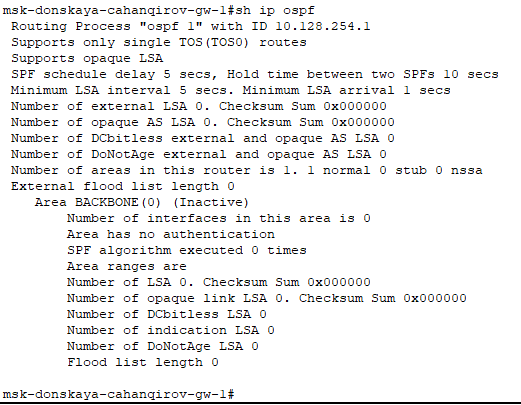
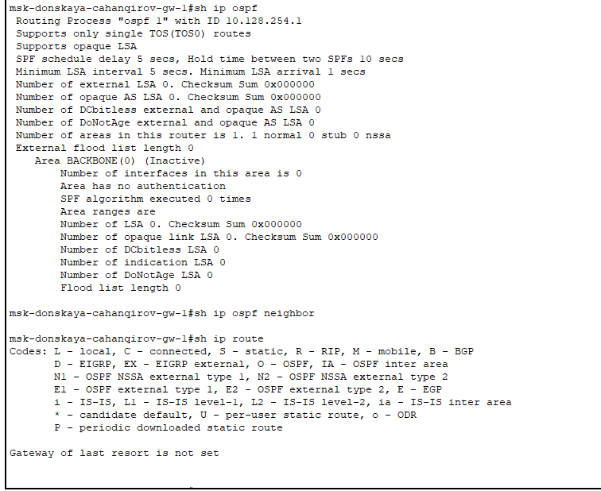
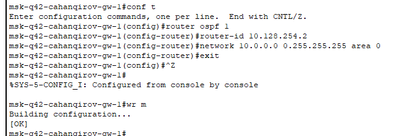
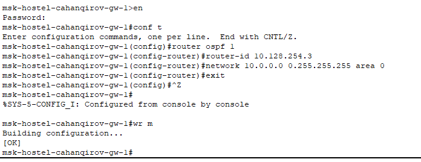
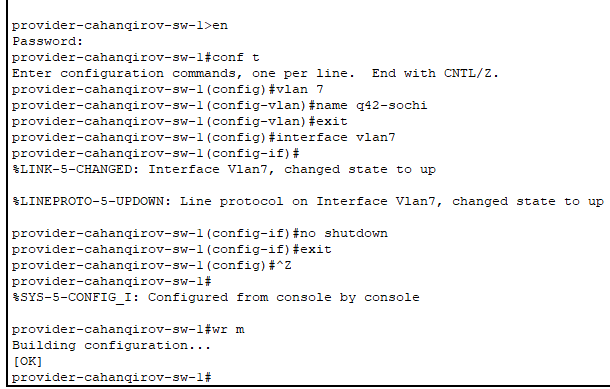
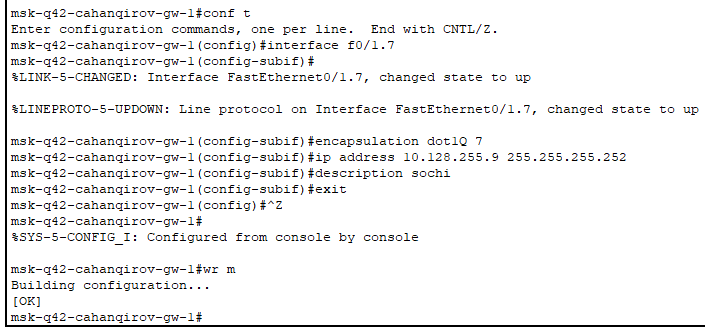
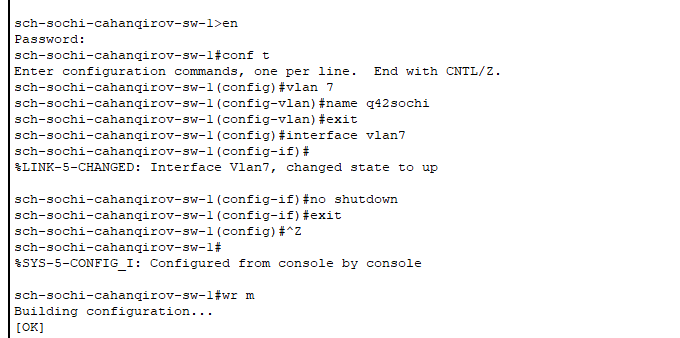
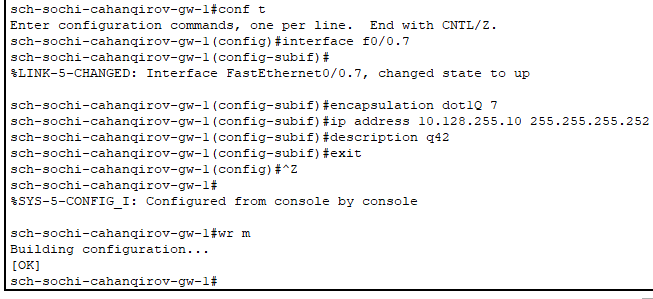
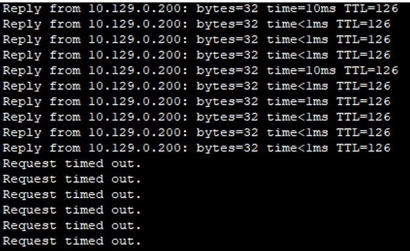

---
## Front matter
title: "Лабораторная работа № 15"
subtitle: "Динамическая маршрутизация"
author: "Джахангиров Илгар Залид оглы"

## Generic otions
lang: ru-RU
toc-title: "Содержание"

## Bibliography
bibliography: bib/cite.bib
csl: pandoc/csl/gost-r-7-0-5-2008-numeric.csl

## Pdf output format
toc: true # Table of contents
toc-depth: 2
lof: true # List of figures
lot: false # List of tables
fontsize: 12pt
linestretch: 1.5
papersize: a4
documentclass: scrreprt
## I18n polyglossia
polyglossia-lang:
  name: russian
  options:
	- spelling=modern
	- babelshorthands=true
polyglossia-otherlangs:
  name: english
## I18n babel
babel-lang: russian
babel-otherlangs: english
## Fonts
mainfont: PT Serif
romanfont: PT Serif
sansfont: PT Sans
monofont: PT Mono
mainfontoptions: Ligatures=TeX
romanfontoptions: Ligatures=TeX
sansfontoptions: Ligatures=TeX,Scale=MatchLowercase
monofontoptions: Scale=MatchLowercase,Scale=0.9
## Biblatex
biblatex: true
biblio-style: "gost-numeric"
biblatexoptions:
  - parentracker=true
  - backend=biber
  - hyperref=auto
  - language=auto
  - autolang=other*
  - citestyle=gost-numeric
## Pandoc-crossref LaTeX customization
figureTitle: "Рис."
tableTitle: "Таблица"
listingTitle: "Листинг"
lofTitle: "Список иллюстраций"
lotTitle: "Список таблиц"
lolTitle: "Листинги"
## Misc options
indent: true
header-includes:
  - \usepackage{indentfirst}
  - \usepackage{float} # keep figures where there are in the text
  - \floatplacement{figure}{H} # keep figures where there are in the text
---

# Цель работы

Настроить динамическую маршрутизацию между территориями организации.

# Задание

1. Настроить динамическую маршрутизацию по протоколу OSPF на маршрутизаторах msk-donskaya-gw-1, msk-q42-gw-1, msk-hostel-gw-1, sch-sochi-gw-1.
2. Настроить связь сети квартала 42 в Москве с сетью филиала в г. Сочи напрямую.
3. В режиме симуляции отследить движение пакета ICMP с ноутбука администратора сети на Донской в Москве (Laptop-PT admin) до компьютера пользователя в филиале в г. Сочи pc-sochi-1.
4. На коммутаторе провайдера отключить временно vlan 6 и в режиме симуляции убедиться в изменении маршрута прохождения пакета ICMP с ноутбука администратора сети на Донской в Москве (Laptop-PT admin) до компьютера пользователя в филиале в г. Сочи pc-sochi-1.
5. На коммутаторе провайдера восстановить vlan 6 и в режиме симуляции убедиться в изменении маршрута прохождения пакета ICMP с ноутбука администратора сети на Донской в Москве (Laptop-PT admin) до компьютера пользователя в филиале в г. Сочи pc-sochi-1.

# Выполнение лабораторной работы

## Настройка OSPF

Включим OSPF на маршрутизаторах: включим процесс OSPF командой `router ospf <process-id>`, и назначим области (зоны) интерфейсам с помощью команды
`network <network or IP address> <mask> area <area-id>`.

Сначала включим на маршрутизаторе msk-donskaya-gw-1 (рис. [-@fig:001]).

Идентификатор процесса OSPF (process-id) по сути идентифицирует маршрутизатор в автономной системе, и, вообще говоря, он не должен совпадать
с идентификаторами процессов на других маршрутизаторах.

И посмотрим состояние протокола: общую информацию об OSPF, соседей маршрутизатора(на этом тапе их нет, так как это единственный маршрутизатор с этим протоколом) и таблицу маршрутизации (рис. [-@fig:002], [-@fig:003]):

[Проверка состояния протокола OSPF на маршрутизаторе msk-donskaya-gw-1](image/12.png)

Затем включим OSPF на остальных маршрутизаторах (рис. [-@fig:004] - [-@fig:006]).

Проверим состояние протокола OSPF на всех маршрутизаторах. Для маршрутизатора на Донской появилась информация о соседях, в ней нет маршрутизирующего коммутатора msk-hostel-gw-1, так как с ним связь происходит через маршрутизатор msk-q42-gw-1 (рис. [-@fig:007]).

## Настройка линка 42-й квартал–Сочи

Настроим маршруты между маршрутизаторами на 42 квартале, добавив 7 vlan для их коммуникации на коммутаторе с территории провайдера(так как через него будут идти пакеты) и на маршрутизаторе в Сочи, коммутаторе в Сочи и маршрутизаторе в 42 квартале (рис. [-@fig:011], [-@fig:014]).

Потом включим vlan 5, и маршрут снова перестраивается на кратчайший (на изначальный).

# Выводы

В результате выполнения данной лабораторной я приобрел практические навыки по настройке динамической маршрутизации между территориями организации.