---
## Front matter
lang: ru-RU
title: Лабораторная работа №16
subtitle: Настройка VPN
author:
  - Джахангиров Илгар Залид оглы
institute:
  - Российский университет дружбы народов, Москва, Россия

## i18n babel
babel-lang: russian
babel-otherlangs: english

## Formatting pdf
toc: false
toc-title: Содержание
slide_level: 2
aspectratio: 169
section-titles: true
theme: metropolis
header-includes:
 - \metroset{progressbar=frametitle,sectionpage=progressbar,numbering=fraction}
 - '\makeatletter'
 - '\beamer@ignorenonframefalse'
 - '\makeatother'
---

# Информация

## Докладчик

:::::::::::::: {.columns align=center}
::: {.column width="70%"}

  * Джахангиров Илгар Залид оглы
  * студент
  * Российский университет дружбы народов
  * [1032225689@pfur.ru]

:::
::::::::::::::

## Цель работы

Получить навыки настройки VPN-туннеля через незащищённое Интернет-соединение.

## Задание

1. Разместить в рабочей области проекта в соответствии с модельными предположениями оборудование для сети Университета г. Пиза.
2. В физической рабочей области проекта создать город Пиза, здание Университета г. Пиза. Переместить туда соответствующее оборудование.
3. Сделать первоначальную настройку и настройку интерфейсов оборудования
сети Университета г. Пиза.
4. Настроить VPN на основе протокола GRE.
5. Проверить доступность узлов сети Университета г. Пиза с ноутбука администратора сети «Донская».

## Выполнение лабораторной работы

Виртуальная частная сеть (Virtual Private Network, VPN) — технология,
обеспечивающая одно или несколько сетевых соединений поверх другой сети
(например, Интернет).

Сеть Университета г. Пиза (Италия) содержит маршрутизатор Cisco 2811
pisa-inipi-gw-1, коммутатор Cisco 2950 pisa-unipi-sw-1 и оконечное устройство PC pc-unipi-1.

Разместим эти устройства в рабочей области, заменим у медиаконвертеров имеющиеся модули на PT-REPEATERNM-1FFE и PT-REPEATER-NM-1CFE для подключения витой пары по технологии Fast Ethernet и оптоволокна соответственно (рис. [-@fig:001]).

## Выполнение лабораторной работы

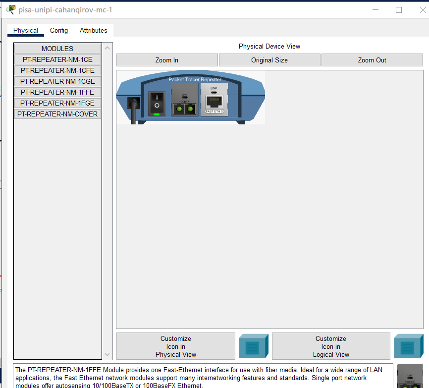

Назовем устройства, выполняя соглашение об именовании, а также соединим устройства (рис. [-@fig:002]).

## Выполнение лабораторной работы

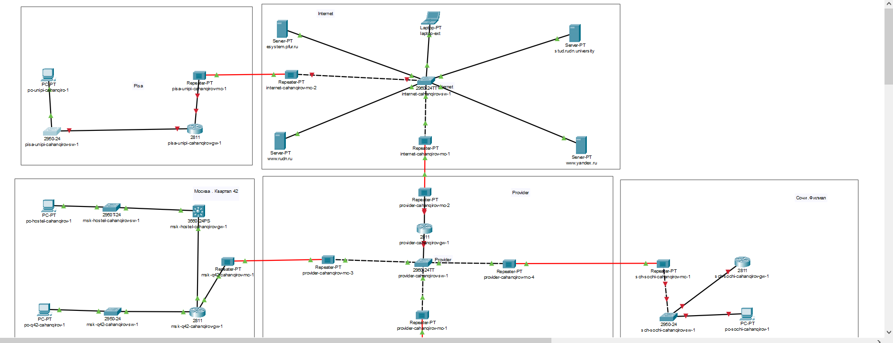

В физической рабочей области проекта создадим город Пиза, здание Университета г. Пиза и переместим туда соответствующее оборудование (рис. [-@fig:003],[-@fig:004]). 

## Выполнение лабораторной работы

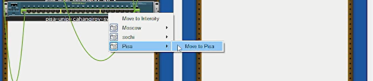

## Выполнение лабораторной работы

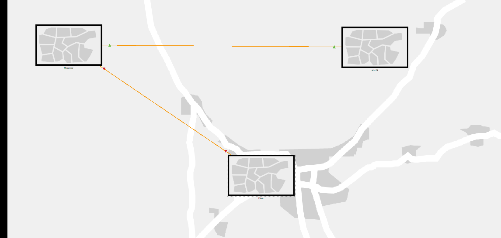

Выполним первоначальную настройку маршрутизатора pisa-unipi-gw-1 (рис. [-@fig:005]). Зададим имя, установим доступ по паролю и оставим доступ по ssh.

## Выполнение лабораторной работы

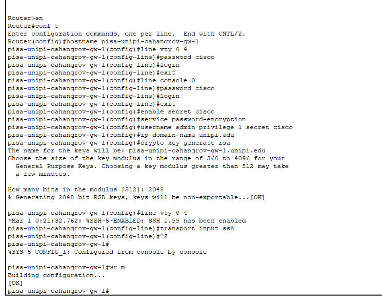

Выполним первоначальную настройку коммутатора pisa-unipi-sw-1 (рис. [-@fig:006]). Зададим имя, установим доступ по паролю и оставим доступ по ssh.

## Выполнение лабораторной работы

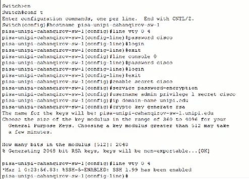

Выполним настройку интерфейсов маршрутизатора pisa-unipi-gw-1 (рис. [-@fig:007]).

## Выполнение лабораторной работы

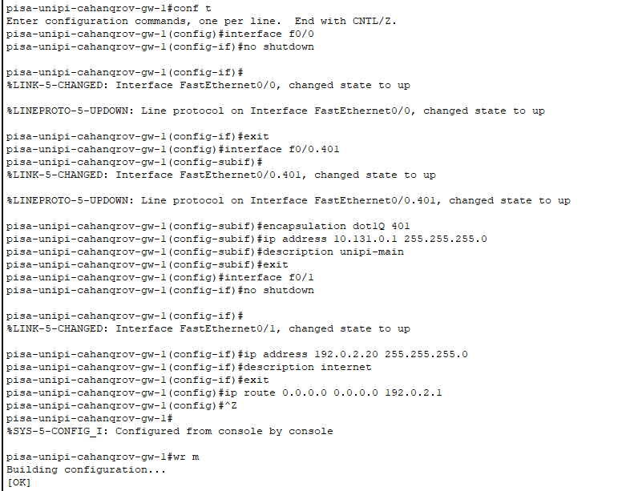

Выполним настройку интерфейсов коммутатора pisa-unipi-sw-1 (рис. [-@fig:008]).

## Выполнение лабораторной работы

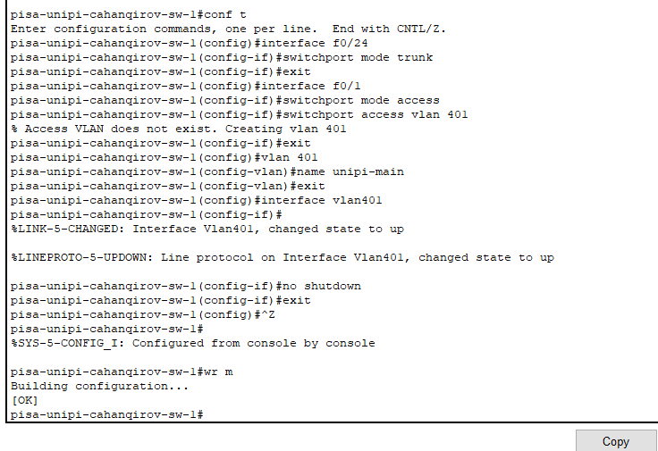

Зададим ПК в г. Пиза ip-адрес и пропингуем маршрутизатор, чтобы проверит работоспособность соединения (рис. [-@fig:009]). Пингование прошло успешно.

## Выполнение лабораторной работы

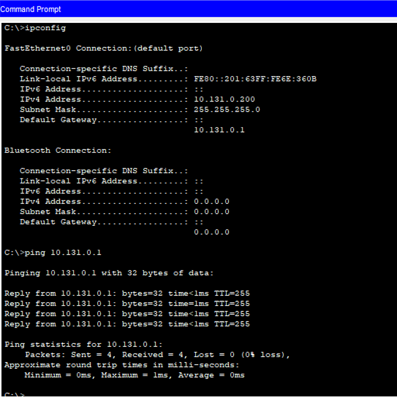

Выполним настройку VPN на основе GRE (рис. [-@fig:010],[-@fig:011]). Создадим интерфейс туннель, зададим ip-адрес, укажем начало и конец туннеля, также настроим интерфейс loopback.

## Выполнение лабораторной работы

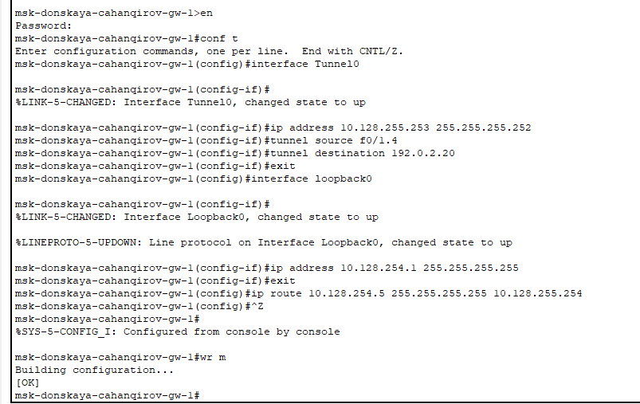

## Выполнение лабораторной работы

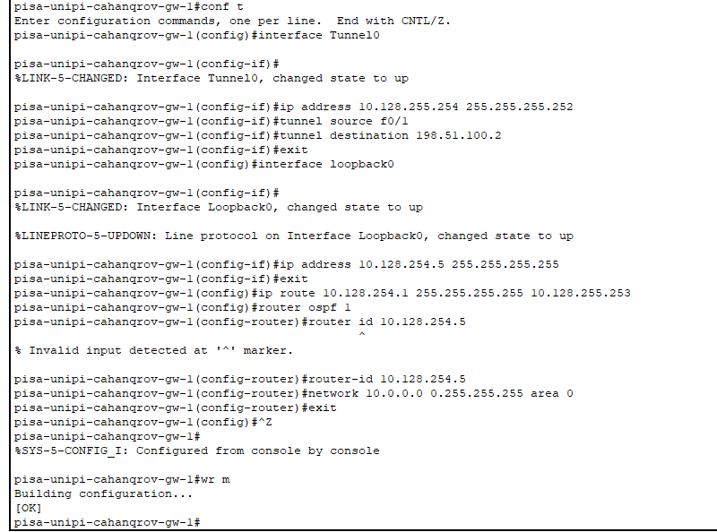

Проверим доступность узлов сети Университета г. Пиза с ноутбука администратора сети «Донская» (рис. [-@fig:012]). Пингование прошло успешно.

## Выполнение лабораторной работы

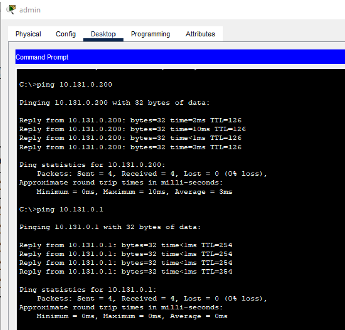

## Выводы

В результате выполнения данной лабораторной работы я получил навыки настройки VPN-туннеля через незащищённое Интернет-соединение.
