---
## Front matter
title: "Лабораторная работа № 16"
subtitle: "Настройка VPN"
author: "Джахангиров Илгар Залид оглы"

## Generic otions
lang: ru-RU
toc-title: "Содержание"

## Bibliography
bibliography: bib/cite.bib
csl: pandoc/csl/gost-r-7-0-5-2008-numeric.csl

## Pdf output format
toc: true # Table of contents
toc-depth: 2
lof: true # List of figures
lot: false # List of tables
fontsize: 12pt
linestretch: 1.5
papersize: a4
documentclass: scrreprt
## I18n polyglossia
polyglossia-lang:
  name: russian
  options:
	- spelling=modern
	- babelshorthands=true
polyglossia-otherlangs:
  name: english
## I18n babel
babel-lang: russian
babel-otherlangs: english
## Fonts
mainfont: PT Serif
romanfont: PT Serif
sansfont: PT Sans
monofont: PT Mono
mainfontoptions: Ligatures=TeX
romanfontoptions: Ligatures=TeX
sansfontoptions: Ligatures=TeX,Scale=MatchLowercase
monofontoptions: Scale=MatchLowercase,Scale=0.9
## Biblatex
biblatex: true
biblio-style: "gost-numeric"
biblatexoptions:
  - parentracker=true
  - backend=biber
  - hyperref=auto
  - language=auto
  - autolang=other*
  - citestyle=gost-numeric
## Pandoc-crossref LaTeX customization
figureTitle: "Рис."
tableTitle: "Таблица"
listingTitle: "Листинг"
lofTitle: "Список иллюстраций"
lotTitle: "Список таблиц"
lolTitle: "Листинги"
## Misc options
indent: true
header-includes:
  - \usepackage{indentfirst}
  - \usepackage{float} # keep figures where there are in the text
  - \floatplacement{figure}{H} # keep figures where there are in the text
---

# Цель работы

Получить навыки настройки VPN-туннеля через незащищённое Интернет-соединение.

# Задание

1. Разместить в рабочей области проекта в соответствии с модельными предположениями оборудование для сети Университета г. Пиза.
2. В физической рабочей области проекта создать город Пиза, здание Университета г. Пиза. Переместить туда соответствующее оборудование.
3. Сделать первоначальную настройку и настройку интерфейсов оборудования
сети Университета г. Пиза.
4. Настроить VPN на основе протокола GRE.
5. Проверить доступность узлов сети Университета г. Пиза с ноутбука администратора сети «Донская».

# Выполнение лабораторной работы

Виртуальная частная сеть (Virtual Private Network, VPN) — технология,
обеспечивающая одно или несколько сетевых соединений поверх другой сети
(например, Интернет).

Сеть Университета г. Пиза (Италия) содержит маршрутизатор Cisco 2811
pisa-inipi-gw-1, коммутатор Cisco 2950 pisa-unipi-sw-1 и оконечное устройство PC pc-unipi-1.

Разместим эти устройства в рабочей области, заменим у медиаконвертеров имеющиеся модули на PT-REPEATERNM-1FFE и PT-REPEATER-NM-1CFE для подключения витой пары по технологии Fast Ethernet и оптоволокна соответственно (рис. [-@fig:001]).

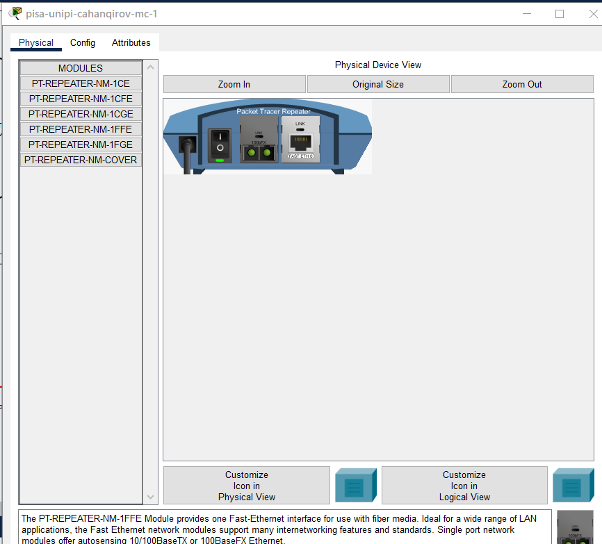

Назовем устройства, выполняя соглашение об именовании, а также соединим устройства (рис. [-@fig:002]).

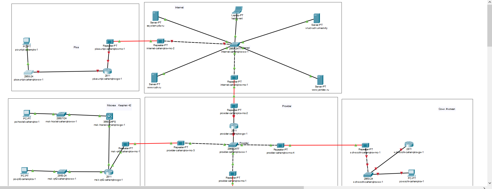

В физической рабочей области проекта создадим город Пиза, здание Университета г. Пиза и переместим туда соответствующее оборудование (рис. [-@fig:003],[-@fig:004]). 

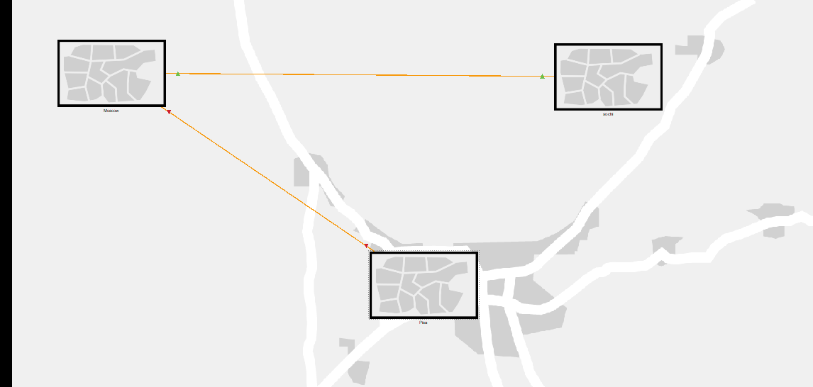

Выполним первоначальную настройку маршрутизатора pisa-unipi-gw-1 (рис. [-@fig:005]). Зададим имя, установим доступ по паролю и оставим доступ по ssh.

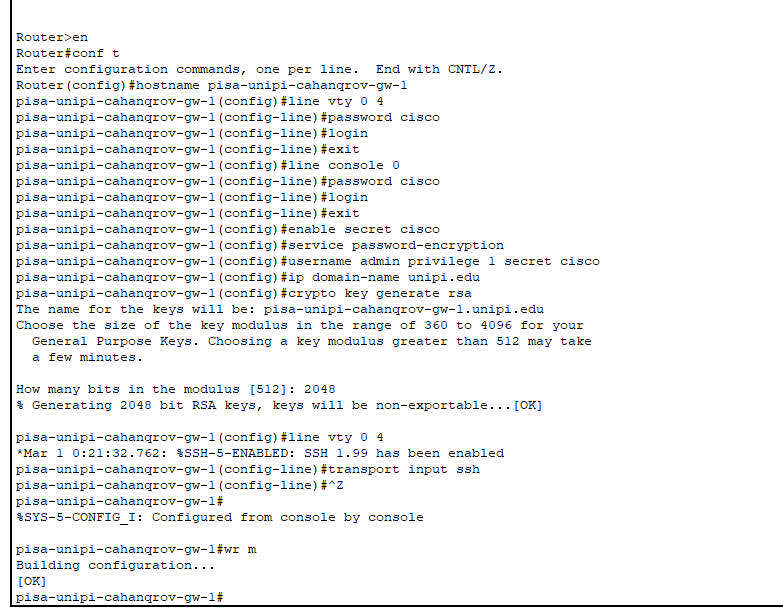

Выполним первоначальную настройку коммутатора pisa-unipi-sw-1 (рис. [-@fig:006]). Зададим имя, установим доступ по паролю и оставим доступ по ssh.

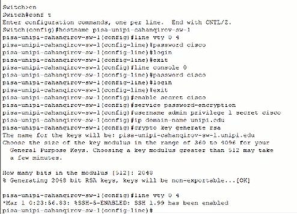

Выполним настройку интерфейсов маршрутизатора pisa-unipi-gw-1 (рис. [-@fig:007]).

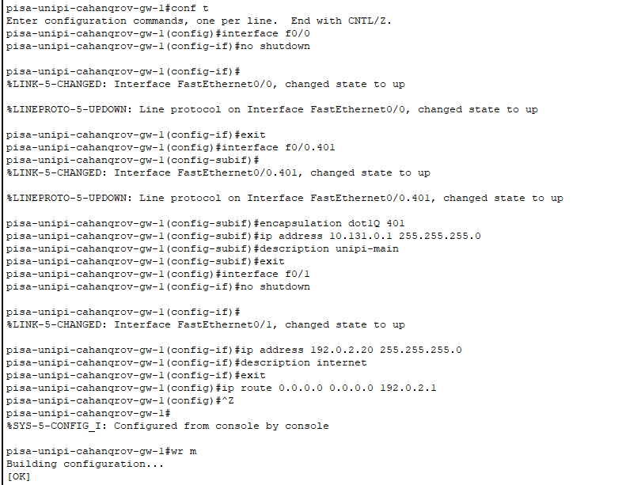

Выполним настройку интерфейсов коммутатора pisa-unipi-sw-1 (рис. [-@fig:008]).

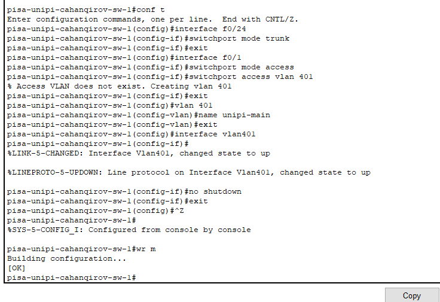

Зададим ПК в г. Пиза ip-адрес и пропингуем маршрутизатор, чтобы проверит работоспособность соединения (рис. [-@fig:009]). Пингование прошло успешно.

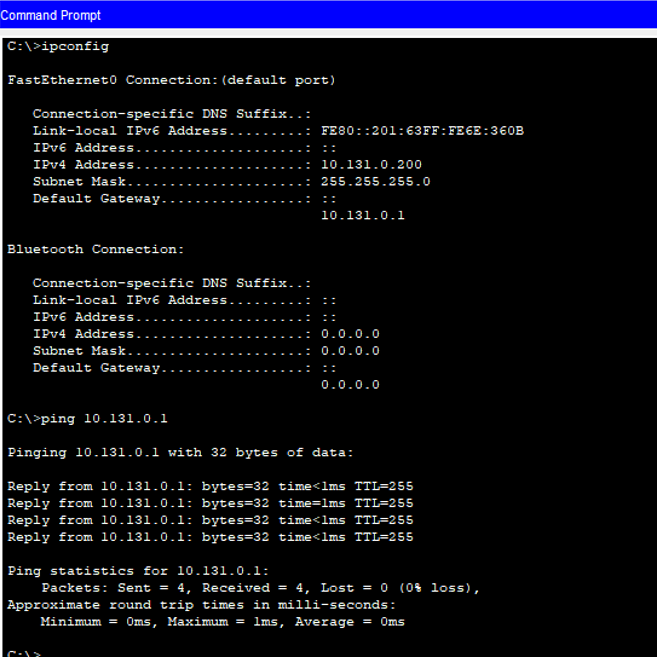

Выполним настройку VPN на основе GRE (рис. [-@fig:010],[-@fig:011]). Создадим интерфейс туннель, зададим ip-адрес, укажем начало и конец туннеля, также настроим интерфейс loopback.

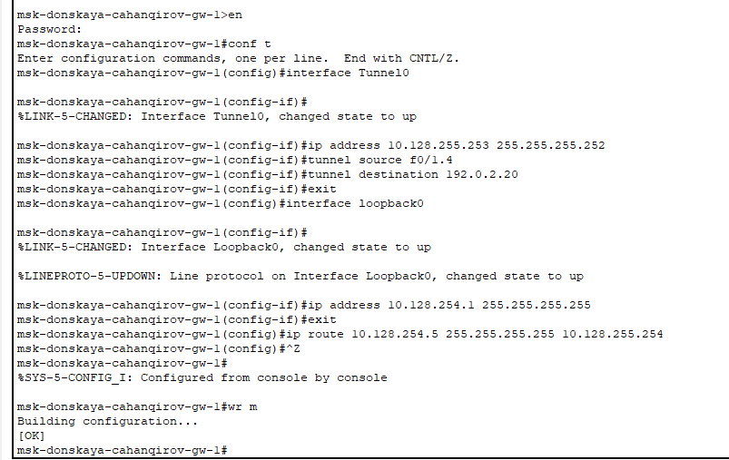

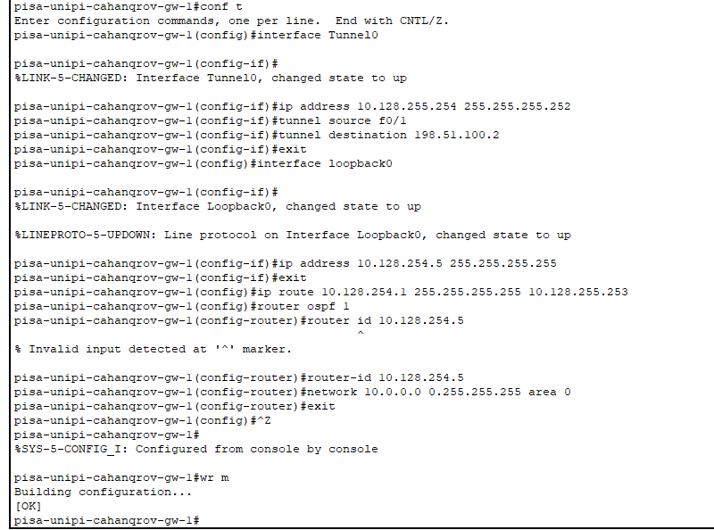

Проверим доступность узлов сети Университета г. Пиза с ноутбука администратора сети «Донская» (рис. [-@fig:012]). Пингование прошло успешно.

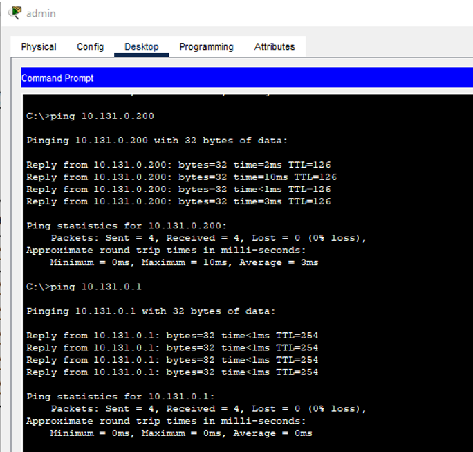

# Выводы

В результате выполнения данной лабораторной работы я получил навыки настройки VPN-туннеля через незащищённое Интернет-соединение.
